# Anthem

#Windows #RDP #PrivEsc 
## Reconnaissance

I started running nmap and I got this following result.

```
$ nmap -sV -Pn 10.65.131.226
Starting Nmap 7.98 ( https://nmap.org ) at 2026-02-12 05:36 -0500
Nmap scan report for 10.65.131.226
Host is up (0.14s latency).
Not shown: 998 filtered tcp ports (no-response)
PORT     STATE SERVICE       VERSION
80/tcp   open  http          Microsoft HTTPAPI httpd 2.0 (SSDP/UPnP)
3389/tcp open  ms-wbt-server Microsoft Terminal Services
Service Info: OS: Windows; CPE: cpe:/o:microsoft:windows

Service detection performed. Please report any incorrect results at https://nmap.org/submit/ .
Nmap done: 1 IP address (1 host up) scanned in 57.81 seconds
```

By accessing port 80, I got this page.

<figure>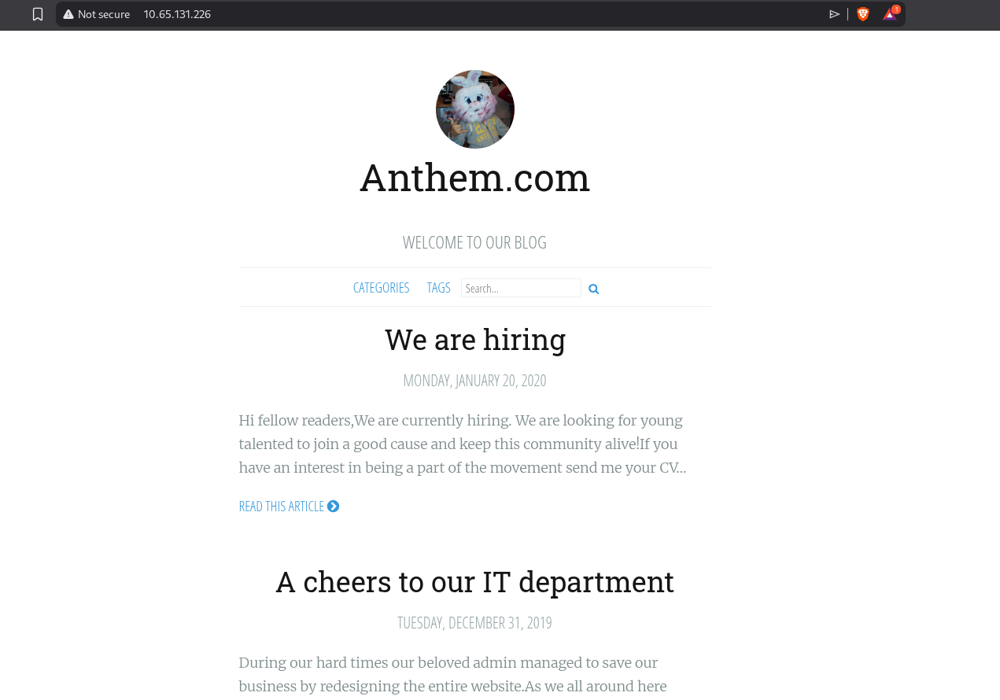<figcaption></figcaption></figure>

## Enumeration

On `robots.txt`, we have a clue. I will try to use it later.

<figure>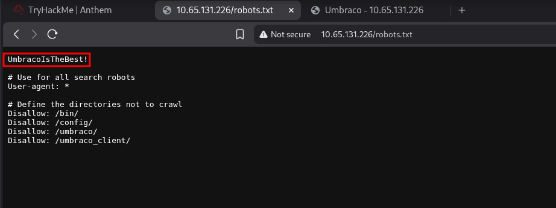<figcaption></figcaption></figure>

Looking for credentials, I look a "puzzle", searching it I found about "Solomon Grundy".

<figure>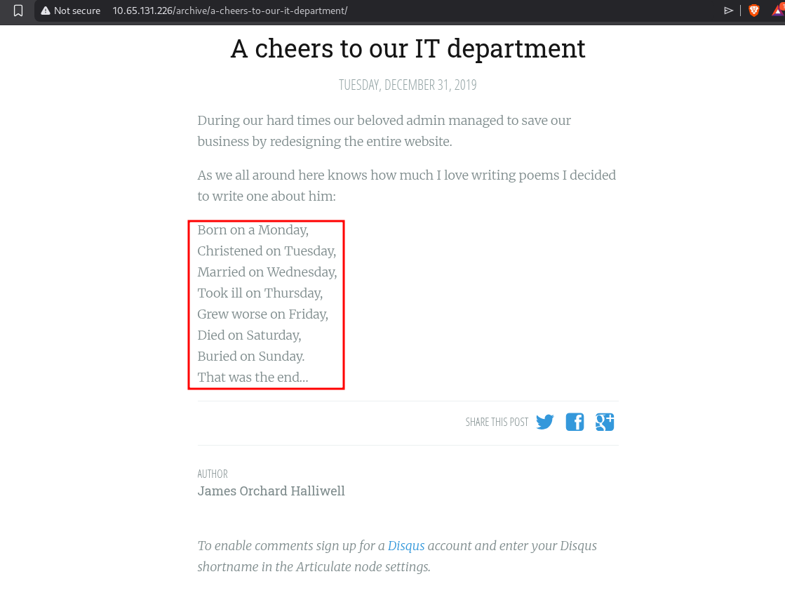<figcaption></figcaption></figure>

I use it to answer these questions.

<figure>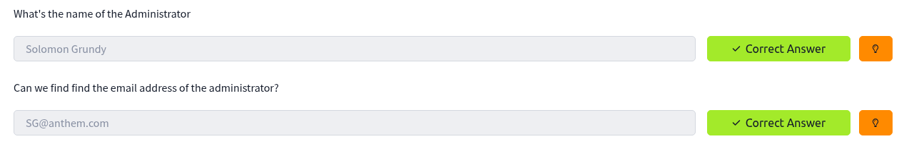<figcaption></figcaption></figure>

Accessing `umbraco` page found on `robots.txt`, I got this login page.

<figure>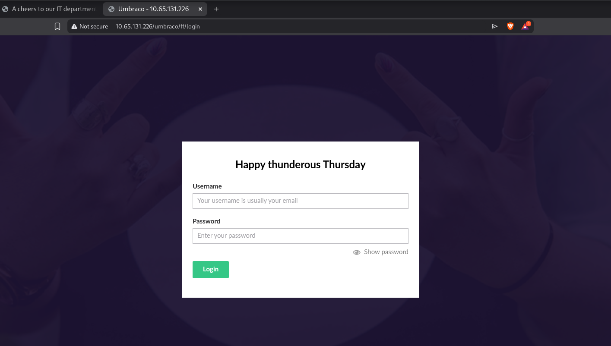<figcaption></figcaption></figure>

Using this email with the clue found previously on `robots.txt`, I was able to login.

<figure>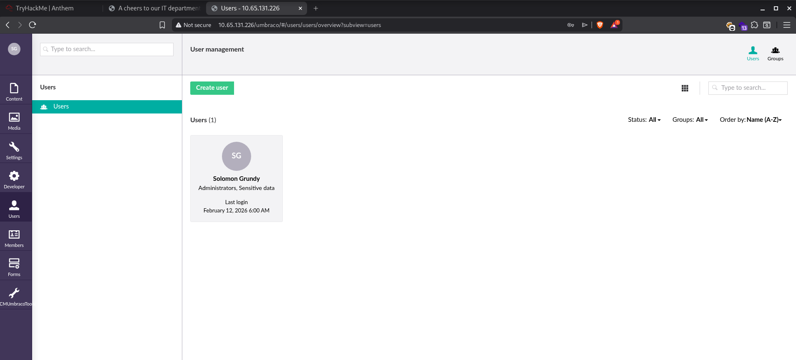<figcaption></figcaption></figure>

On settings section, I tried to write run a command on server, I used a webshell to verify if I was able to.

<figure>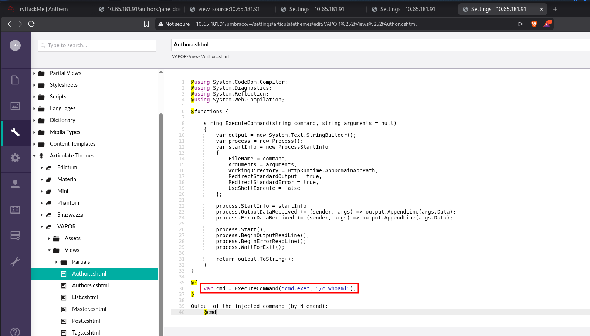<figcaption></figcaption></figure>

<figure>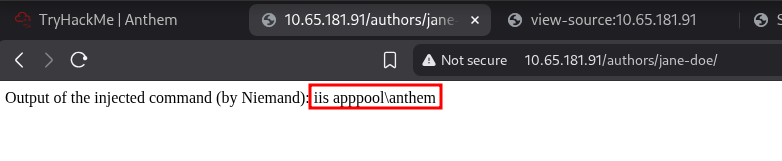<figcaption></figcaption></figure>

I didn't manage to get a webshell, so I tried to access the host using `FreeRDP` with those credentials. I was able to read the first flag `user.txt`.

<figure>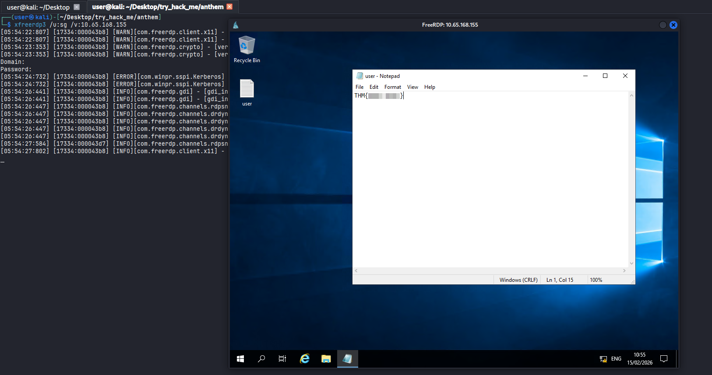<figcaption></figcaption></figure>

I found a hidden folder `backup`, it contains a file `restore` which I didn't have permission to read it.

<figure>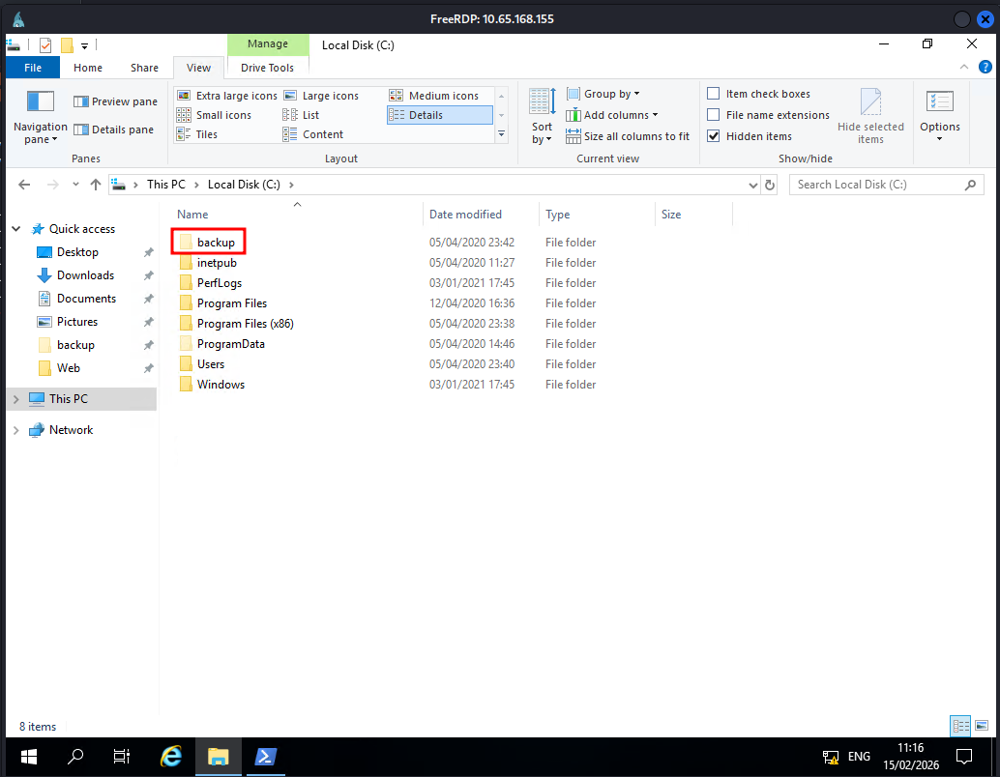<figcaption></figcaption></figure>
<figure>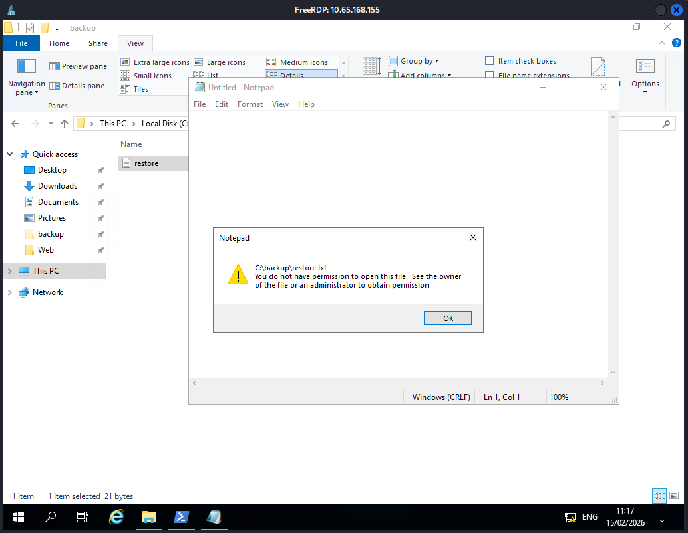<figcaption></figcaption></figure>

To bypass it, I added the user to the group to give him the permission.

<figure>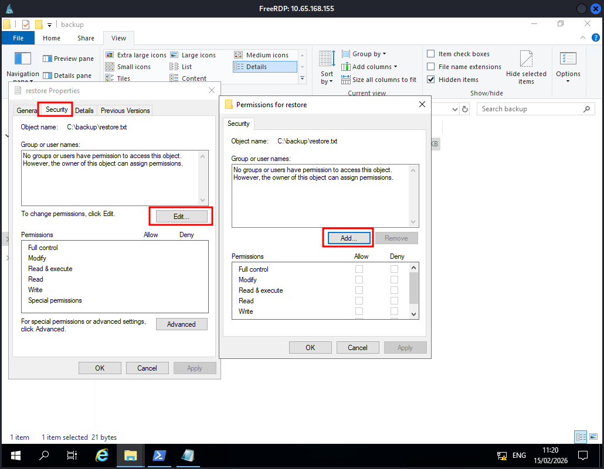<figcaption></figcaption></figure>

Since I was able to read the file, I got this password.

<figure>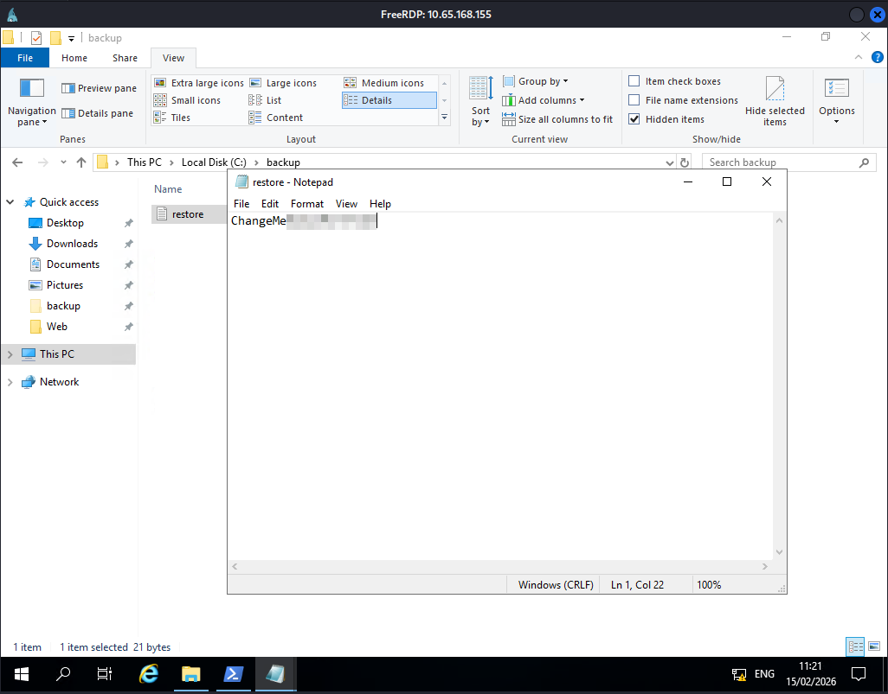<figcaption></figcaption></figure>

Using this password, I was able to read the `root.txt` flag.

<figure>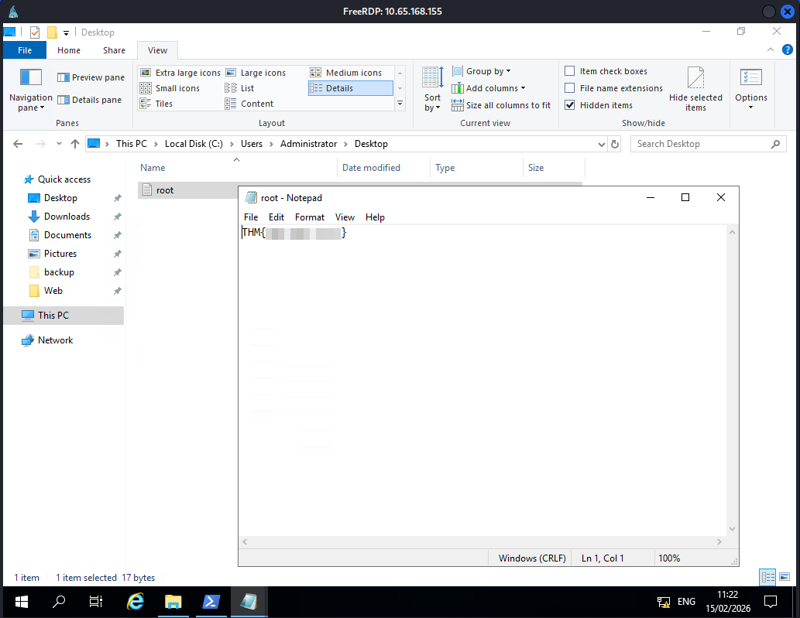<figcaption></figcaption></figure>
