# Lookup

#Linux #PHP #PrivEsc 

## Reconnaissance

I started running nmap and I got the result:

```
$ nmap -sV -sC 10.65.189.97
Starting Nmap 7.98 ( https://nmap.org ) at 2026-01-07 05:07 -0500
Nmap scan report for lookup.thm (10.65.189.97)
Host is up (0.13s latency).
Not shown: 998 closed tcp ports (reset)
PORT   STATE SERVICE VERSION
22/tcp open  ssh     OpenSSH 8.2p1 Ubuntu 4ubuntu0.9 (Ubuntu Linux; protocol 2.0)
| ssh-hostkey: 
|   3072 8e:20:b1:56:74:61:40:09:ea:e5:da:e2:7d:5b:48:4e (RSA)
|   256 ed:6e:58:2e:f4:2f:8d:4f:28:ff:ac:f6:26:45:88:f5 (ECDSA)
|_  256 0f:7b:4b:0c:78:02:11:2f:aa:28:53:da:54:a6:e9:ff (ED25519)
80/tcp open  http    Apache httpd 2.4.41 ((Ubuntu))
|_http-server-header: Apache/2.4.41 (Ubuntu)
|_http-title: Login Page
Service Info: OS: Linux; CPE: cpe:/o:linux:linux_kernel
```

I used ffuf, but I didn't find anything interesting.

```
$ ffuf -u http://lookup.thm/FUZZ -w /usr/share/wordlists/seclists/Discovery/Web-Content/raft-medium-files.txt 

        /'___\  /'___\           /'___\       
       /\ \__/ /\ \__/  __  __  /\ \__/       
       \ \ ,__\\ \ ,__\/\ \/\ \ \ \ ,__\      
        \ \ \_/ \ \ \_/\ \ \_\ \ \ \ \_/      
         \ \_\   \ \_\  \ \____/  \ \_\       
          \/_/    \/_/   \/___/    \/_/       

       v2.1.0-dev
________________________________________________

 :: Method           : GET
 :: URL              : http://lookup.thm/FUZZ
 :: Wordlist         : FUZZ: /usr/share/wordlists/seclists/Discovery/Web-Content/raft-medium-files.txt
 :: Follow redirects : false
 :: Calibration      : false
 :: Timeout          : 10
 :: Threads          : 40
 :: Matcher          : Response status: 200-299,301,302,307,401,403,405,500
________________________________________________

.htaccess        [Status: 403, Size: 275, Words: 20, Lines: 10, Duration: 132ms]
login.php        [Status: 200, Size: 1, Words: 1, Lines: 2, Duration: 237ms]
index.php        [Status: 200, Size: 719, Words: 114, Lines: 27, Duration: 237ms]
.                [Status: 200, Size: 719, Words: 114, Lines: 27, Duration: 133ms]
styles.css       [Status: 200, Size: 687, Words: 95, Lines: 51, Duration: 133ms]
.html            [Status: 403, Size: 275, Words: 20, Lines: 10, Duration: 132ms]
.php             [Status: 403, Size: 275, Words: 20, Lines: 10, Duration: 132ms]
.htpasswd        [Status: 403, Size: 275, Words: 20, Lines: 10, Duration: 132ms]
.htm             [Status: 403, Size: 275, Words: 20, Lines: 10, Duration: 132ms]
.htpasswds       [Status: 403, Size: 275, Words: 20, Lines: 10, Duration: 132ms]
.htgroup         [Status: 403, Size: 275, Words: 20, Lines: 10, Duration: 132ms]
wp-forum.phps    [Status: 403, Size: 275, Words: 20, Lines: 10, Duration: 132ms]
.htaccess.bak    [Status: 403, Size: 275, Words: 20, Lines: 10, Duration: 132ms]
.htuser          [Status: 403, Size: 275, Words: 20, Lines: 10, Duration: 132ms]
.htc             [Status: 403, Size: 275, Words: 20, Lines: 10, Duration: 132ms]
.ht              [Status: 403, Size: 275, Words: 20, Lines: 10, Duration: 132ms]
```

## Exploiting

It's necessary to add the IP to hosts file.

```
10.66.165.76    lookup.thm
```

Accessing the main page, I have a login form.

<figure>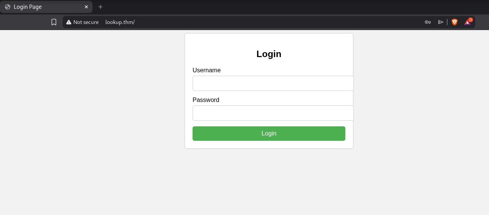<figcaption></figcaption></figure>

I tested a few SQL Injection payloads to bypass the authentication but none of them worked. So, I intercepted the request using Burpsuite to test some default users and passwords. 

<figure>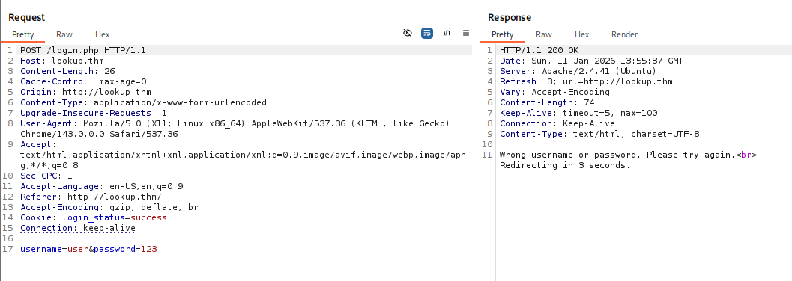<figcaption></figcaption></figure>

I received an "Wrong username or password" message. I knew that if I send a valid username, the application will probably say that only the password is wrong.

<figure><figcaption></figcaption></figure>

I was able to validate that. I tested `admin` username and now I know that `admin` is a valid username.

Let's try to figure out the password using hydra (or ffuf).


<figure>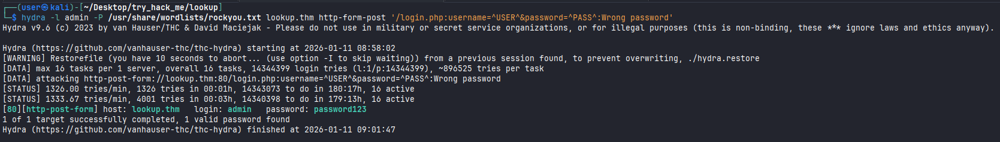<figcaption></figcaption></figure>

<figure>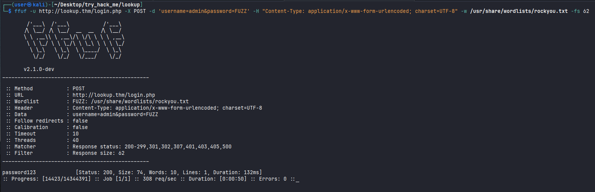<figcaption></figcaption></figure>

As we can see, `password123` is a valid password. But when I try to login as `admin` using this password, I can not. The password is probably valid, but not for the `admin` user.

Let's enumerate users with this password.

<figure>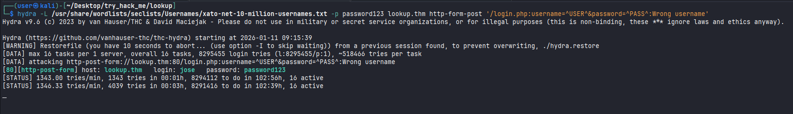<figcaption></figcaption></figure>

<figure><figcaption></figcaption></figure>

I found a user called `jose`, with the password `password123`, I was able to authenticate myself in the application. I also needed to add the IP to hosts file.

```
10.66.165.76    files.lookup.thm
```

<figure>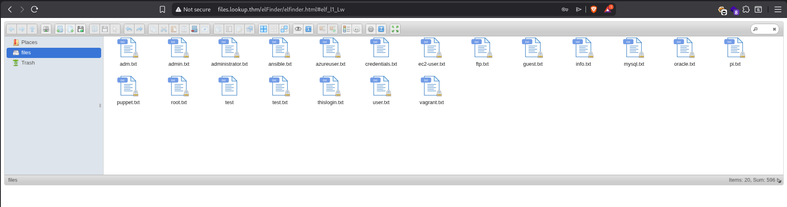<figcaption></figcaption></figure>

I tried to upload some PHP files as a webshell bypassing some filters, but none of them worked because the application blocked some file extensions and contents.

<figure>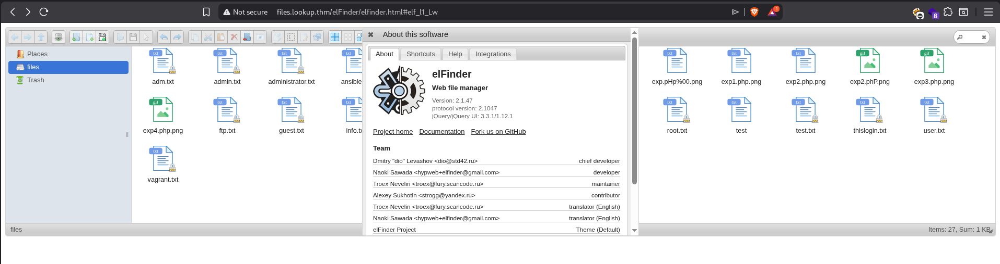<figcaption></figcaption></figure>

After investigating the software further, I discovered its name and version. I started searching for public exploits and found this one.



I was able to get a shell through this exploit.

<figure>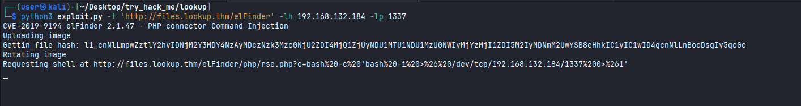<figcaption></figcaption></figure>
<figure>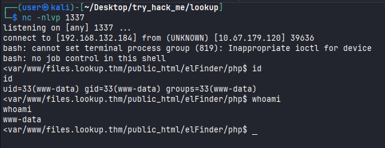<figcaption></figcaption></figure>

Checking `home` folder, I was unable to read the `user.txt` flag.

<figure><figcaption></figcaption></figure>

## Shell as `Think`

First, I did a manual check but I didn't find anything interesting. After that, I ran linpeas script, which indicated that there was a binary `/usr/bin/pwm` running with sudo privileges.

<figure>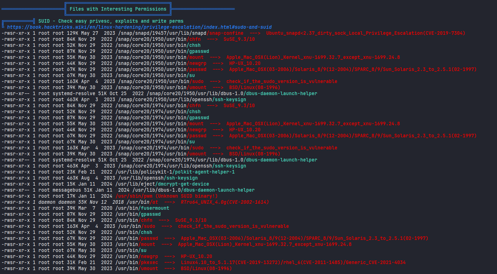<figcaption></figcaption></figure>

If I try to run this binary file, I get the following result. This binary checks the user id, and then used to locate the `.password` file of this user in the `home` directory. 

<figure>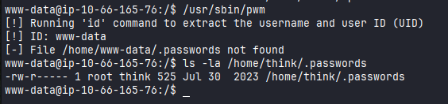<figcaption></figcaption></figure>

To bypass it, we can create a simple bash script `id`, that replicate the output of the original `id` command.

```
echo '#!/bin/bash' > id
echo 'echo "uid=1000(think) gid=1000(think) groups=1000(think)"' >> id
chmod +x id
```

<figure>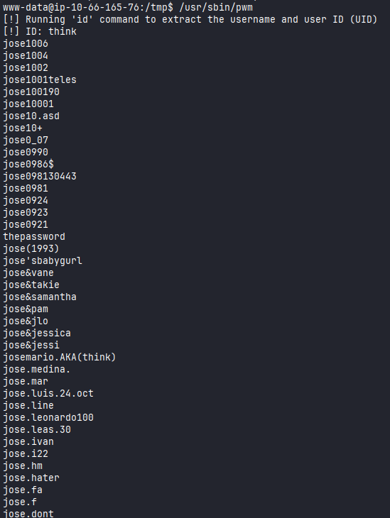<figcaption></figcaption></figure>

Next, we add `/tmp` to our `PATH` variable so that the binary is looked up first when any binary such as `id` is called.

```
 export PATH=/tmp:$PATH
```

Running `/usr/sbin/pwm`, I got the contents of `.passwords`. 

<figure>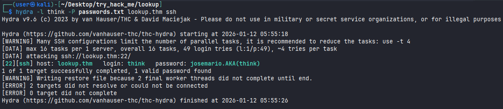<figcaption></figcaption></figure>

I used hydra again to discover `think` password, and I was able to find it.

<figure>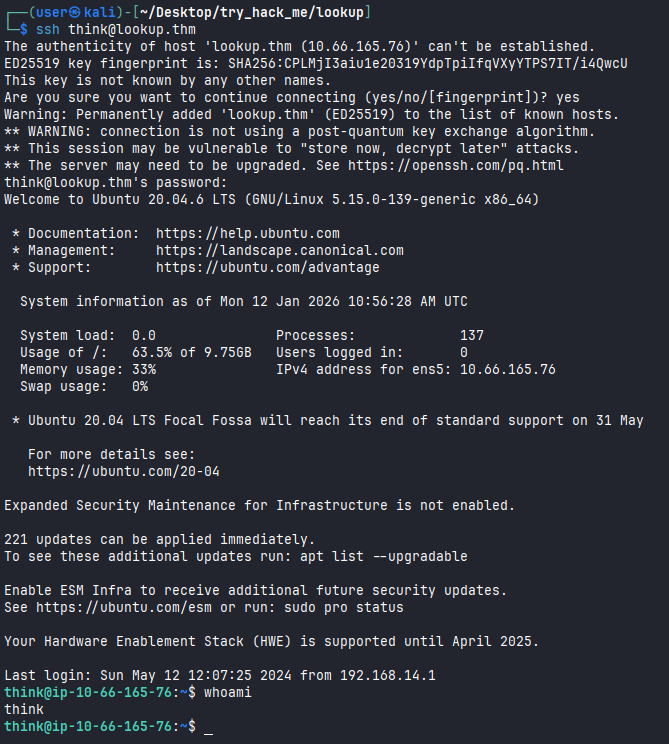<figcaption></figcaption></figure>

Accessing SSH with `think` user, I was able to read the `user.txt` flag. 

<figure><figcaption></figcaption></figure>
<figure>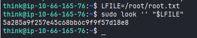<figcaption></figcaption></figure>

## Privilege Escalation

Checking for possible binaries that I could run as sudo, I found `look`.

<figure>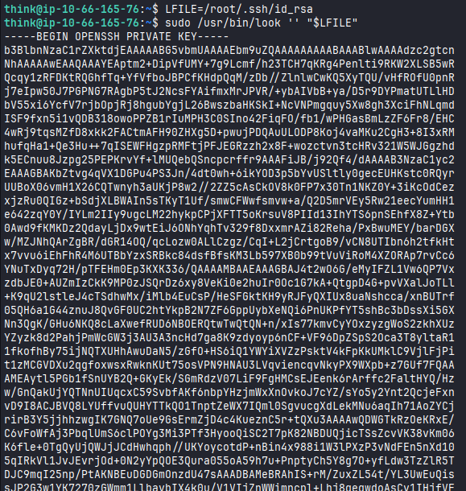<figcaption></figcaption></figure>

On GTFOBins, we can see that it's possible to take advantage of that to read data from local file.

<figure>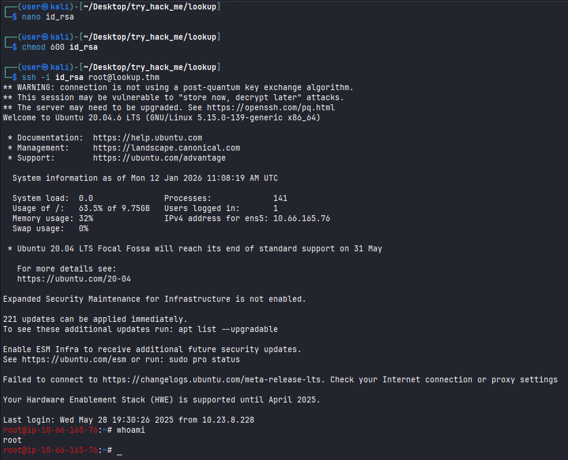<figcaption></figcaption></figure>

I was able to read `/root/.ssh/id_rsa` file, and I obtained the root's private key to access SSH.

<figure>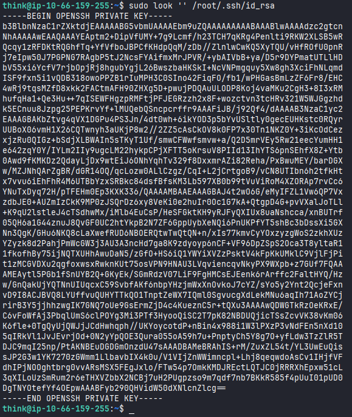<figcaption></figcaption></figure>

Using this private key, I can log in as root.

<figure><figcaption></figcaption></figure>

Reading the `root.txt` flag.

<figure>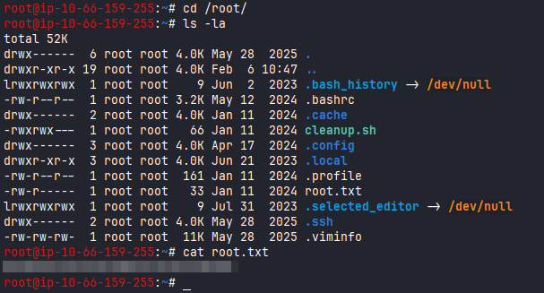<figcaption></figcaption></figure>
