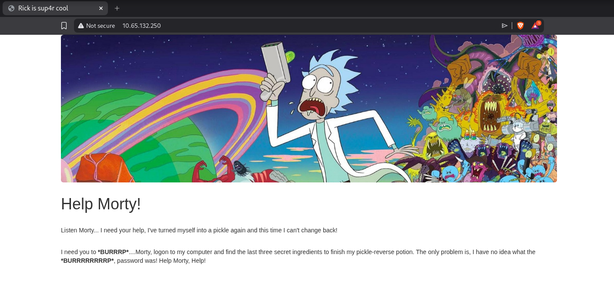
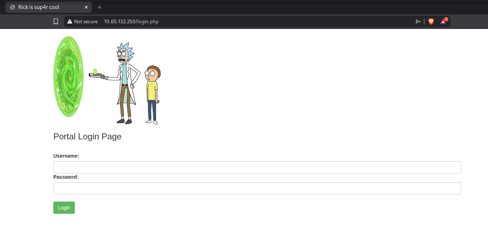
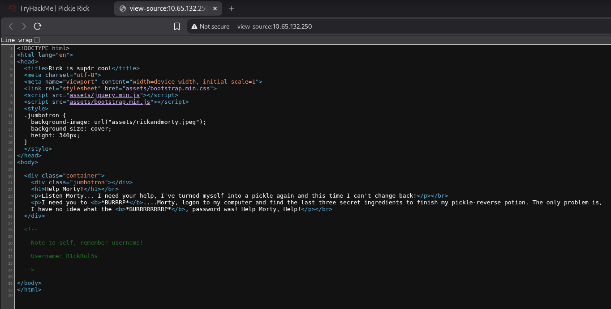
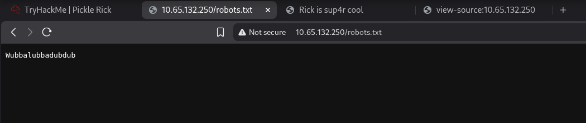
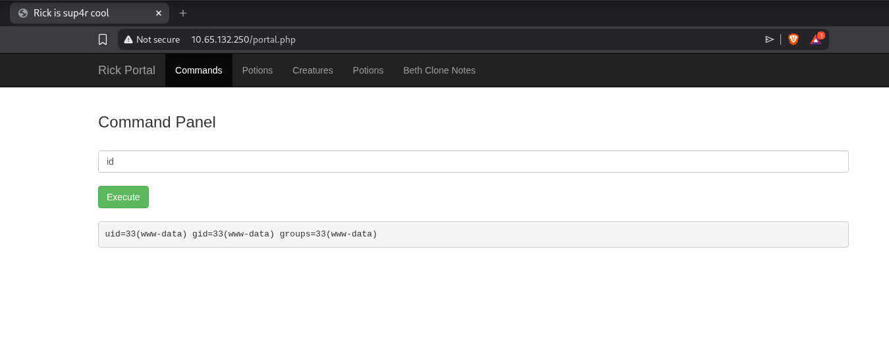
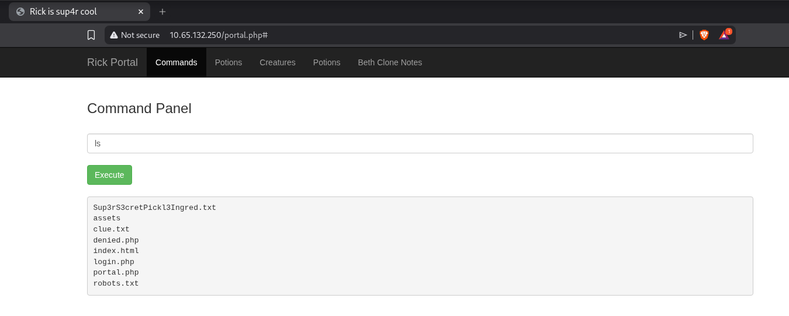
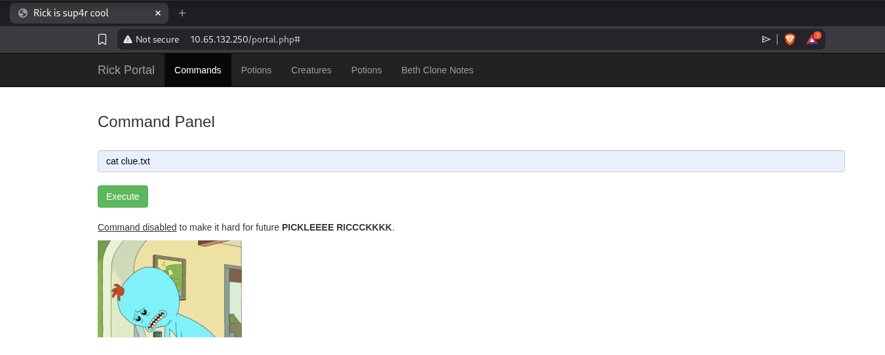
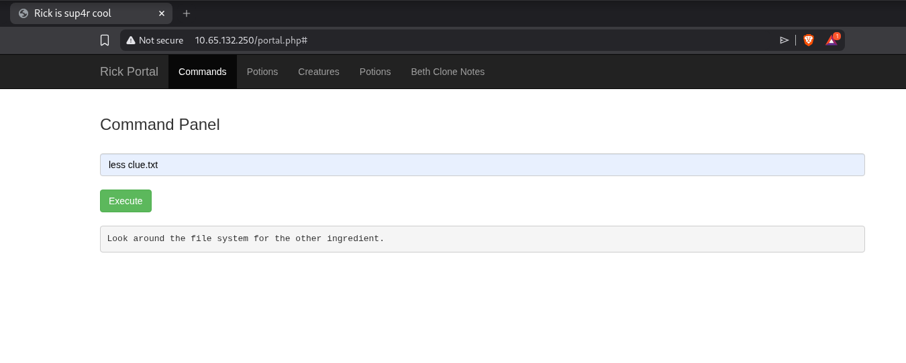
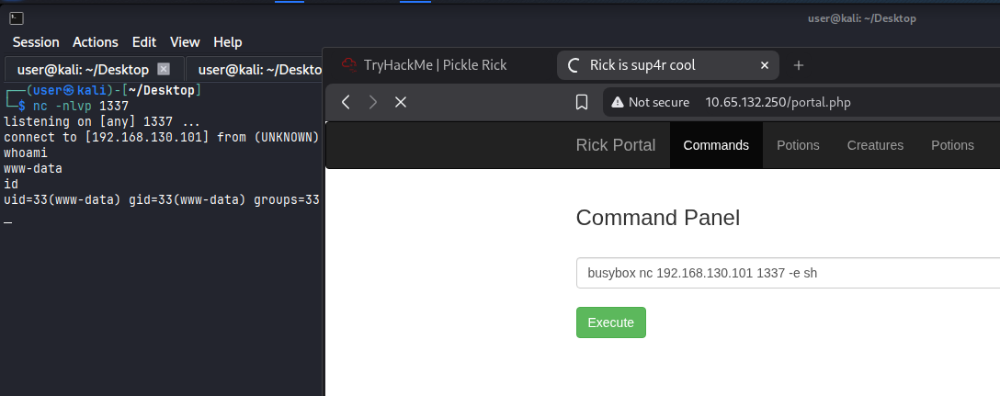
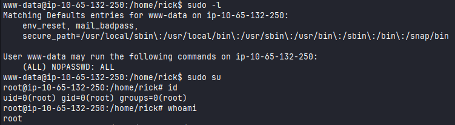

# Pickle Rick

## Recon

#Linux #PHP #PrivEsc #CommandInjection 

## Reconnaissance

I started running nmap and I got the following result.

```
$ nmap -sV -sC 10.65.132.250 
Starting Nmap 7.98 ( https://nmap.org ) at 2026-01-18 05:52 -0500
Nmap scan report for 10.65.132.250
Host is up (0.13s latency).
Not shown: 998 closed tcp ports (reset)
PORT   STATE SERVICE VERSION
22/tcp open  ssh     OpenSSH 8.2p1 Ubuntu 4ubuntu0.11 (Ubuntu Linux; protocol 2.0)
| ssh-hostkey: 
|   3072 4d:66:76:21:d1:46:82:06:7e:e7:9b:7b:a3:9b:c4:14 (RSA)
|   256 05:f9:4c:55:7c:11:16:71:fd:71:8d:2e:18:7a:f1:07 (ECDSA)
|_  256 04:bd:71:be:5a:a8:f9:49:61:de:a6:04:bf:72:e5:7a (ED25519)
80/tcp open  http    Apache httpd 2.4.41 ((Ubuntu))
|_http-server-header: Apache/2.4.41 (Ubuntu)
|_http-title: Rick is sup4r cool
Service Info: OS: Linux; CPE: cpe:/o:linux:linux_kernel
```

Accessing on port `80`, I got this page. 

<figure><figcaption></figcaption></figure>

Searching for files, I found `login.php` page.

```
$ ffuf -u http://10.65.132.250/FUZZ -w /usr/share/wordlists/seclists/Discovery/Web-Content/raft-large-files.txt

        /'___\  /'___\           /'___\       
       /\ \__/ /\ \__/  __  __  /\ \__/       
       \ \ ,__\\ \ ,__\/\ \/\ \ \ \ ,__\      
        \ \ \_/ \ \ \_/\ \ \_\ \ \ \ \_/      
         \ \_\   \ \_\  \ \____/  \ \_\       
          \/_/    \/_/   \/___/    \/_/       

       v2.1.0-dev
________________________________________________

 :: Method           : GET
 :: URL              : http://10.65.132.250/FUZZ
 :: Wordlist         : FUZZ: /usr/share/wordlists/seclists/Discovery/Web-Content/raft-large-files.txt
 :: Follow redirects : false
 :: Calibration      : false
 :: Timeout          : 10
 :: Threads          : 40
 :: Matcher          : Response status: 200-299,301,302,307,401,403,405,500
________________________________________________

login.php       [Status: 200, Size: 882, Words: 89, Lines: 26, Duration: 273ms]
index.html      [Status: 200, Size: 1062, Words: 148, Lines: 38, Duration: 127ms]
.htaccess       [Status: 403, Size: 278, Words: 20, Lines: 10, Duration: 127ms]
robots.txt      [Status: 200, Size: 17, Words: 1, Lines: 2, Duration: 127ms]
.html           [Status: 403, Size: 278, Words: 20, Lines: 10, Duration: 126ms]
portal.php      [Status: 302, Size: 0, Words: 1, Lines: 1, Duration: 130ms]
							...
```

I tried to bypass the login using SQLInjection but it didn't work.

<figure><figcaption></figcaption></figure>

On source page, I found the username `R1ckRul3s`. 

<figure><figcaption></figcaption></figure>

On `robots.txt`, we can see that there is something here. 

<figure><figcaption></figcaption></figure>

Using the username found earlier with this information found on `robots.txt` file, I was able to login and I was redirected to `portal.php` which basically executes the command we pass in the input. 

<figure><figcaption></figcaption></figure>

Run `ls` command we can list the files.

<figure><figcaption></figcaption></figure>

I can't use the `cat` command to view the contents of the file.

<figure><figcaption></figcaption></figure>

But I was able to use `less`, that way I could see the content.

<figure><figcaption></figcaption></figure>

Since some commands are not allowed to use, I was able to get a shell using `busybox`.

<figure><figcaption></figcaption></figure>

## Privilege Escalation

We can see that with this user it's possible to execute everything as sudo. Since I was able to login as a root, I got all the flags.

<figure><figcaption></figcaption></figure>