# Silver Platter

#Linux #Java #CVE-2024-36042

## Reconnaissance

I started running nmap and I got the result:

```
$ nmap -sV -sC 10.67.150.239
Starting Nmap 7.98 ( https://nmap.org ) at 2026-02-01 06:38 -0500
Nmap scan report for 10.67.150.239
Host is up (0.13s latency).
Not shown: 997 closed tcp ports (reset)
PORT     STATE SERVICE    VERSION
22/tcp   open  ssh        OpenSSH 8.9p1 Ubuntu 3ubuntu0.4 (Ubuntu Linux; protocol 2.0)
| ssh-hostkey: 
|   256 15:40:a8:53:47:99:2b:cc:28:dc:25:29:b5:44:0b:e1 (ECDSA)
|_  256 be:8d:53:2f:b2:4f:32:a7:62:95:47:1b:8f:fe:01:f8 (ED25519)
80/tcp   open  http       nginx 1.18.0 (Ubuntu)
|_http-title: Hack Smarter Security
|_http-server-header: nginx/1.18.0 (Ubuntu)
8080/tcp open  http-proxy
|_http-title: Error
| fingerprint-strings: 
|   FourOhFourRequest, HTTPOptions: 
|     HTTP/1.1 404 Not Found
|     Connection: close
|     Content-Length: 74
|     Content-Type: text/html
|     Date: Sun, 01 Feb 2026 11:38:43 GMT
|     <html><head><title>Error</title></head><body>404 - Not Found</body></html>
|   GenericLines, Help, Kerberos, LDAPSearchReq, LPDString, RTSPRequest, SMBProgNeg, SSLSessionReq, Socks5, TLSSessionReq, TerminalServerCookie: 
|     HTTP/1.1 400 Bad Request
|     Content-Length: 0
|     Connection: close
|   GetRequest: 
|     HTTP/1.1 404 Not Found
|     Connection: close
|     Content-Length: 74
|     Content-Type: text/html
|     Date: Sun, 01 Feb 2026 11:38:42 GMT
|_    <html><head><title>Error</title></head><body>404 - Not Found</body></html>
1 service unrecognized despite returning data. If you know the service/version, please submit the following fingerprint at https://nmap.org/cgi-bin/submit.cgi?new-service :
SF-Port8080-TCP:V=7.98%I=7%D=2/1%Time=697F3B43%P=x86_64-pc-linux-gnu%r(Get
SF:Request,C9,"HTTP/1\.1\x20404\x20Not\x20Found\r\nConnection:\x20close\r\
SF:nContent-Length:\x2074\r\nContent-Type:\x20text/html\r\nDate:\x20Sun,\x
SF:2001\x20Feb\x202026\x2011:38:42\x20GMT\r\n\r\n<html><head><title>Error<
SF:/title></head><body>404\x20-\x20Not\x20Found</body></html>")%r(HTTPOpti
SF:ons,C9,"HTTP/1\.1\x20404\x20Not\x20Found\r\nConnection:\x20close\r\nCon
                                 ...
```

By accessing the main page on port 80, I got a page from the website. We can see a username on the contact details, but there is nothing interesting here. I couldn't find any directory or file that could give me a clue.

<figure>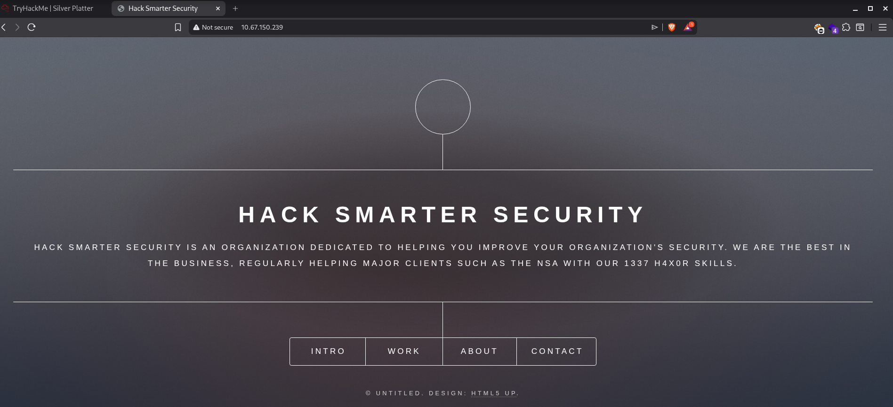<figcaption></figcaption></figure>

<figure>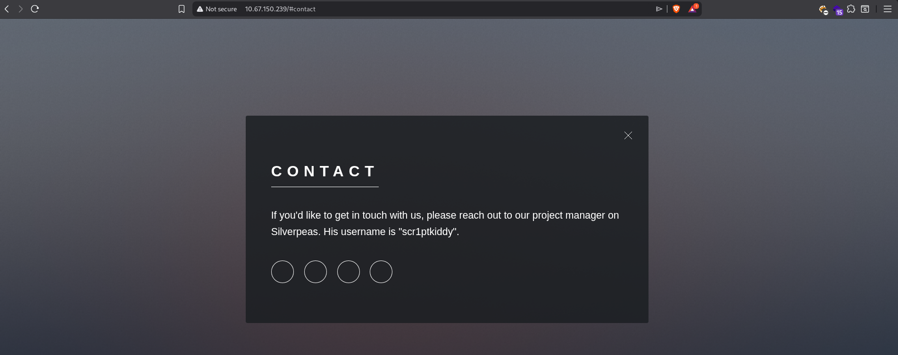<figcaption></figcaption></figure>

I started looking at look 8080. 

<figure>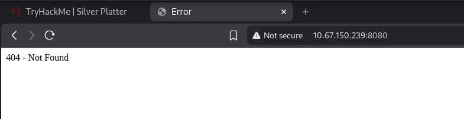<figcaption></figcaption></figure>

Searching for directories on port 8080, I found `weblib`.

```
$ ffuf -u http://10.67.150.239:8080/FUZZ -w /usr/share/wordlists/seclists/Discovery/Web-Content/raft-large-directories.txt

        /'___\  /'___\           /'___\       
       /\ \__/ /\ \__/  __  __  /\ \__/       
       \ \ ,__\\ \ ,__\/\ \/\ \ \ \ ,__\      
        \ \ \_/ \ \ \_/\ \ \_\ \ \ \ \_/      
         \ \_\   \ \_\  \ \____/  \ \_\       
          \/_/    \/_/   \/___/    \/_/       

       v2.1.0-dev
________________________________________________

 :: Method           : GET
 :: URL              : http://10.67.150.239:8080/FUZZ
 :: Wordlist         : FUZZ: /usr/share/wordlists/seclists/Discovery/Web-Content/raft-large-directories.txt
 :: Follow redirects : false
 :: Calibration      : false
 :: Timeout          : 10
 :: Threads          : 40
 :: Matcher          : Response status: 200-299,301,302,307,401,403,405,500
________________________________________________

website                 [Status: 302, Size: 0, Words: 1, Lines: 1, Duration: 133ms]
console                 [Status: 302, Size: 0, Words: 1, Lines: 1, Duration: 133ms]
weblib                  [Status: 302, Size: 0, Words: 1, Lines: 1, Duration: 161ms]
:: Progress: [62281/62281] :: Job [1/1] :: 298 req/sec :: Duration: [0:03:28] :: Errors: 0 ::
```

Accessing `weblib`, I got an error.

<figure>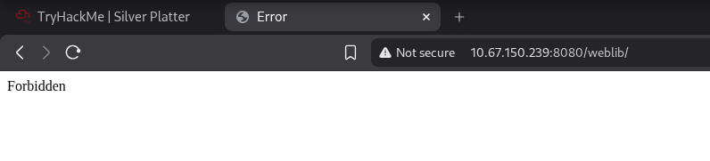<figcaption></figcaption></figure>

Searching for files in this directory, I found `robots.txt`, which showed me a login page.

<figure>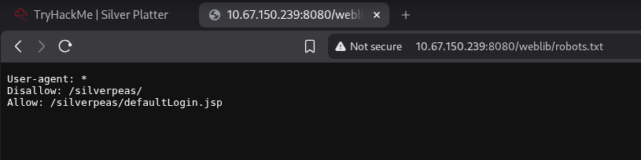<figcaption></figcaption></figure>
<figure>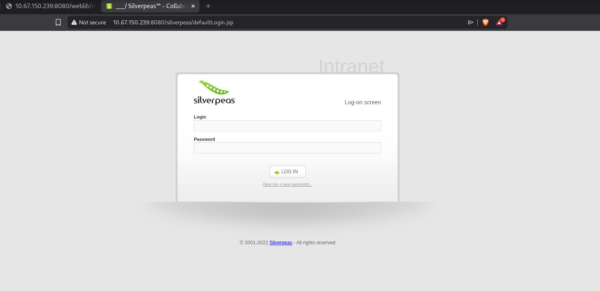<figcaption></figcaption></figure>

I tried some SQLInjection manually on the login page, but none of them worked. I tried the default username and pass but that didn't worked either. 
<figure>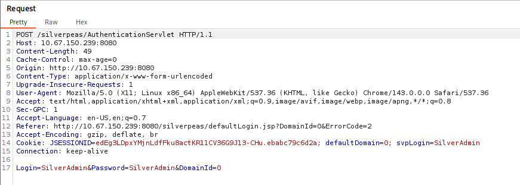<figcaption></figcaption></figure>

While searching for public exploits on Silverpeas, I found `CVE-2024-36042`. This allows to bypass the authentication by omitting the password form field. The following image shows a request when we try to login as `SilverAdmin`.



<figure><figcaption></figcaption></figure>

After removing the `&Password=Silveradmin`, I was able to login successfully.

<figure>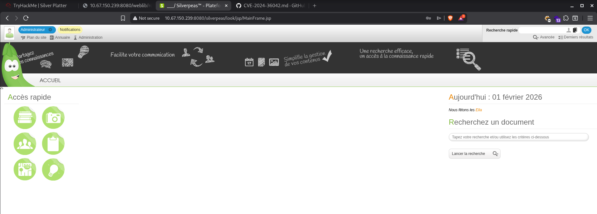<figcaption></figcaption></figure>

I searched for some file uploads but without success. I found a page that contains some users.  

<figure>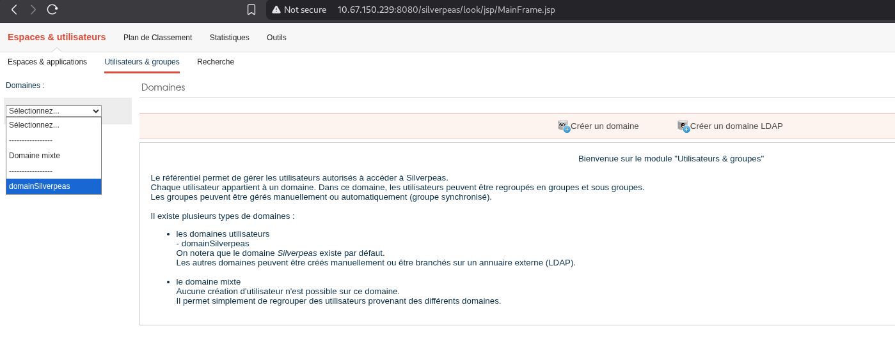<figcaption></figcaption></figure>
<figure>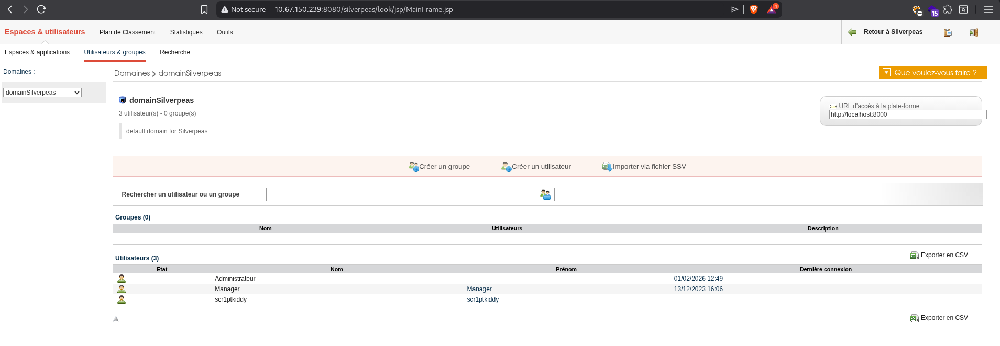<figcaption></figcaption></figure>

I changed the Manager password to try to log in.

<figure>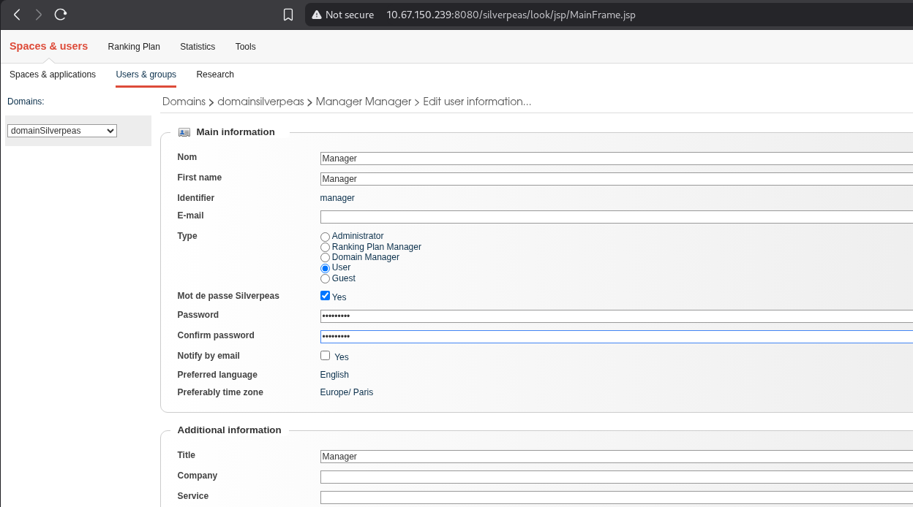<figcaption></figcaption></figure>

After successfully loggin in as Manager, I found a credential in the notifications.

<figure>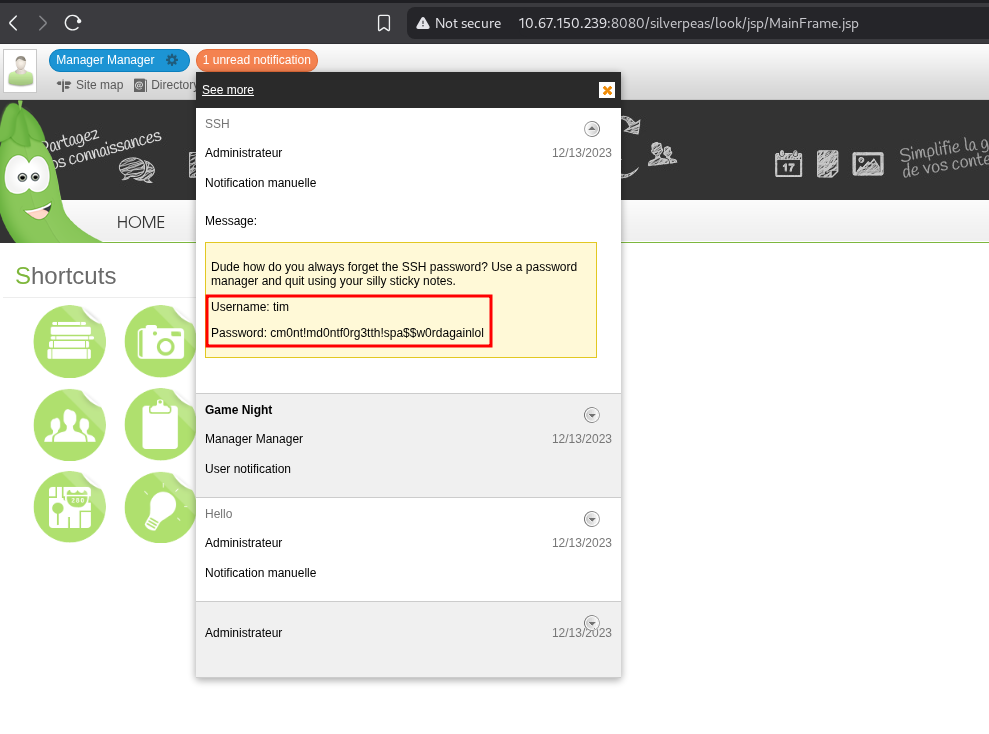<figcaption></figcaption></figure>

Firstly I attempted to connect to SSH using this credential and it worked.

<figure>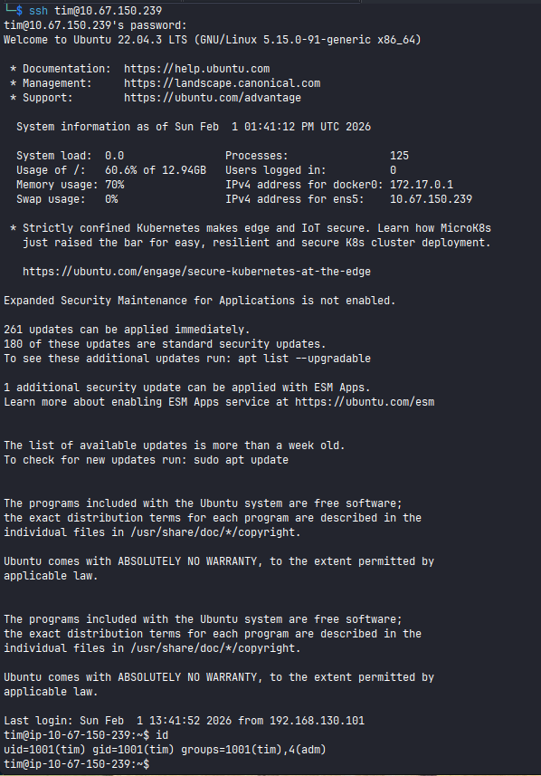<figcaption></figcaption></figure>

Reading `user.txt` flag.

<figure>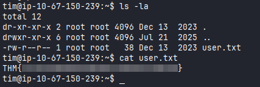<figcaption></figcaption></figure>


Running Linpeas script, I noticed that there is a user Tyler.

<figure><figcaption></figcaption></figure>

The idea is to find the Tyler's password. I use grep on `/var/log` to find any command that has been used that contains `pass` or `tyler` (both worked).

```
tim@ip-10-65-145-5:/home$ grep -iR 'pass' /var/log 2>/dev/null
```

```
tim@ip-10-65-145-5:/home$ grep -iR 'tyler' /var/log 2>/dev/null
```

<figure>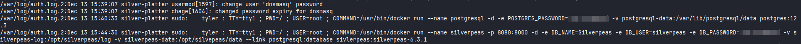<figcaption></figcaption></figure>

After finding the password, I was able to log in as Tyler.

<figure><figcaption></figcaption></figure>

Running `sudo -l` to check permissions, I noticed that I could login as sudo without a password. 

<figure>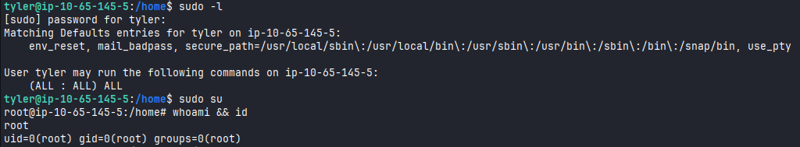<figcaption></figcaption></figure>

Reading `root.txt` flag.

<figure>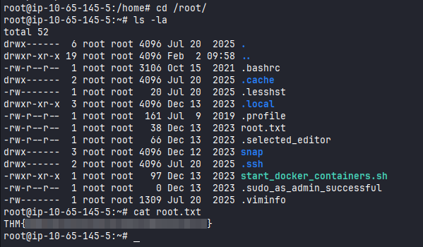<figcaption></figcaption></figure>
