# Tomghost

#Linux #Tomcat #CVE-2020-1938 

## Reconnaissance

I started running nmap and I got the result:

```
$ nmap -sV -sC 10.66.144.241
Starting Nmap 7.98 ( https://nmap.org ) at 2026-01-28 05:12 -0500
Nmap scan report for 10.66.144.241
Host is up (0.13s latency).
Not shown: 996 closed tcp ports (reset)
PORT     STATE SERVICE    VERSION
22/tcp   open  ssh        OpenSSH 7.2p2 Ubuntu 4ubuntu2.8 (Ubuntu Linux; protocol 2.0)
| ssh-hostkey: 
|   2048 f3:c8:9f:0b:6a:c5:fe:95:54:0b:e9:e3:ba:93:db:7c (RSA)
|   256 dd:1a:09:f5:99:63:a3:43:0d:2d:90:d8:e3:e1:1f:b9 (ECDSA)
|_  256 48:d1:30:1b:38:6c:c6:53:ea:30:81:80:5d:0c:f1:05 (ED25519)
53/tcp   open  tcpwrapped
8009/tcp open  ajp13      Apache Jserv (Protocol v1.3)
| ajp-methods: 
|_  Supported methods: GET HEAD POST OPTIONS
8080/tcp open  http       Apache Tomcat 9.0.30
|_http-open-proxy: Proxy might be redirecting requests
|_http-title: Apache Tomcat/9.0.30
|_http-favicon: Apache Tomcat
Service Info: OS: Linux; CPE: cpe:/o:linux:linux_kernel
```

## Exploiting

Accessing the main page, we can notice that the application is using `Apache Tomcat 9.0.30`.

<figure>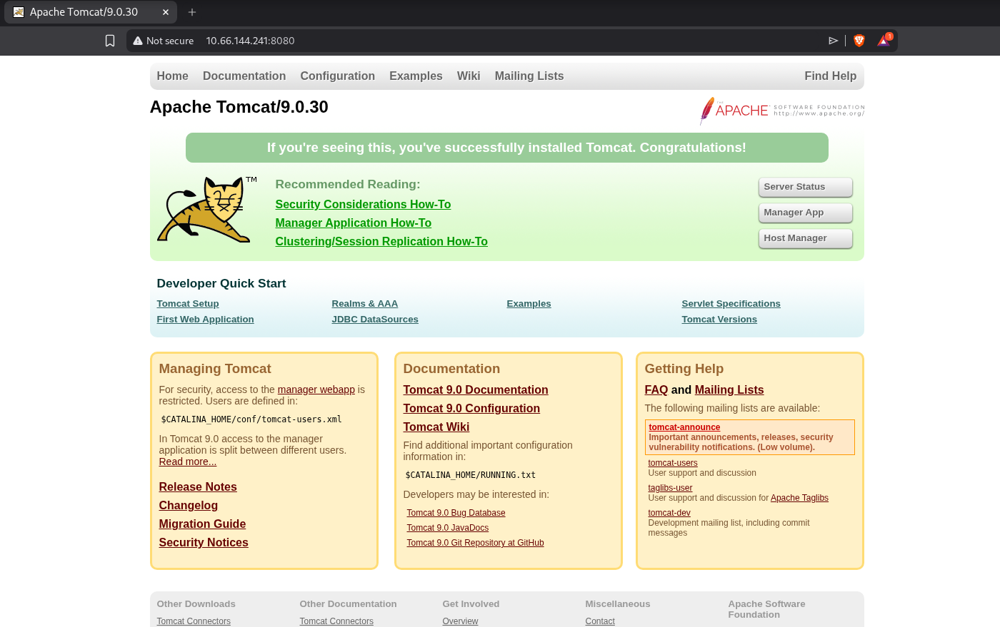<figcaption></figcaption></figure>

Searching for exploits, I discover that is vulnerable and has a `CVE-2020-1938`.



Running this exploit, I was able to read `web.xml` file, which contains an user and password.

<figure>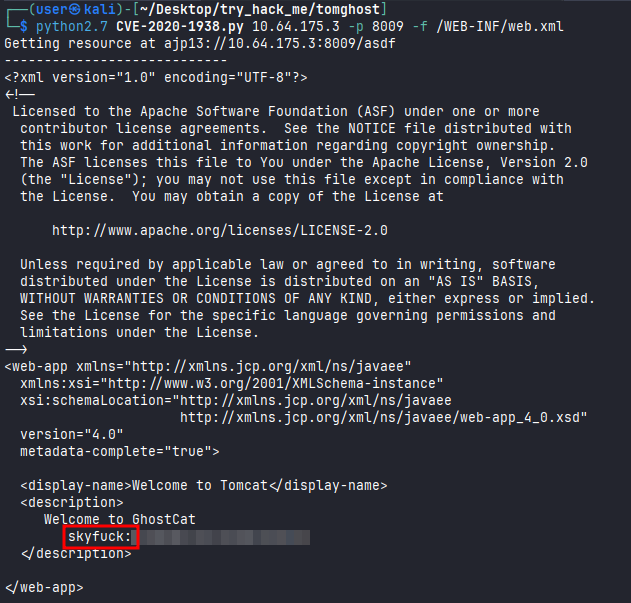<figcaption></figcaption></figure>

I can access SSH successfully with skyfuck user.

<figure><figcaption></figcaption></figure>

Reading the `user.txt` flag.

<figure><figcaption></figcaption></figure>

## Lateral Privilege Escalation

There are two interesting files, `credential.pgp` and `tryhackme.asc`. 

*Pgp is a binary file. It is typically used for encrypted data or signed files in a compact, machine-friendly format.* 

*An .asc file is a plain text file format based on the American Standard Code for Information Interchange (ASCII). Often used to store digital signatures, public keys, or secure messages.*

<figure>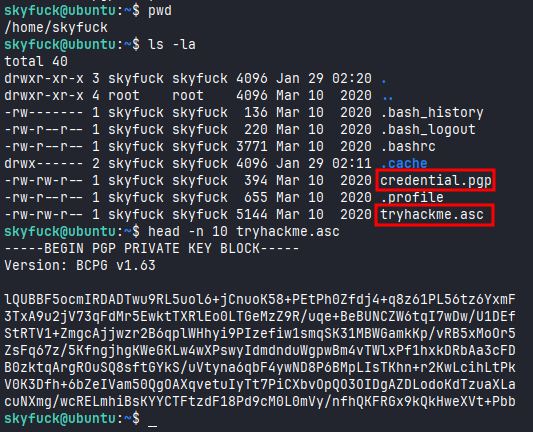<figcaption></figcaption></figure>

I need to import the `asc` file then decrypt the `.pgp` file, but it require a passphrase, in that case I don't have it.

<figure>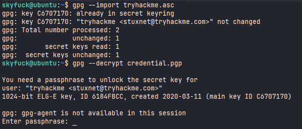<figcaption></figcaption></figure>

The idea is to try to find that out it. To do that, I sent the files to my local machine using `wget` (I could also use `scp`).

<figure>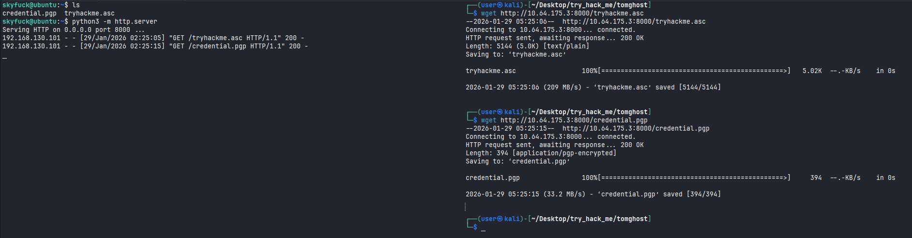<figcaption></figcaption></figure>
<figure>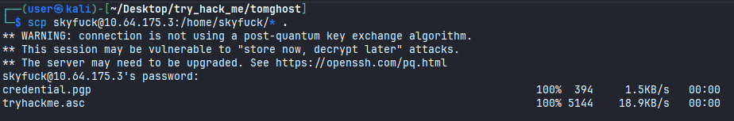<figcaption></figcaption></figure>

I can use `gpg2john` in `.asc` file to modify the content to be able to use `john`. 

<figure>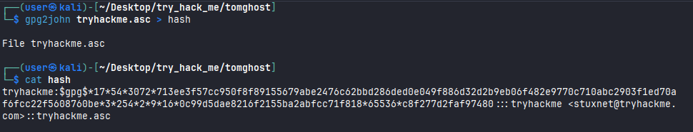<figcaption></figcaption></figure>

Since I did that, I was able to find the passphrase.

<figure>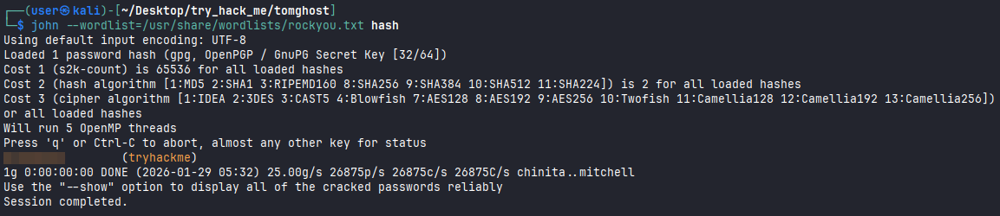<figcaption></figcaption></figure>

Now I can decrypt it successfully. It contains a password to login as Merlin user.

<figure>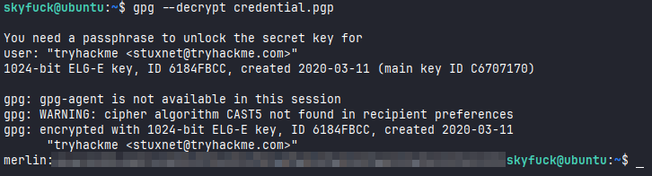<figcaption></figcaption></figure>
## Privilege Escalation

Searching for commands that I can run as sudo, I found `/usr/bin/zip` that I can run as sudo with no password.

<figure>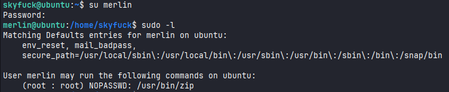<figcaption></figcaption></figure>

I can spawn a shell as root using this command bellow.

```
sudo zip anything.zip /etc/hosts -T -TT '/bin/bash #'
```

<figure>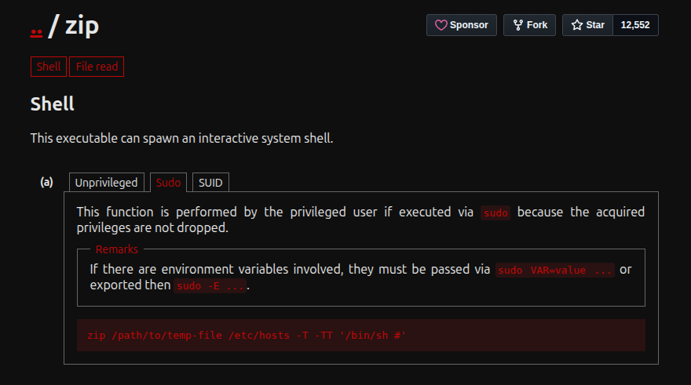<figcaption></figcaption></figure>

Done! I was able to get a shell as root.

<figure>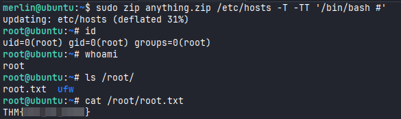<figcaption></figcaption></figure>

