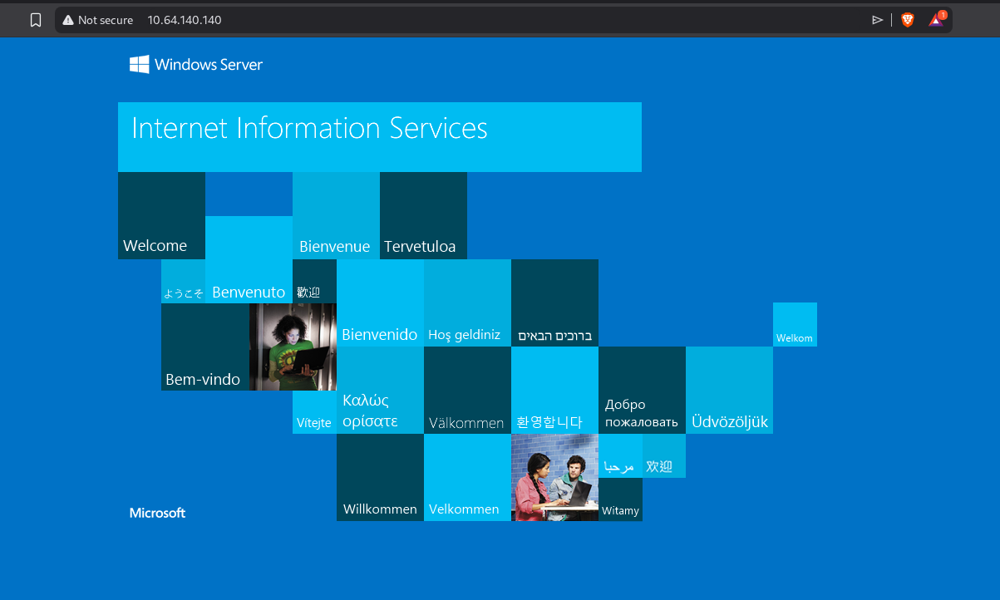
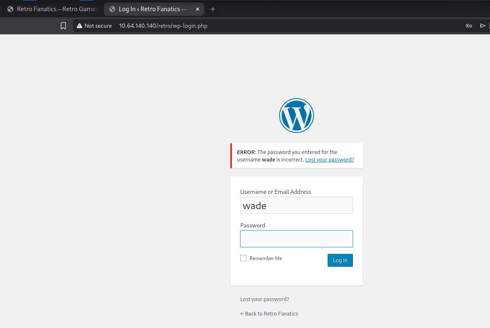
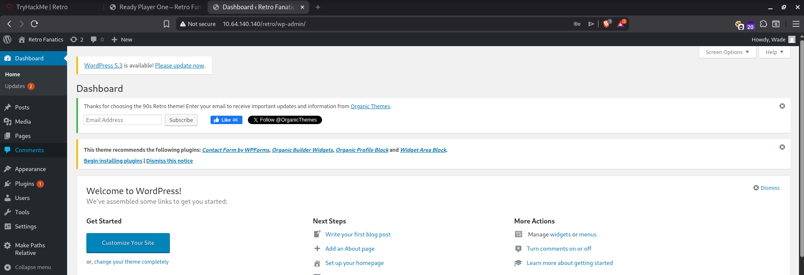
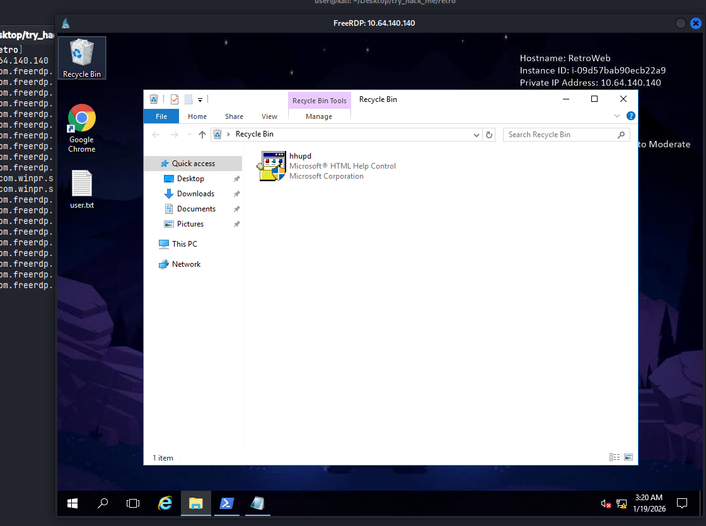
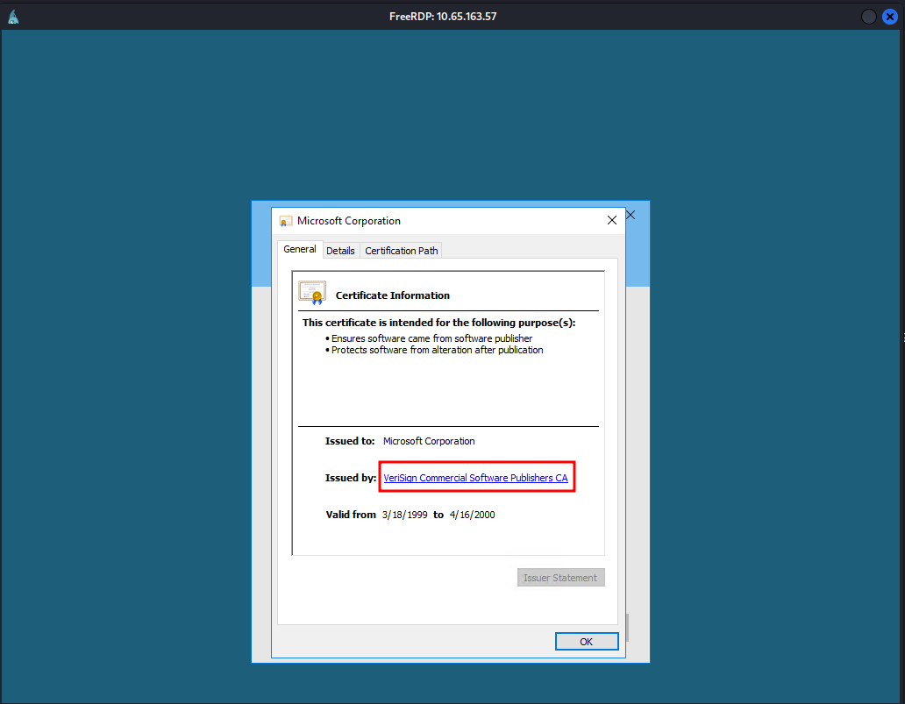
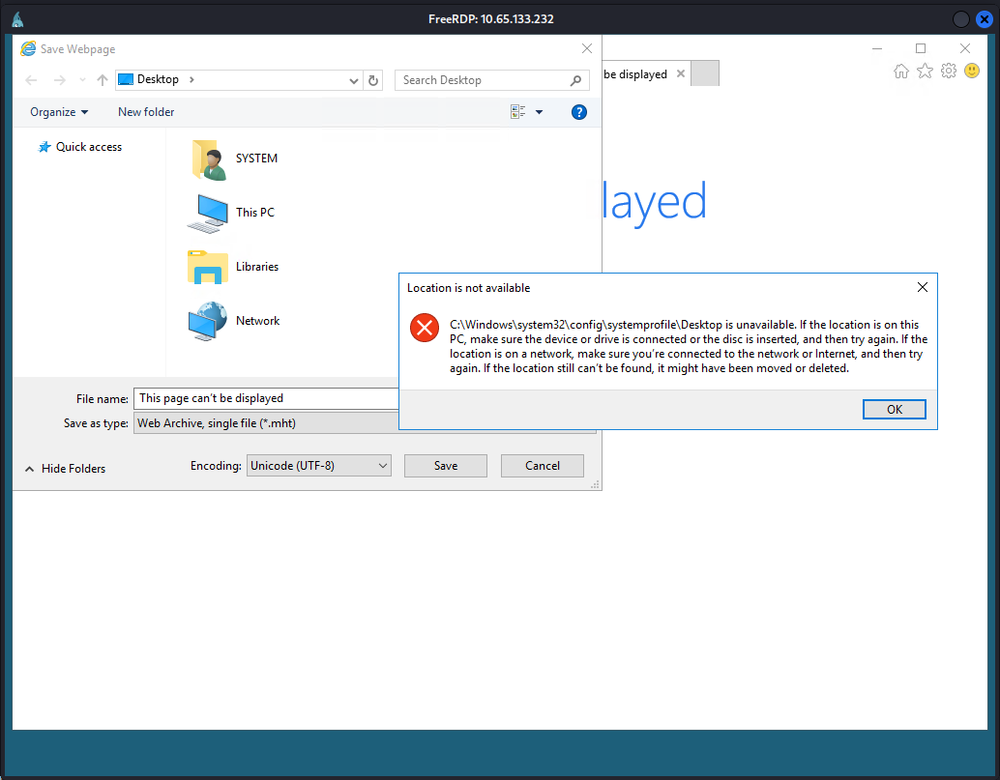
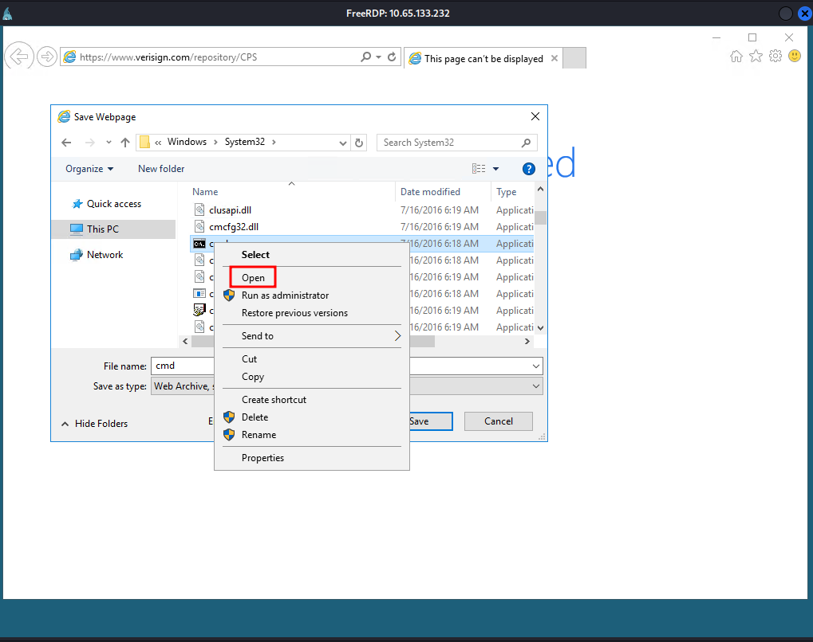
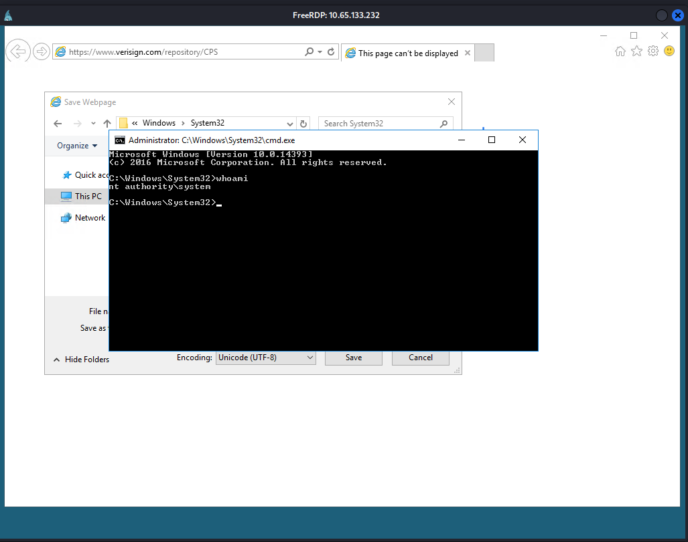
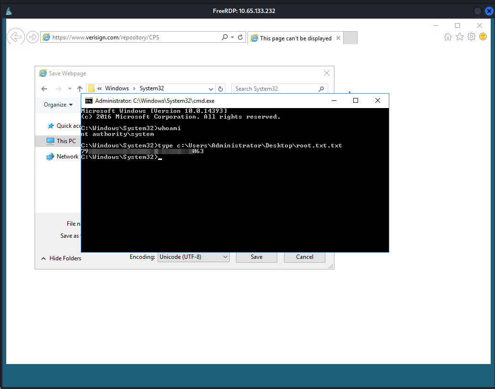

# Retro

#Windows #CVE-2019-1388 #Wordpress 

## Reconnaissance

I started running nmap and I got the following result.

```
$ nmap -sV -Pn 10.64.140.140
Starting Nmap 7.98 ( https://nmap.org ) at 2026-01-19 05:23 -0500
Nmap scan report for 10.64.140.140
Host is up (0.13s latency).
Not shown: 998 filtered tcp ports (no-response)
PORT     STATE SERVICE       VERSION
80/tcp   open  http          Microsoft IIS httpd 10.0
3389/tcp open  ms-wbt-server Microsoft Terminal Services
Service Info: OS: Windows; CPE: cpe:/o:microsoft:windows

Service detection performed. Please report any incorrect results at https://nmap.org/submit/ .
Nmap done: 1 IP address (1 host up) scanned in 18.63 seconds
```

Accessing on port 80, we can see this default page.

<figure><figcaption></figcaption></figure>

Searching for directories, I found `retro`.

```
$ ffuf -u http://10.64.140.140/FUZZ -w /usr/share/wordlists/seclists/Discovery/Web-Content/raft-large-directories.txt 

        /'___\  /'___\           /'___\       
       /\ \__/ /\ \__/  __  __  /\ \__/       
       \ \ ,__\\ \ ,__\/\ \/\ \ \ \ ,__\      
        \ \ \_/ \ \ \_/\ \ \_\ \ \ \ \_/      
         \ \_\   \ \_\  \ \____/  \ \_\       
          \/_/    \/_/   \/___/    \/_/       

       v2.1.0-dev
________________________________________________

 :: Method           : GET
 :: URL              : http://10.64.140.140/FUZZ
 :: Wordlist         : FUZZ: /usr/share/wordlists/seclists/Discovery/Web-Content/raft-large-directories.txt
 :: Follow redirects : false
 :: Calibration      : false
 :: Timeout          : 10
 :: Threads          : 40
 :: Matcher          : Response status: 200-299,301,302,307,401,403,405,500
________________________________________________

retro                   [Status: 301, Size: 150, Words: 9, Lines: 2, Duration: 296ms]
```

What a beautiful retro blog!

<figure><figcaption></figcaption></figure>

I noticed that is using `Wordpress v5.2.1`.

<figure><figcaption></figcaption></figure>

Looking through the blog, I found a possible user `Wade`. We can validate it by trying to use this user. As we can see, this is a valid user.

<figure><figcaption></figcaption></figure>

Performing a brute-force attack on `Wade` password, I can find a password `parzival`. 

<figure><figcaption></figcaption></figure>

I was able to login successfully into Wordpress, although this will not be necessary from now on.

<figure><figcaption></figcaption></figure>

## Privilege Escalation

Since the port `3389` is open, I can try to access remotely using `xfreerdp`.

<figure><figcaption></figcaption></figure>

I notice a file `hhupd` on recycle bin.

<figure><figcaption></figcaption></figure>

I search about this file and I found a `CVE-2019-1388`. Following this article, I can exploit it to escalate the privilege.



When running this file, you must click on "Show more details".

Step 1
<figure><figcaption></figcaption></figure>

Step 2
<figure><figcaption></figcaption></figure>

Step 3
<figure><figcaption></figcaption></figure>

Step 4
<figure><figcaption></figcaption></figure>

Step 5
<figure><figcaption></figcaption></figure>

Step 6
<figure><figcaption></figcaption></figure>

Step 7
<figure><figcaption></figcaption></figure>

After all theses steps, I am now administrator of this system.
<figure><figcaption></figcaption></figure>

Reading the `root.txt.txt` flag.
<figure><figcaption></figcaption></figure>