# Year of the Jellyfish

#Linux #PHP #Monitorr #PrivEsc 
## Reconnaissance 

I started running nmap and I got this following result.

```
$ nmap -p- -sV -sC 10.64.95.248
Starting Nmap 7.98 ( https://nmap.org ) at 2026-02-25 05:50 -0500
Nmap scan report for robyns-petshop.thm (10.64.95.248)
Host is up (0.14s latency).
Not shown: 65528 filtered tcp ports (no-response)
PORT      STATE SERVICE  VERSION
21/tcp    open  ftp      vsftpd 3.0.3
22/tcp    open  ssh      OpenSSH 5.9p1 Debian 5ubuntu1.4 (Ubuntu Linux; protocol 2.0)
| ssh-hostkey: 
|_  2048 46:b2:81:be:e0:bc:a7:86:39:39:82:5b:bf:e5:65:58 (RSA)
80/tcp    open  http     Apache httpd 2.4.29
|_http-title: Did not follow redirect to https://robyns-petshop.thm/
|_http-server-header: Apache/2.4.29 (Ubuntu)
443/tcp   open  ssl/http Apache httpd 2.4.29 ((Ubuntu))
| tls-alpn: 
|_  http/1.1
|_ssl-date: TLS randomness does not represent time
|_http-title: Robyn&#039;s Pet Shop
| ssl-cert: Subject: commonName=robyns-petshop.thm/organizationName=Robyns Petshop/stateOrProvinceName=South West/countryName=GB
| Subject Alternative Name: DNS:robyns-petshop.thm, DNS:monitorr.robyns-petshop.thm, DNS:beta.robyns-petshop.thm, DNS:dev.robyns-petshop.thm
| Not valid before: 2026-02-25T10:47:32
|_Not valid after:  2027-02-25T10:47:32
|_http-server-header: Apache/2.4.29 (Ubuntu)
8000/tcp  open  http-alt
| fingerprint-strings: 
|   GenericLines: 
|     HTTP/1.1 400 Bad Request
|     Content-Length: 15
|_    Request
8096/tcp  open  http     Microsoft Kestrel httpd
|_http-server-header: Kestrel
| http-robots.txt: 1 disallowed entry 
|_/
| http-title: Jellyfin
|_Requested resource was /web/index.html
22222/tcp open  ssh      OpenSSH 7.6p1 Ubuntu 4ubuntu0.3 (Ubuntu Linux; protocol 2.0)
| ssh-hostkey: 
|   2048 8d:99:92:52:8e:73:ed:91:01:d3:a7:a0:87:37:f0:4f (RSA)
|   256 5a:c0:cc:a1:a8:79:eb:fd:6f:cf:f8:78:0d:2f:5d:db (ECDSA)
|_  256 0a:ca:b8:39:4e:ca:e3:cf:86:5c:88:b9:2e:25:7a:1b (ED25519)
```

By accessing the main port `80`, I got this page.

<figure>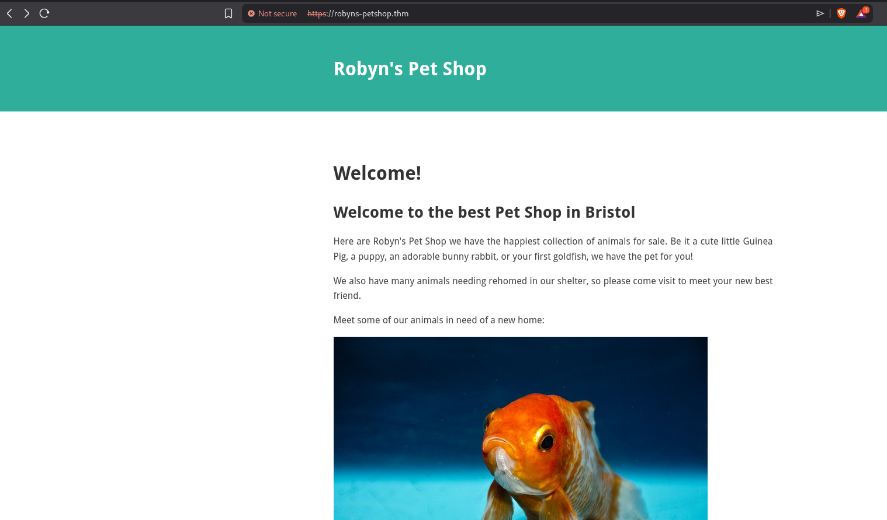<figcaption></figcaption></figure>

Accessing the port `8000` I have this page.

<figure>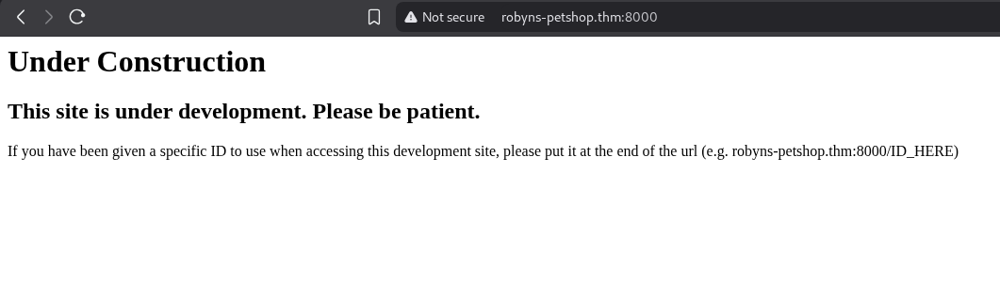<figcaption></figcaption></figure>

And finally accessing the port `8096` I have this following page.

<figure>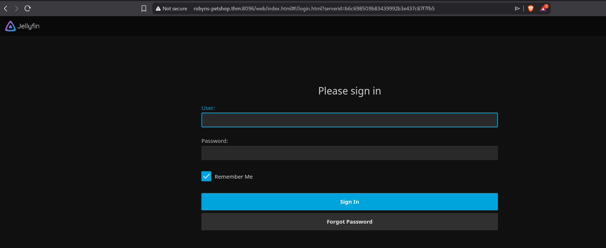<figcaption></figcaption></figure>

## Enumeration

I spent a few time trying to enumerate this previous pages, but I didn't get anything.

I noticed that on nmap results, I could access the subdomain `monitorr.robyns-petshop.thm`. We can see that Monitorr *is a webfront to live display the status of any webapp or service* and is on version `1.7.6`.

<figure>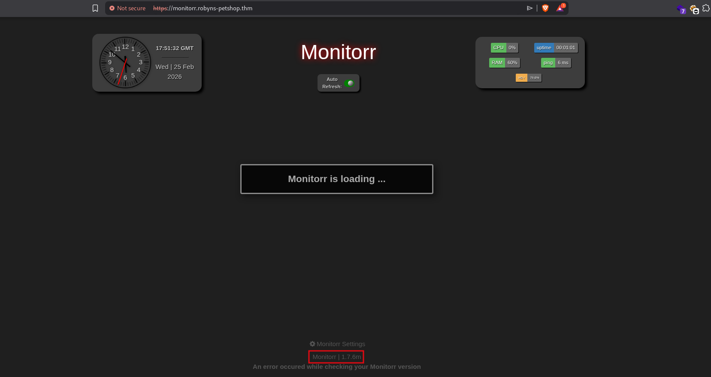<figcaption></figcaption></figure>

I found a few interesting folders on this subdomain.

```
$ ffuf -u https://monitorr.robyns-petshop.thm/FUZZ -w /usr/share/wordlists/seclists/Discovery/Web-Content/raft-large-directories.txt

        /'___\  /'___\           /'___\       
       /\ \__/ /\ \__/  __  __  /\ \__/       
       \ \ ,__\\ \ ,__\/\ \/\ \ \ \ ,__\      
        \ \ \_/ \ \ \_/\ \ \_\ \ \ \ \_/      
         \ \_\   \ \_\  \ \____/  \ \_\       
          \/_/    \/_/   \/___/    \/_/       

       v2.1.0-dev
________________________________________________

 :: Method           : GET
 :: URL              : https://monitorr.robyns-petshop.thm/FUZZ
 :: Wordlist         : FUZZ: /usr/share/wordlists/seclists/Discovery/Web-Content/raft-large-directories.txt
 :: Follow redirects : false
 :: Calibration      : false
 :: Timeout          : 10
 :: Threads          : 40
 :: Matcher          : Response status: 200-299,301,302,307,401,403,405,500
________________________________________________

data              [Status: 301, Size: 343, Words: 20, Lines: 10, Duration: 133ms]
assets            [Status: 301, Size: 345, Words: 20, Lines: 10, Duration: 133ms]
...
```

Searching for exploits, I found these two. The first one didn't work, so I tried the second one.

<figure>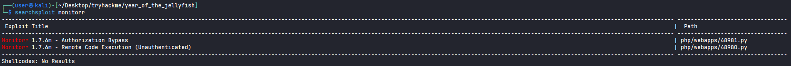<figcaption></figcaption></figure>

We can take a look on this exploit, it allows us to upload a malicious PHP file to get a Remote Code Execution.

<figure>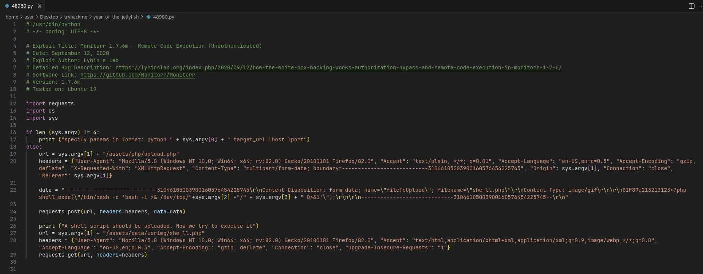<figcaption></figcaption></figure>

But running it, I got some errors.

<figure>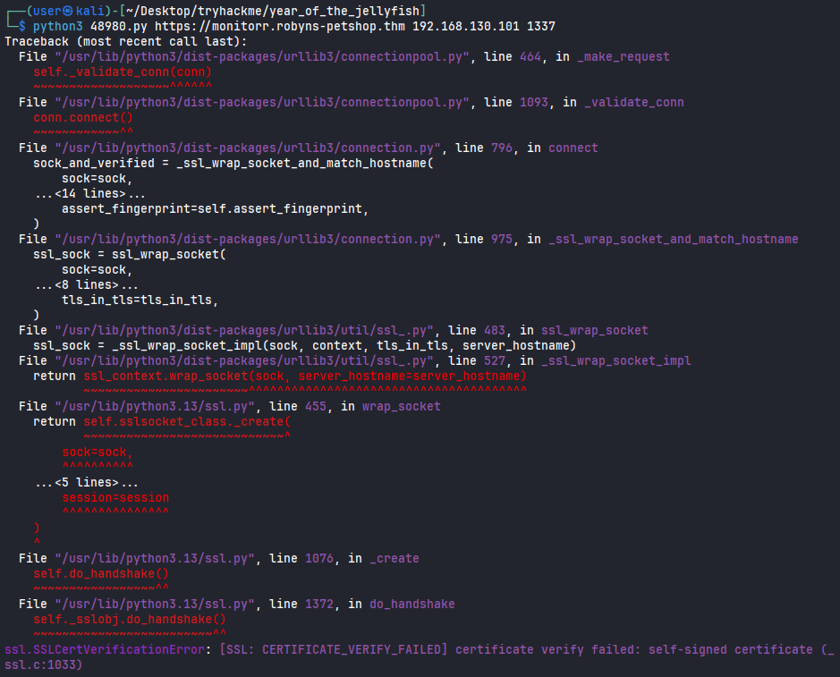<figcaption></figcaption></figure>

It looks like we have some SSL error. We can solve it adding a `verify=False` on post request to ignore the SSL certificate verification.

<figure>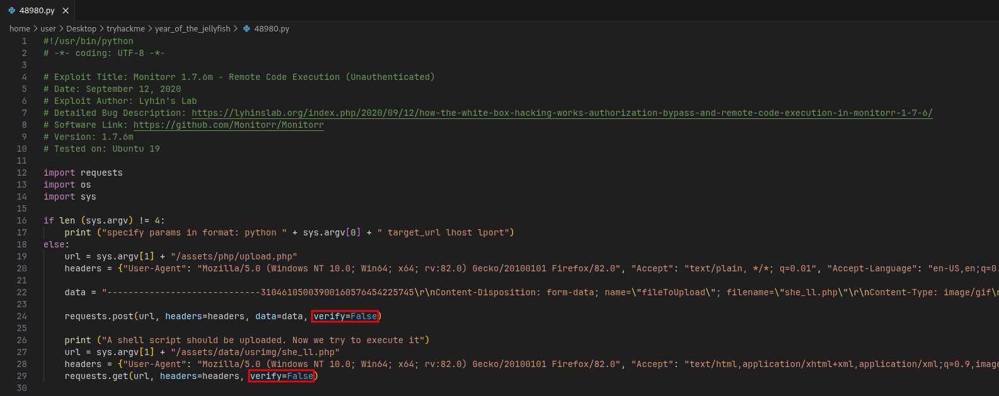<figcaption></figcaption></figure>

Even adding it, I got a error.

<figure>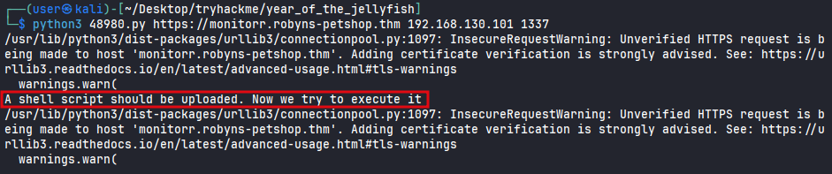<figcaption></figcaption></figure>

I started thinking about some ways to get the exploit to work. I noticed that I could read the source code, since the repository is public. According to the exploit, the upload file was located on `assets/php/upload.php`. We can noticed that if it's checking using `getimagesize()` function, so it's not possible to send a `.php` extension file.

<figure>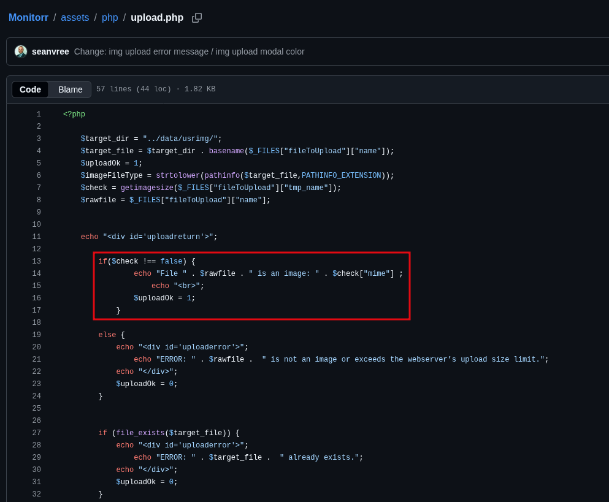<figcaption></figcaption></figure>

After that, I accessed the file to see its behavior.

<figure>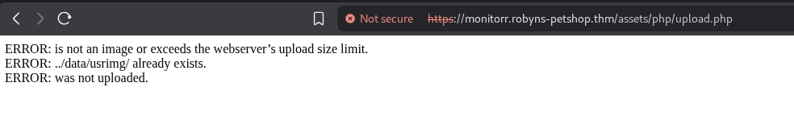<figcaption></figcaption></figure>

Using Burpsuite to intercept the request, we can see that it's necessary to set a cookie as `isHuman=1` to work correctly (it wasn't present in the exploit).

<figure>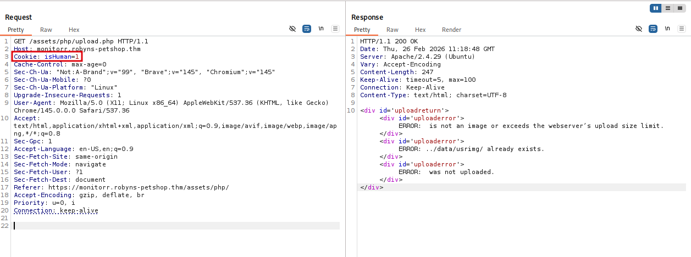<figcaption></figcaption></figure>

I tried again adding this cookie, but it didn't work as well.

<figure>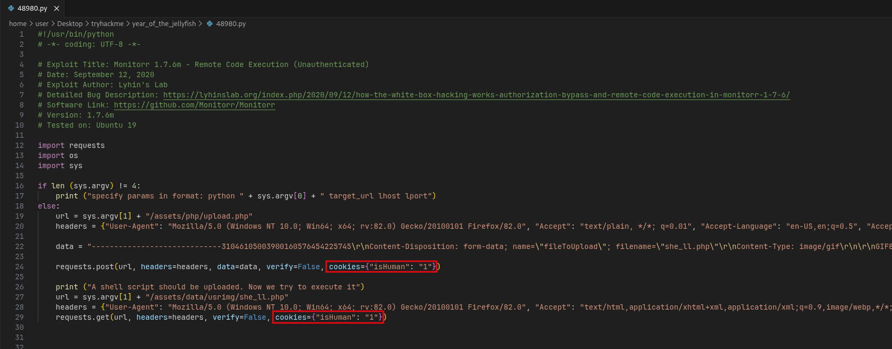<figcaption></figcaption></figure>
<figure>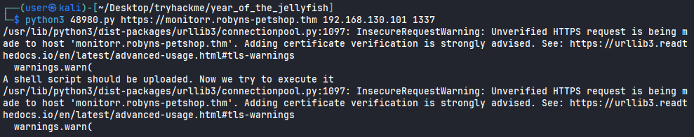<figcaption></figcaption></figure>

I changed the method request to POST and copied the header and body request from the exploit to see better its behavior when I send a file. We can noticed that it's possible to send a image.

<figure>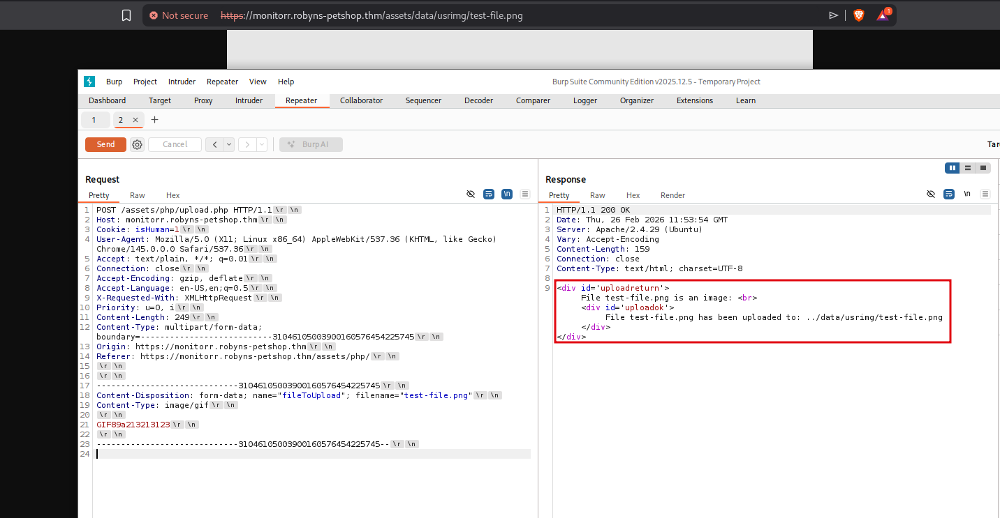<figcaption></figcaption></figure>

But the problem is, I was not allowed to send a PHP file as we know. We can see that the exploit was using a `.php` file extension. 

<figure>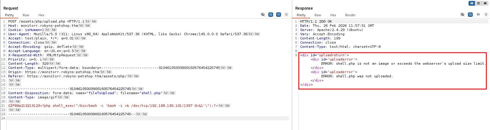<figcaption></figcaption></figure>

According to the application, it is only using the extension for validation. We can bypass that adding a `.png.PhP` extension, or `.png.phtml`, something like that. Doing that, I got a reverse shell.

<figure>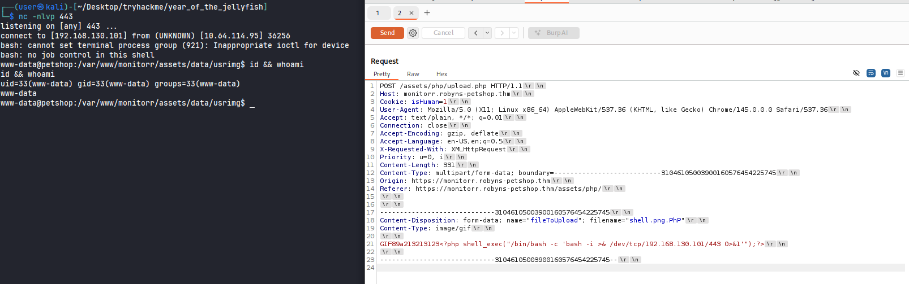<figcaption></figcaption></figure>

Accessing `robyn` folder on `home`, I didn't find the flag.

<figure>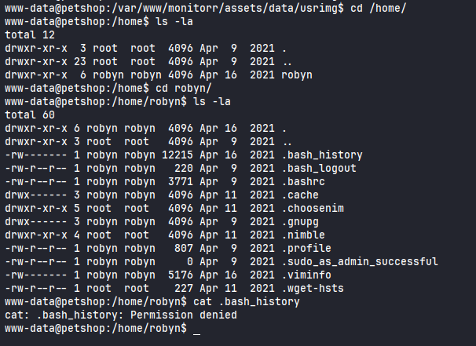<figcaption></figcaption></figure>

I was located on `/var/www`. I was able to read the `flag1.txt` file.

<figure>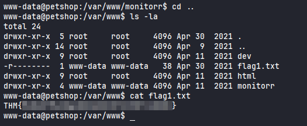<figcaption></figcaption></figure>

## Privilege Escalation

Searching for files, I noticed that the pkexec binary had SUID bit set.

<figure>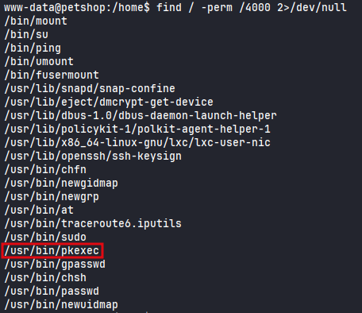<figcaption></figcaption></figure>

Running the `PwnKit` script, I got a shell as a root!

<figure>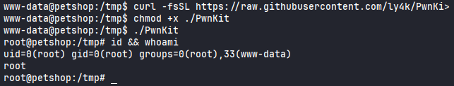<figcaption></figcaption></figure>

Reading the `root.txt` flag.

<figure>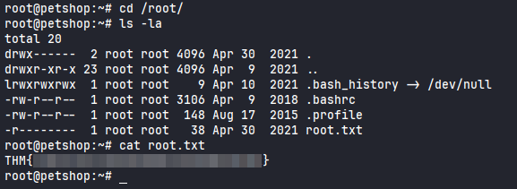<figcaption></figcaption></figure>