# Year of the Owl

#Windows 
## Reconnaissance

I started running nmap and I got the following result.

```
$ nmap -p- -sV -sC 10.64.152.37
Starting Nmap 7.98 ( https://nmap.org ) at 2026-02-28 05:50 -0500
Nmap scan report for 10.64.152.37
Host is up (0.13s latency).
Not shown: 65527 filtered tcp ports (no-response)
PORT      STATE SERVICE       VERSION
80/tcp    open  http          Apache httpd 2.4.46 ((Win64) OpenSSL/1.1.1g PHP/7.4.10)
|_http-server-header: Apache/2.4.46 (Win64) OpenSSL/1.1.1g PHP/7.4.10
|_http-title: Year of the Owl
139/tcp   open  netbios-ssn   Microsoft Windows netbios-ssn
443/tcp   open  ssl/http      Apache httpd 2.4.46 ((Win64) OpenSSL/1.1.1g PHP/7.4.10)
|_http-server-header: Apache/2.4.46 (Win64) OpenSSL/1.1.1g PHP/7.4.10
|_ssl-date: TLS randomness does not represent time
| tls-alpn: 
|_  http/1.1
|_http-title: Year of the Owl
| ssl-cert: Subject: commonName=localhost
| Not valid before: 2009-11-10T23:48:47
|_Not valid after:  2019-11-08T23:48:47
445/tcp   open  microsoft-ds?
3306/tcp  open  mysql         MariaDB 10.3.24 or later (unauthorized)
3389/tcp  open  ms-wbt-server Microsoft Terminal Services
| rdp-ntlm-info: 
|   Target_Name: YEAR-OF-THE-OWL
|   NetBIOS_Domain_Name: YEAR-OF-THE-OWL
|   NetBIOS_Computer_Name: YEAR-OF-THE-OWL
|   DNS_Domain_Name: year-of-the-owl
|   DNS_Computer_Name: year-of-the-owl
|   Product_Version: 10.0.17763
|_  System_Time: 2026-02-28T10:53:07+00:00
|_ssl-date: 2026-02-28T10:53:48+00:00; 0s from scanner time.
| ssl-cert: Subject: commonName=year-of-the-owl
| Not valid before: 2026-02-27T10:28:02
|_Not valid after:  2026-08-29T10:28:02
5985/tcp  open  http          Microsoft HTTPAPI httpd 2.0 (SSDP/UPnP)
|_http-title: Not Found
|_http-server-header: Microsoft-HTTPAPI/2.0
47001/tcp open  http          Microsoft HTTPAPI httpd 2.0 (SSDP/UPnP)
|_http-title: Not Found
|_http-server-header: Microsoft-HTTPAPI/2.0
Service Info: OS: Windows; CPE: cpe:/o:microsoft:windows

Host script results:
| smb2-security-mode: 
|   3.1.1: 
|_    Message signing enabled but not required
| smb2-time: 
|   date: 2026-02-28T10:53:08
|_  start_date: N/A
```

By accessing the default port `80`, I got this page. 

<figure>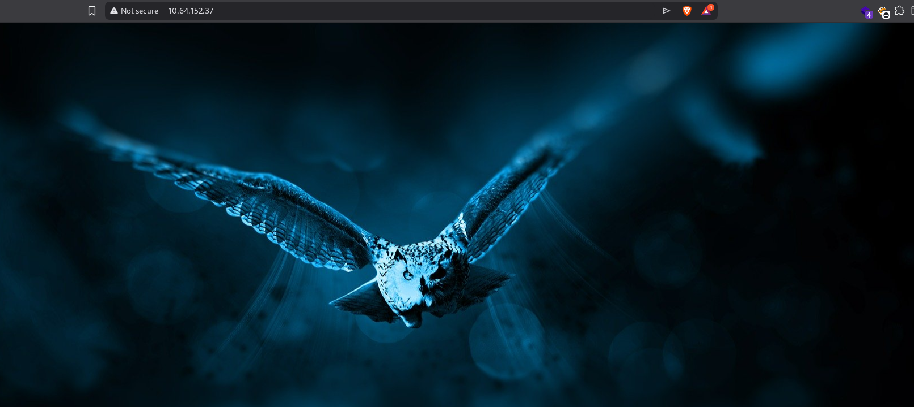<figcaption></figcaption></figure>
## Enumeration

I spend a considerable time trying to enumerate the website and others ports I found on nmap results, but I didn't get anything. I tried to enumerate other services like MySQL,RDP, NetBIOS/SMB but with without success. At that moment, I was stuck and didn't know what to do. I read an article and I can know that There is an SNMP server running on UDP port 161.

We need to find out the "Community String" that SNMP uses for verification. I used `onesixtyone` to perform this and we can see that is `openview`.

<figure>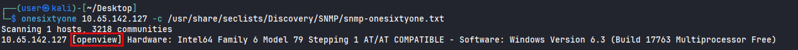<figcaption></figcaption></figure>

Since we know that, I used `snmpwalk` to enumerate user accounts (we need to send the sequence number `1.3.6.1.4.1.77.1.2.25`, this is how SNMP works, it needs this value to verify the user accounts). We have 5 accounts, the only one is not default is `Jareth`.

<figure>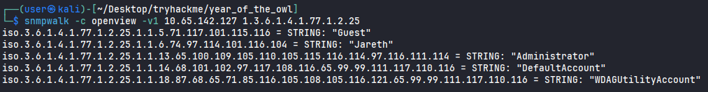<figcaption></figcaption></figure>

Now I had a username but not a password. I used a tool called `crackmapexec` to try to discover.

```
crackmapexec smb 10.65.142.127 -u Jareth -p /usr/share/wordlists/rockyou.txt
```

<figure>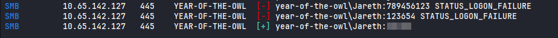<figcaption></figcaption></figure>

After discovered the password, I was able to authenticate myself with this user, using `evil-winrm`. (I tried to login using RDP but I was unable to do it). Reading the `user.txt` flag.

<figure>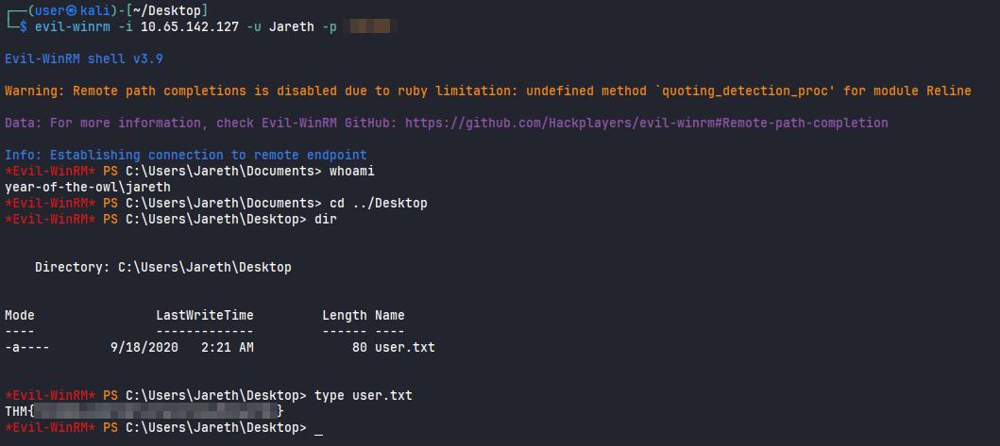<figcaption></figcaption></figure>

## Privilege Escalation

I ran some scripts but none of them returned anything interesting. Looking for files on Recycle bin, I found these two folders.

<figure>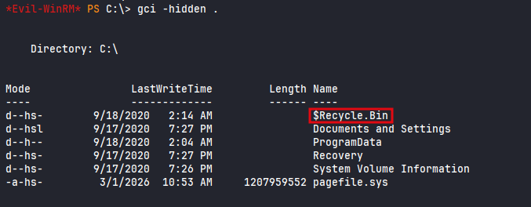<figcaption></figcaption></figure>
<figure>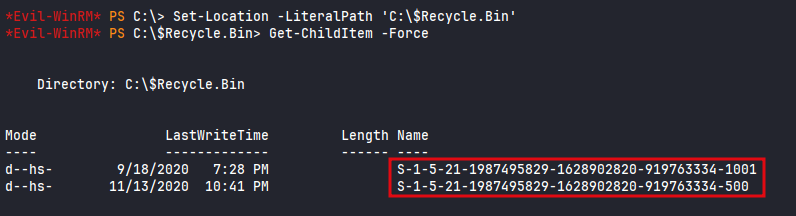<figcaption></figcaption></figure>

Accessing the first folder, I found two files `sam.bak` and `system.bak`.

<figure>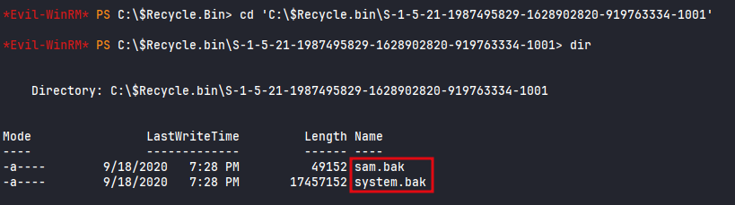<figcaption></figcaption></figure>

Downloading the files to my local machine.

<figure>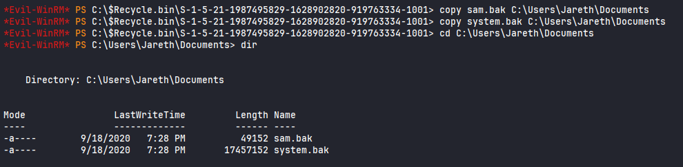<figcaption></figcaption></figure>
<figure>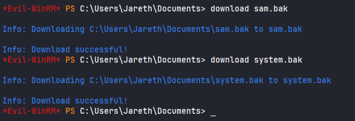<figcaption></figcaption></figure>

I used `impacket-secretsdump` to find the hash. 

<figure>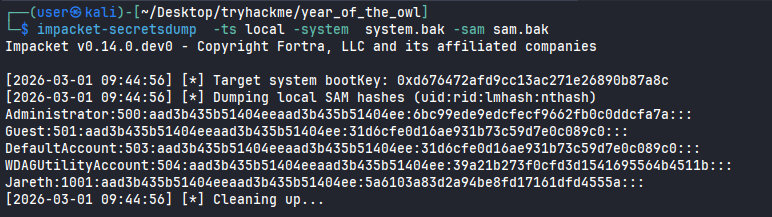<figcaption></figcaption></figure>

Since I was able to do it, I used `evil-winrm` to authenticate as Administrator passing the hash founded. I was able to read `admin.txt` flag.

<figure>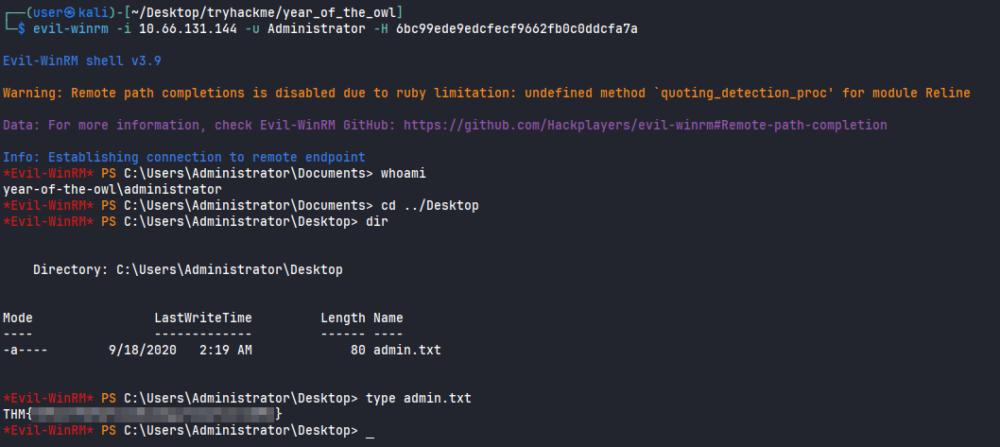<figcaption></figcaption></figure>


