#Linux #Wordpress #PHP #PrivEsc #WebExploitation 
# Mr Robot

## Reconnaissance

I started running nmap and I got the following result.

```
$ nmap -sV -sC 10.65.172.144
Starting Nmap 7.98 ( https://nmap.org ) at 2026-01-04 06:12 -0500
Nmap scan report for 10.65.172.144
Host is up (0.15s latency).
Not shown: 997 filtered tcp ports (no-response)
PORT    STATE SERVICE  VERSION
22/tcp  open  ssh      OpenSSH 8.2p1 Ubuntu 4ubuntu0.13 (Ubuntu Linux; protocol 2.0)
| ssh-hostkey: 
|   3072 95:1b:0f:2b:63:2e:ae:82:57:f4:a4:3d:fe:2e:10:47 (RSA)
|   256 0f:30:11:06:1c:a3:46:71:1b:6c:b7:4e:72:68:08:a9 (ECDSA)
|_  256 57:9a:13:c3:f3:3f:36:8a:74:47:d5:73:22:7f:8c:8c (ED25519)
80/tcp  open  http     Apache httpd
|_http-title: Site doesn't have a title (text/html).
|_http-server-header: Apache
443/tcp open  ssl/http Apache httpd
|_ssl-date: TLS randomness does not represent time
|_http-title: Site doesn't have a title (text/html).
| ssl-cert: Subject: commonName=www.example.com
| Not valid before: 2015-09-16T10:45:03
|_Not valid after:  2025-09-13T10:45:03
|_http-server-header: Apache
Service Info: OS: Linux; CPE: cpe:/o:linux:linux_kernel

Service detection performed. Please report any incorrect results at https://nmap.org/submit/ .
Nmap done: 1 IP address (1 host up) scanned in 30.18 seconds

```

Accessing the main page, I got the following page.

<figure>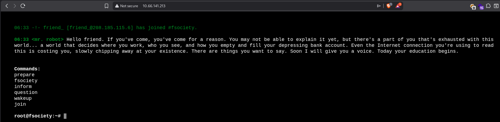<figcaption></figcaption></figure>
## Enumeration

I started the enumeration by running `ffuf` and I noticed that the applications is using wordpress.

```
$ ffuf -u http://10.65.172.144/FUZZ -w /usr/share/wordlists/seclists/Discovery/Web-Content/raft-medium-directories.txt

        /'___\  /'___\           /'___\       
       /\ \__/ /\ \__/  __  __  /\ \__/       
       \ \ ,__\\ \ ,__\/\ \/\ \ \ \ ,__\      
        \ \ \_/ \ \ \_/\ \ \_\ \ \ \ \_/      
         \ \_\   \ \_\  \ \____/  \ \_\       
          \/_/    \/_/   \/___/    \/_/       

       v2.1.0-dev
________________________________________________

 :: Method           : GET
 :: URL              : http://10.65.172.144/FUZZ
 :: Wordlist         : FUZZ: /usr/share/wordlists/seclists/Discovery/Web-Content/raft-medium-directories.txt
 :: Follow redirects : false
 :: Calibration      : false
 :: Timeout          : 10
 :: Threads          : 40
 :: Matcher          : Response status: 200-299,301,302,307,401,403,405,500
________________________________________________

images          [Status: 301, Size: 236, Words: 14, Lines: 8, Duration: 148ms]
admin           [Status: 301, Size: 235, Words: 14, Lines: 8, Duration: 148ms]
wp-content      [Status: 301, Size: 240, Words: 14, Lines: 8, Duration: 148ms]
wp-includes     [Status: 301, Size: 241, Words: 14, Lines: 8, Duration: 149ms]
css             [Status: 301, Size: 233, Words: 14, Lines: 8, Duration: 150ms]
wp-admin        [Status: 301, Size: 238, Words: 14, Lines: 8, Duration: 151ms]
js              [Status: 301, Size: 232, Words: 14, Lines: 8, Duration: 151ms]
blog            [Status: 301, Size: 234, Words: 14, Lines: 8, Duration: 147ms]
login           [Status: 302, Size: 0, Words: 1, Lines: 1, Duration: 1542ms]
feed            [Status: 301, Size: 0, Words: 1, Lines: 1, Duration: 442ms]
xmlrpc          [Status: 405, Size: 42, Words: 6, Lines: 1, Duration: 1736ms]
rss             [Status: 301, Size: 0, Words: 1, Lines: 1, Duration: 408ms]
video           [Status: 301, Size: 235, Words: 14, Lines: 8, Duration: 148ms]
sitemap         [Status: 200, Size: 0, Words: 1, Lines: 1, Duration: 147ms]
image           [Status: 301, Size: 0, Words: 1, Lines: 1, Duration: 390ms]
audio           [Status: 301, Size: 235, Words: 14, Lines: 8, Duration: 147ms]
phpmyadmin      [Status: 403, Size: 94, Words: 14, Lines: 1, Duration: 146ms]
dashboard       [Status: 302, Size: 0, Words: 1, Lines: 1, Duration: 389ms]
wp-login        [Status: 200, Size: 2613, Words: 115, Lines: 53, Duration: 420ms]
atom            [Status: 301, Size: 0, Words: 1, Lines: 1, Duration: 407ms]
robots          [Status: 200, Size: 41, Words: 2, Lines: 4, Duration: 148ms]
license         [Status: 200, Size: 309, Words: 25, Lines: 157, Duration: 271ms]
								...
```

We got the first flag on `robots` page.

<figure>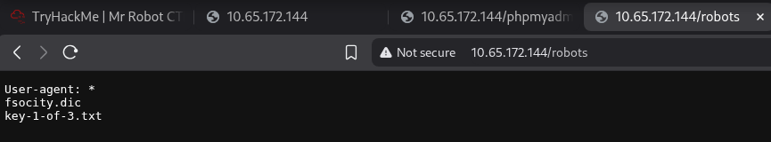<figcaption></figcaption></figure>

Reading `license` directory, we can have a clue encoded in base64.

<figure>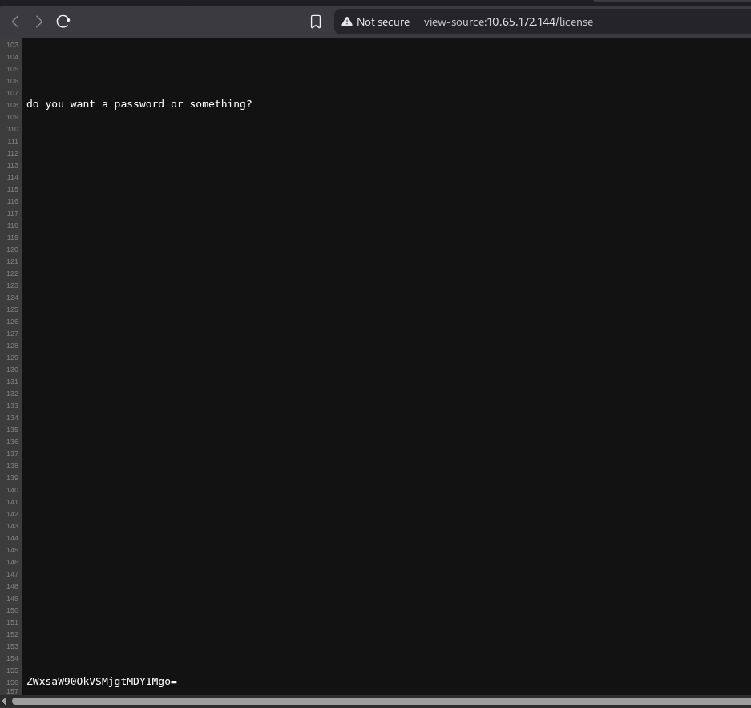<figcaption></figcaption></figure>

Decoding it, we have elliot's credentials.

<figure>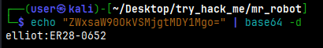<figcaption></figcaption></figure>

Using this, we can access wordpress. Since I was able to edit files, I wrote a webshell to gain access.

<figure>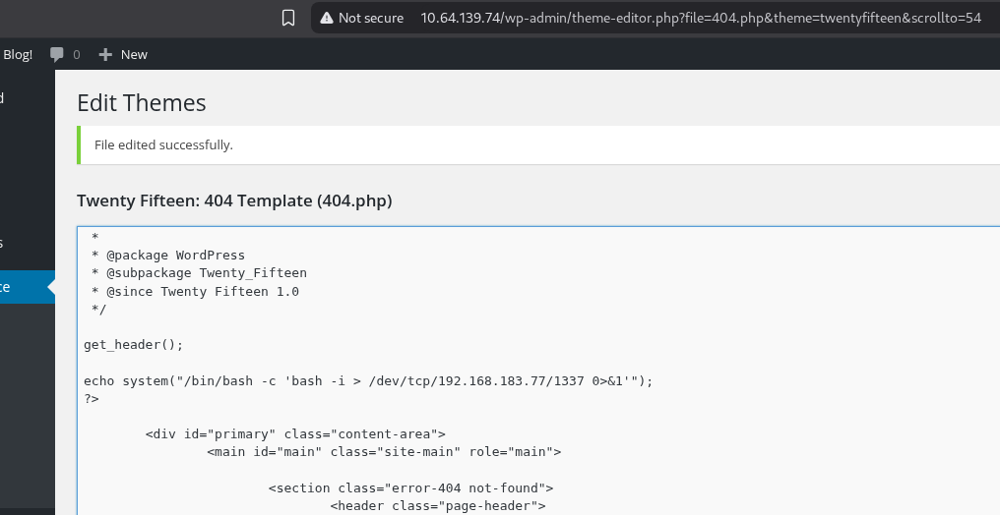<figcaption></figcaption></figure>

By accessing `404.php` page, I got a shell.

<figure>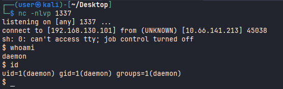<figcaption></figcaption></figure>

I was unable to read the second flag `key-2-of-3.txt`. I had to use a tool to discover the content of `password.raw-md5`. After discover this, I was able to login as `robot` and read the flag.

<figure>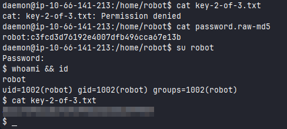<figcaption></figcaption></figure>


<figure>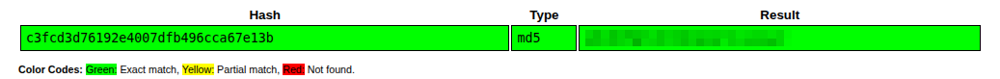<figcaption></figcaption></figure>

Running linpeas script, I found a SUID `nmap`. 

<figure>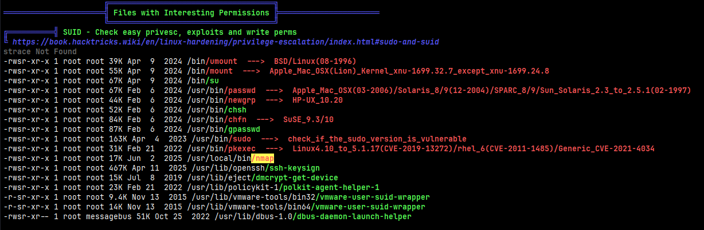<figcaption></figcaption></figure>

Checking on GTFOBIns, I noticed that we can get a root running the command `nmap --interactive`.

<figure>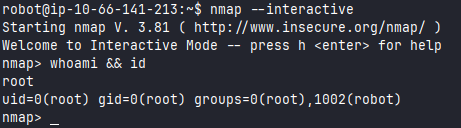<figcaption></figcaption></figure>

Since I'm root, I was able to read the final flag `key-3-of-3.txt`.

<figure>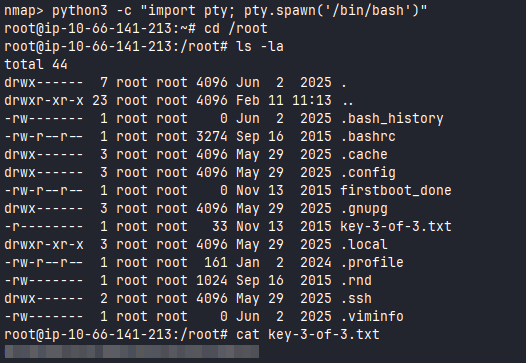<figcaption></figcaption></figure>