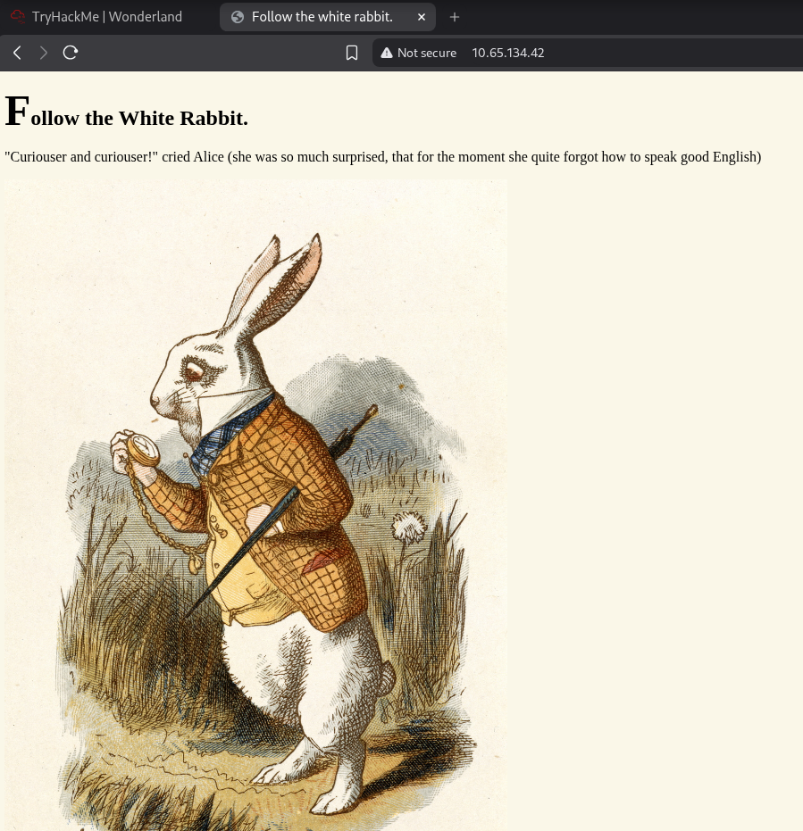
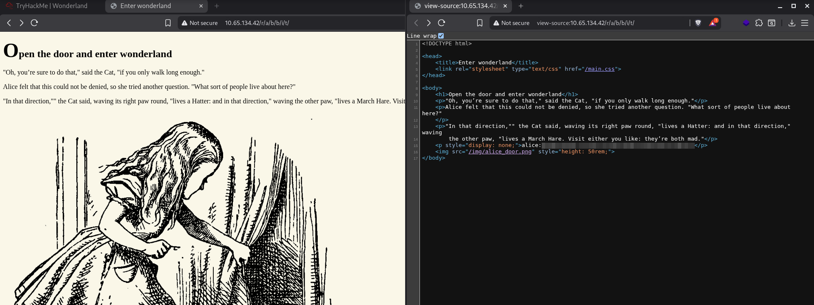
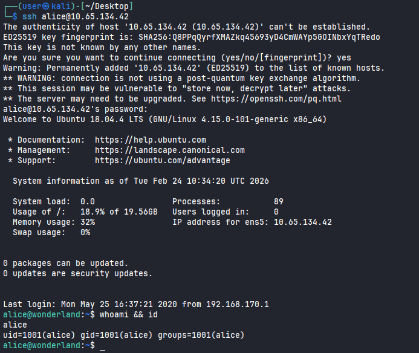
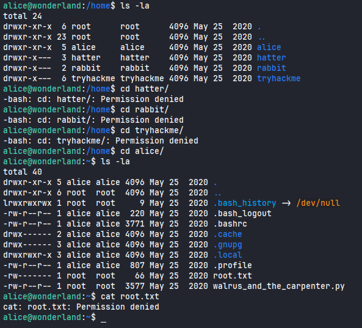
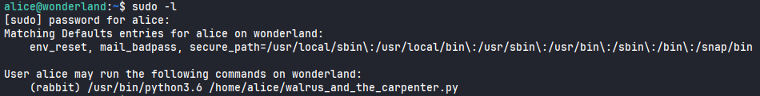
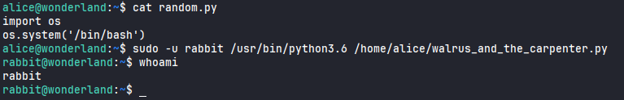
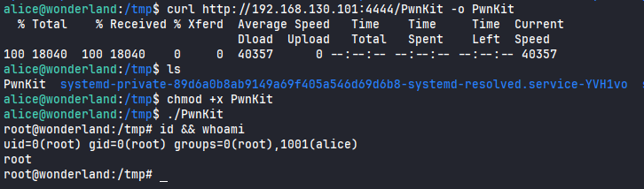
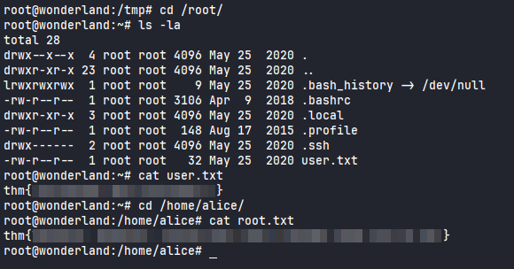

# Wonderland

#Linux #PrivEsc 

## Reconnaissance

I started running nmap and I got the following result.

```
$ nmap -sV -sC 10.65.134.42   
Starting Nmap 7.98 ( https://nmap.org ) at 2026-02-24 05:15 -0500
Nmap scan report for 10.65.134.42
Host is up (0.14s latency).
Not shown: 998 closed tcp ports (reset)
PORT   STATE SERVICE VERSION
22/tcp open  ssh     OpenSSH 7.6p1 Ubuntu 4ubuntu0.3 (Ubuntu Linux; protocol 2.0)
| ssh-hostkey: 
|   2048 8e:ee:fb:96:ce:ad:70:dd:05:a9:3b:0d:b0:71:b8:63 (RSA)
|   256 7a:92:79:44:16:4f:20:43:50:a9:a8:47:e2:c2:be:84 (ECDSA)
|_  256 00:0b:80:44:e6:3d:4b:69:47:92:2c:55:14:7e:2a:c9 (ED25519)
80/tcp open  http    Golang net/http server (Go-IPFS json-rpc or InfluxDB API)
|_http-title: Follow the white rabbit.
Service Info: OS: Linux; CPE: cpe:/o:linux:linux_kernel
```

Accessing port `80`, I got this following page.

<figure><figcaption></figcaption></figure>

## Enumeration

I started searching for directories. The only interesting directory was `r`.

```
$ ffuf -u http://10.65.134.42/FUZZ -w /usr/share/wordlists/seclists/Discovery/Web-Content/raft-large-directories.txt 

        /'___\  /'___\           /'___\       
       /\ \__/ /\ \__/  __  __  /\ \__/       
       \ \ ,__\\ \ ,__\/\ \/\ \ \ \ ,__\      
        \ \ \_/ \ \ \_/\ \ \_\ \ \ \ \_/      
         \ \_\   \ \_\  \ \____/  \ \_\       
          \/_/    \/_/   \/___/    \/_/       

       v2.1.0-dev
________________________________________________

 :: Method           : GET
 :: URL              : http://10.65.134.42/FUZZ
 :: Wordlist         : FUZZ: /usr/share/wordlists/seclists/Discovery/Web-Content/raft-large-directories.txt
 :: Follow redirects : false
 :: Calibration      : false
 :: Timeout          : 10
 :: Threads          : 40
 :: Matcher          : Response status: 200-299,301,302,307,401,403,405,500
________________________________________________

img                     [Status: 301, Size: 0, Words: 1, Lines: 1, Duration: 143ms]
r                       [Status: 301, Size: 0, Words: 1, Lines: 1, Duration: 143ms]
poem                    [Status: 301, Size: 0, Words: 1, Lines: 1, Duration: 142ms]
```

Performing other enumeration on this directory, I found other called `a`.

```
$ ffuf -u http://10.65.134.42/r/FUZZ -w /usr/share/wordlists/seclists/Discovery/Web-Content/raft-large-directories.txt

        /'___\  /'___\           /'___\       
       /\ \__/ /\ \__/  __  __  /\ \__/       
       \ \ ,__\\ \ ,__\/\ \/\ \ \ \ ,__\      
        \ \ \_/ \ \ \_/\ \ \_\ \ \ \ \_/      
         \ \_\   \ \_\  \ \____/  \ \_\       
          \/_/    \/_/   \/___/    \/_/       

       v2.1.0-dev
________________________________________________

 :: Method           : GET
 :: URL              : http://10.65.134.42/r/FUZZ
 :: Wordlist         : FUZZ: /usr/share/wordlists/seclists/Discovery/Web-Content/raft-large-directories.txt
 :: Follow redirects : false
 :: Calibration      : false
 :: Timeout          : 10
 :: Threads          : 40
 :: Matcher          : Response status: 200-299,301,302,307,401,403,405,500
________________________________________________

a                       [Status: 301, Size: 0, Words: 1, Lines: 1, Duration: 143ms]
```

The first thing that came to mind was `rabbit` because of the reference in Alice in Wonderland. I tried to access this path and it worked. Inspecting the source code, I found some credentials. 

<figure><figcaption></figcaption></figure>

Since the port `22` is accessible, I was able to login as `alice` using these credentials.

<figure><figcaption></figcaption></figure>

I was unable to read the first flag located on `/home/alice`.

<figure><figcaption></figcaption></figure>
## Login as `Rabbit`

Running `sudo -l` command, I noticed that we can run the file ` walrus_and_the_carpenter.py` as `rabbit`.

<figure><figcaption></figcaption></figure>

This python file was just a script who choice a random poem. I was unable to edit or delete this file.

```
alice@wonderland:~$ head -n 10 walrus_and_the_carpenter.py 
import random
poem = """The sun was shining on the sea,
Shining with all his might:
He did his very best to make
The billows smooth and bright —
And this was odd, because it was
The middle of the night.

The moon was shining sulkily,
Because she thought the sun
```

I created a file called `random.py`, so when the script is ran, the random library will find our local file `random.py` and give us a shell as `rabbit` user.  

<figure><figcaption></figcaption></figure>

## Privilege Escalation

I noticed that polkit's pkexec binary had SUID bit set. I was able to download a PwnKit script and I got a shell as a root.

<figure><figcaption></figcaption></figure>

Reading `user.txt` and `root.txt` flag.

<figure><figcaption></figcaption></figure>